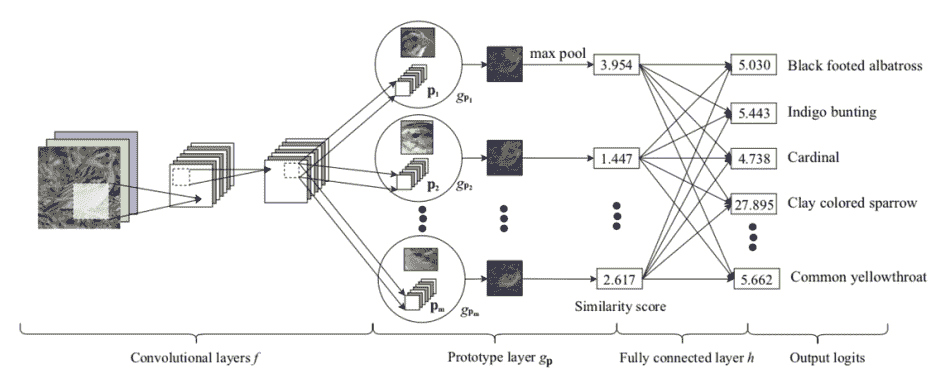
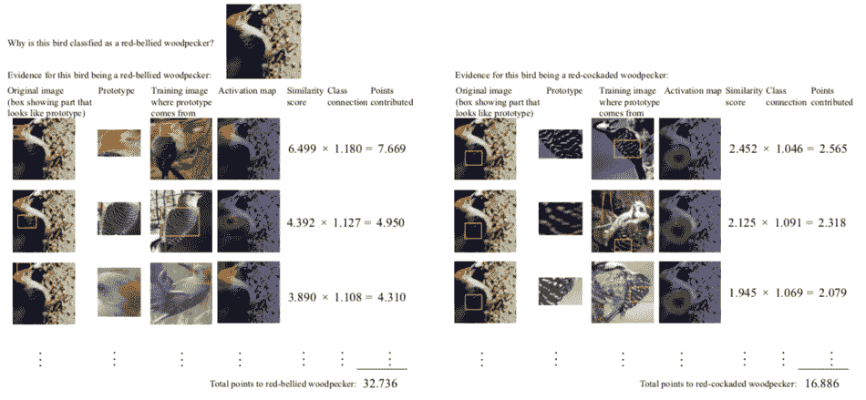
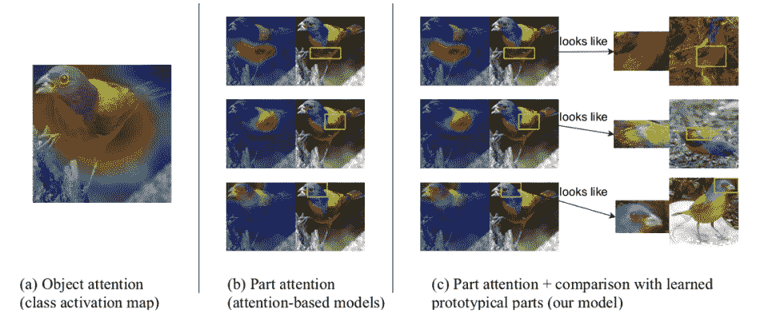

# 研究人员建立了一个“可解释的”人工智能，显示它是如何思考的

> 原文：<https://thenewstack.io/researchers-build-an-interpretable-ai-that-shows-how-it-thinks/>

随着自动化在我们的[工作场所](/ai-starts-taking-white-collar-jobs/)、[金融机构](/ai-investors-taking-wall-street/)甚至[法院](/when-ai-is-biased/)变得越来越普遍，机器学习的使用也越来越多——告诉我们应该雇佣谁、借钱给谁，以及谁可能会再次犯罪。但令人痛苦的是，这些复杂的[算法可以掩盖任何数量的隐藏偏见](/hidden-gender-racial-biases-algorithms-can-big-deal/)——导致他们无意中基于性别或种族歧视他人——往往会带来可怕的、改变生活的后果。问题是，这种人工智能系统是出了名的不透明；通常情况下，他们预测背后的机制和推理不会立即显现出来，甚至对创建这些系统的人来说也是如此。

因此，难怪越来越多的专家正在努力构建所谓的“可解释”或“可解释”的人工智能，其中机器预测的基础过程变得更加透明，因此也更容易理解(至少对我们人类来说)。为了更好地理解机器如何以及为什么以这种方式对图像进行分类，杜克大学的一个研究团队创建了一个新的深度学习神经网络，其推理过程可以比可比模型更容易地被解构、分析和理解。特别是，他们专注于使用数千种不同的鸟类图像来训练他们的 AI，这样它不仅可以正确识别各种鸟类，还可以“展示”它得出结论所采取的步骤。

“我们的目标是为计算机视觉中的图像分类设计深度神经网络，而不是黑盒，”杜克大学计算机科学教授、[预测分析实验室负责人](https://users.cs.duke.edu/~cynthia/lab.html)解释道。“这些网络使用一种基于案例的推理形式，根据当前图像的各个部分以及这些部分与记忆中典型的过去案例的相似程度进行推理。”

ProtoPNet 的网络体系结构。

对于他们的实验，该团队的[论文](https://github.com/cfchen-duke/ProtoPNet/blob/master/this_looks_like_that.pdf)解释了他们如何利用[卷积神经网络](https://en.wikipedia.org/wiki/Convolutional_neural_network) (CNN)，这是一种模拟人脑功能的深度学习神经网络，常用于图像和视频识别和分类、推荐引擎、医学图像分析和自然语言处理。这个名为 [ProtoPNet](https://github.com/cfchen-duke/ProtoPNet) 的网络被输入了超过 11000 张 200 种鸟类的图像，包括麻雀、啄木鸟和蜂鸟。这是在研究人员没有明确告诉模型每个物种的识别特征的情况下完成的，无论是喙的特定形状，还是羽毛的颜色。相反，网络自己学习挑选出突出的视觉模式作为“原型”，然后允许它将未来的图像和特征与之前看到和识别的进行比较。

“例如，网络可能会解释说，一只鸟的图像包含一只粘土色的麻雀，因为这只鸟的头部看起来像它以前见过的原型粘土色麻雀的头部，因为这只鸟翅膀上的羽毛图案看起来像另一只原型粘土色麻雀的翅膀图案，”鲁丁说。

显示 ProtoPNet 如何展示其识别过程背后的推理的图表。

该团队提出的另一个有用的功能是使用“激活图”，这类似于彩色编码的红外热图，并显示图像的哪些部分与之前已经看到的鸟类特征最相符。正是以这种方式，模型实时显示其内部推理过程，使其成为一个“可解释”的人工智能，与“黑盒”人工智能形成对比，后者在事实发生后进行分析，鲁丁指出:“网络通过解释图像的‘这’部分看起来像它以前见过的另一个图像的‘那’部分来进行推理。”

“激活地图”显示了图像的哪些部分最符合先前学习的鸟类物种特征。

在他们对其他不具备这种可解释性特征的人工智能模型进行测试的过程中，该团队发现，他们的网络能够在高达 84%的时间内识别正确的物种，这意味着它的表现与类似的网络一样好——除了具有透明性的优势。

目前，该团队已经向其他研究人员公开了他们的[代码](https://github.com/cfchen-duke/ProtoPNet)，除了现在将他们的工作用于医学成像目的。

“神经网络开始广泛用于放射学问题，但并不总是清楚这些模型对于特定的预测是否值得信赖，”Rudin 告诉我们。“其中一些问题非常困难，即使对医生来说也是如此——例如乳房 x 光照相术中的肿瘤识别——因此，在计算机和人类之间进行对话，以了解患者的实际状态以及是否需要进行活检，这可能是有用的。我们希望可解释的神经网络能够解释它们为什么做出决定，这样医生就知道是否信任它。此外，机器可能会看到医生看不到的东西，所以从人和机器两个角度来看都是有用的。”

图片:杜克大学

<svg xmlns:xlink="http://www.w3.org/1999/xlink" viewBox="0 0 68 31" version="1.1"><title>Group</title> <desc>Created with Sketch.</desc></svg>