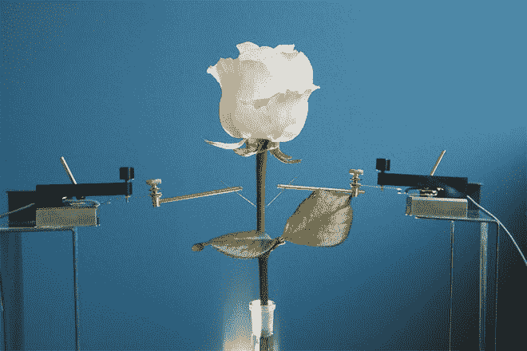
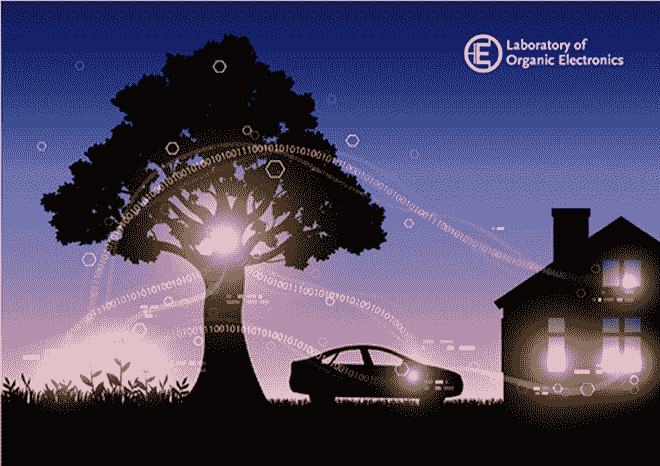

# 研究人员用改良玫瑰创造“植物机器人”

> 原文：<https://thenewstack.io/researchers-create-plant-cyborg-enhanced-rose/>

我们许多人都熟悉人类增强的概念，无论是通过机械附件、神经技术、可穿戴设备，还是工程组织的生物打印。撇开伦理争论不谈，不管我们喜不喜欢，生物学和技术的融合似乎正在快速逼近。如果人类看起来像是尖端改进的公平游戏，那么为什么植物不是呢？

这就是林雪平大学有机电子实验室的瑞典研究人员在最近的一项实验中所做的，他们通过在植物本身内“生长”完全功能的电子电路，成功地“重新连接”了一株活体玫瑰植物。结果是一种电子植物(或“电子植物”)，它的中间长有一根电线，当电流通过时，它可以改变叶子的颜色。

最近发表在 *[科学进展](http://advances.sciencemag.org/content/1/10/e1501136)*的这项研究似乎是某种突破，创造了一种新的植物电子人。“据我们所知，以前没有发表过关于工厂生产的电子产品的研究结果。这项研究的主要作者、林雪平大学有机电子学教授马格努斯·博格伦说:“以前没有人这样做过。

## 有机导线、晶体管和逻辑门

当然，这并不像在玫瑰植株中插入一根预制的电线那么容易。该团队与植物的自然系统合作，探索活体植物和电子电路的混合体如何形成，特别关注[木质部](https://en.wikipedia.org/wiki/Xylem)或具有通道状结构的脉管组织，这些组织在整个有机体中运送水和营养。

科学家们首先将各种半导体聚合物溶解在水中，然后引入切割的玫瑰茎，以观察植物组织对它们的吸收和反应情况。总之，他们测试了十几种聚合物，所有这些聚合物都会产生毒性反应或堵塞植物的木质部。

最终，研究人员终于找到了有效的东西:一种液体溶液，其特点是一种叫做聚(3，4-乙烯二氧噻吩)，简称 PEDOT 的聚合物。当他们将玫瑰植物茎放入这种溶液中时，他们发现它很容易被吸收并扩散到整个植物组织中。

随着时间的推移，这种溶液固化成类似“木质部导线”的东西，可以导电，但仍允许植物继续进行基本的生命功能，如运送水和养分。利用 PEDOT，研究人员能够生长出大约 10 厘米(3.9 英寸)长的“木质部线”。

通过在木质部导线的两端放置电极，并在中间设置一个[逻辑门](https://en.wikipedia.org/wiki/Logic_gate)，研究人员在植物内部创造了一种“有机电化学晶体管”或电子开关，由其自身的内部电解质提供燃料。晶体管是现代电子设备的基本组件，而[逻辑门](https://en.wikipedia.org/wiki/Logic_gate)在计算系统中扮演着重要角色。

该团队还发现，植物的叶子可以被改装成一种可调光的电子元件。将另一种含有纳米纤维素的改良 PEDOT 溶液注入叶子的气孔中，气孔是帮助植物与环境交换气体的小孔。纳米纤维素有助于在树叶中创建海绵状的模板，然后用聚合物填充，从而创建电化学电池或各种“像素”。当系统通电时，这些像素能够变成明显更亮或更暗的颜色。

这些实验仅仅是一个潜在的巨大的新研究领域的开始，这个领域将利用自然界自身进化的复杂性和创造性。“现在我们可以真正开始谈论‘发电厂’——我们可以在植物中放置传感器，利用叶绿素中形成的能量，生产绿色天线或生产新材料，”博格伦解释道。“一切都是自然发生的，我们使用植物自己非常先进、独特的系统。"

## 生物互联网？

除了较小的植物，科学家们认为这种方法可以应用于像树木这样的大型生物。无论如何，自然植物生物学与电子学的结合可能会产生巨大的影响。也许有一天，我们不起眼的室内植物或主食作物可以连接到不断发展的物联网上——通过一个应用程序准确提醒我们何时需要维护，最大限度地提高生长速度，而无需修改基因。

进一步发展这些生物电子电路，人类也可能找到收获植物光合作用产生的能量的方法，创造另一种形式的清洁能源。据我们所知，有一天，计算机系统甚至[神经网络](https://thenewstack.io/deep-learning-neural-networks-google-deep-dream/)可能会以植物为基础的版本来表达，这为人工植物智能的可能性打开了大门。虽然现在这可能有点牵强，但这些实验最终证明，活植物可以像人类一样通过技术得到增强。

在 [IEE Spectrum](http://spectrum.ieee.org/tech-talk/biomedical/bionics/rewired-rose-plant-becomes-living-cyborg) 和林雪平大学阅读更多内容。

图片:林雪平大学

<svg xmlns:xlink="http://www.w3.org/1999/xlink" viewBox="0 0 68 31" version="1.1"><title>Group</title> <desc>Created with Sketch.</desc></svg>