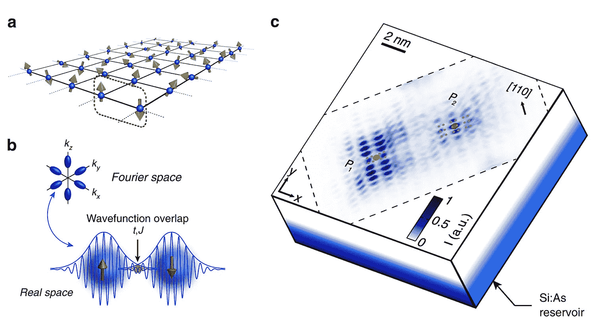
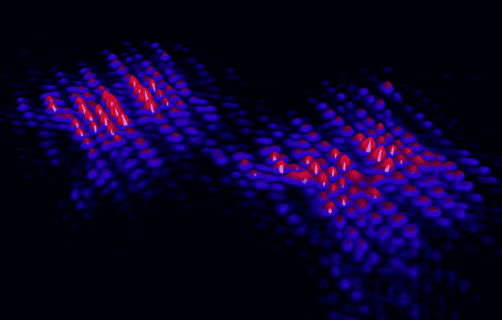

# 研究人员发现在硅中定位量子比特的“最佳点”

> 原文：<https://thenewstack.io/researchers-discover-sweet-spot-for-positioning-quantum-bits-in-silicon/>

多年来，围绕量子计算的可能性(和局限性)有很多猜测。简而言之，许多专家认为，量子计算——依靠量子力学的不寻常定律来编码和处理信息——可能是当前人工智能发展日益复杂的计算需求的答案，[模拟复杂系统](https://thenewstack.io/quantum-computings-challenging-liftoff-to-commercialization/)，以及提高网络安全，以建立[不可攻击的互联网](https://thenewstack.io/scientists-adapt-1930s-radio-tech-help-build-unhackable-quantum-internet/)。

但是我们离开发一台可靠的量子计算机还有很长的路要走，目前的研究集中在如何让量子计算机[更精确](https://thenewstack.io/new-protocol-allows-noisy-quantum-computers-to-auto-assess-their-accuracy/)，[更小](https://thenewstack.io/singapore-researchers-shrink-quantum-chips-to-the-size-of-an-integrated-circuit/)——并有望连接到稳定的[长距离量子网络](https://thenewstack.io/researchers-set-new-quantum-entanglement-record-for-future-quantum-networks/)。澳大利亚[量子计算和通信技术卓越中心](https://www.cqc2t.org/) (CQC ² T)和[硅量子计算](http://sqc.com.au/) (SQC)的研究人员已经朝着这些目标迈出了一步，他们发现了量子比特在硅中的最佳定位，这将有助于在量子比特之间创建持续强大和快速的交互，并在未来扩大量子处理器的规模。

## 使量子位相互作用变得鲁棒

“这项工作是关于控制硅晶体中磷原子构成的量子位之间的相互作用，”新南威尔士大学物理学教授斯文·罗格解释说，他领导了这项研究，最近在《自然通讯》上发表了论文。“量子位之间的相互作用是操作量子处理器的关键:没有这种控制，就不可能从几个量子位的原型可靠地扩大到寻求提供量子优势的成熟处理器。”

该团队的工作解决了一个长期存在的问题，即如何使量子比特的相互作用更加鲁棒。具体来说，量子计算机的核心组件包括两个量子位的门，它利用量子位对之间的相互作用来执行量子计算。

多年来，该领域的先前工作表明，硅晶体中的某些位置会导致振荡，这可能会妨碍量子位门的控制和操作速度。然而，该团队的工作表明，以一种使量子位之间的相互作用更具弹性的方式测量和精确放置量子位是可行的，因此有可能为扩大多量子位处理器铺平道路。

这是可能的，因为硅的各向异性结构，这意味着它的属性(和原子之间相互作用的性质)可以根据原子的放置方向而改变。人们可以在木材中找到一个类似的例子，当“顺纹理”切割时，材料更容易一分为二，而不是垂直于纤维切割。虽然硅的各向异性已经被人们所知很多年了，但是还不清楚这种特性会如何影响量子位的相互作用。

罗格解释说:“在测量传统量子位设备中的交换相互作用时，不可能区分谷干涉(振荡)和各向异性效应，因为这些测量不能追溯到量子位[波函数](https://thenewstack.io/deep-physics-ai-helps-predict-quantum-molecular-wave-functions/)的范围或原子的精确位置。”"从这个意义上说，这个设备是一个黑匣子."

为了解决这个问题，该团队结合了现有的技术——即扫描隧道显微镜和扫描隧道显微镜(STM)光刻技术——开发了一种他们称为“量子态成像”的方法，该方法建立在 UNSW 大学于 2014 年[和 2016 年](https://doi.org/10.1038/nmat3941)[所做的工作基础上。](https://doi.org/10.1038/nnano.2016.83)

“我们的量子态成像技术打开了盒子，我们可以看到原子，并直接获得原子尺度的波函数细节，”罗格说。“这是第一次有可能分别看到谷干涉和各向异性效应，因此有可能进一步探索各向异性对交换的影响，以优化量子位的放置。”

a)束缚于硅中磷原子的单电子自旋的 2D 阵列图。两个量子比特的操作发生在最近的邻居之间，即红/绿自旋对。b)硅中的各向异性(顶部)；相互作用(黄色)来自两个原子(底部)之间的波函数重叠。c)成对量子位的波函数的实验实空间图。

硅中两个相互作用原子的原子尺度图像。

通过使用这种量子状态成像方法，该团队能够观察成对量子位之间的原子级相互作用。这些研究使他们在硅晶体的特定平面内发现了一个特定的角度，在这个角度量子位之间的相互作用最强——这是一个最佳的定位，然后可以通过现有的扫描隧道显微镜(STM)平版印刷术来复制，这也是 UNSW 的首创。

“扫描隧道显微镜在用于原子系统成像的局部光谱学方面有着悠久的历史，”罗格补充道。“这种成像技术和图像识别的结合是我们最新论文的起点，将几何谷干涉效应与原子的位置联系起来。”

该团队看似微小但意义重大的发现将对稳定的硅基量子计算机的最终大规模商业化产生重大影响。

“我们的工作也证明了扫描隧道显微镜技术可以为量子器件的优化提供直接的输入，”罗格说。“我们希望我们的工作将激励其他小组将我们的扫描隧道显微镜技术应用于半导体中的不同量子态，这可能与量子计算有关。”

更多阅读团队[论文](https://www.nature.com/articles/s41467-020-19835-1)。

图片:新南威尔士大学硅量子计算量子计算和通信技术卓越中心

<svg xmlns:xlink="http://www.w3.org/1999/xlink" viewBox="0 0 68 31" version="1.1"><title>Group</title> <desc>Created with Sketch.</desc></svg>