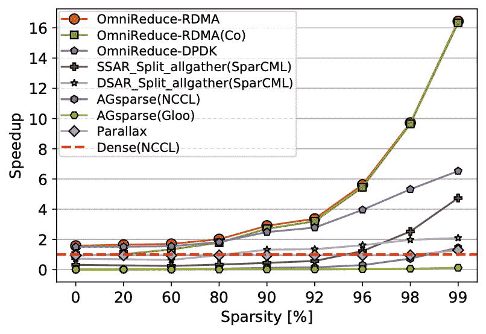

# 研究人员“去掉零”以加速深度学习

> 原文：<https://thenewstack.io/researchers-drop-the-zeroes-to-speed-deep-learning/>

[阿卜杜拉国王科技大学](https://www.kaust.edu.sa/) (KAUST)的研究人员现在正在提出一种通过丢弃零值数据块来加速分布式深度学习的方法，这些数据块是在使用大型数据集的分布式机器学习过程中频繁产生的。

训练日益复杂的人工智能模型所需的数据量越来越大，这促使专家们寻找更有效的方法来训练深度神经网络。一种方法是实现所谓的[分布式深度学习](https://petuum.medium.com/intro-to-distributed-deep-learning-systems-a2e45c6b8e7)，它在更广泛的计算资源基础上扩展模型的训练。

虽然这种形式的分布式机器学习更有效，但用于计算密集型 NLP 模型的更新更大的深度神经网络的规模，如[伯特](https://thenewstack.io/detext-linkedins-open-source-deep-learning-framework-for-natural-language-processing/)和 [GPT-3](https://thenewstack.io/openais-gpt-3-makes-big-leap-forward-for-natural-language-processing/) 将很快超过当前最先进的超级计算机的计算能力。

分布式深度学习通常通过[数据并行化](https://www.tutorialspoint.com/data-parallelism-vs-task-parallelism)来实现，这是一种[并行计算](https://www.omnisci.com/technical-glossary/parallel-computing)的形式，它将数据分布在不同的并行处理器节点上，从而通过将计算负载分散到更广泛的资源上来提高效率。

研究人员的方法侧重于所谓的集体通信例程，这是并行计算应用程序的核心组件，用于在同时运行的多个进程之间组合数据。为了有效地扩展工作负载，集体通信例程必须平稳运行。

“为了实现更好的扩展，我们的目标是通过优化集体通信来降低通信开销，”该团队在他们的论文[中写道，该论文作为 2021 年 ACI SIGCOMM 会议的一部分提交。在许多 DNN 工作负载中，这些开销相当大，尤其是对于大型模型，在这些模型中，测得的性能与理想的线性扩展之间存在巨大差距](https://mcanini.github.io/papers/omnireduce.sigcomm21.pdf)

## 丢弃零加速分布式深度学习

在模型训练期间，学习任务被分配给各种计算节点，这些节点在通过通信网络执行下一个作业之前比较它们的结果。根据该团队的说法，这些节点之间的通信是分布式深度学习的一个主要瓶颈。

“高效的集体交流对于并行计算应用至关重要，例如大规模推荐系统和自然语言处理模型的分布式训练，”该团队表示。

随着模型规模的增长，研究人员还观察到数据块中零值的比例也在增加，导致了一种称为稀疏的现象。虽然已经有一些用于集体通信例程的现有工具，但该团队指出，这种集体通信库不支持稀疏数据，这导致他们发展了他们的想法。

“我们提出了 [OmniReduce](https://sands.kaust.edu.sa/project/omnireduce/) ，这是一个高效的流聚合系统，它利用稀疏性，通过只发送非零数据块来最大化有效带宽的使用。大多数现有的集体图书馆——包括像 [NCCL](https://developer.nvidia.com/nccl) 和 [Gloo](https://github.com/facebookincubator/gloo) 这样的 DDL 专用图书馆——没有对稀疏数据的本地支持。这些库采用密集的输入数据，并低效利用宝贵的网络带宽来传输大量的零。”

OmniReduce 建立在 KAUST 的早期开发之上，名为 [SwitchML](https://sands.kaust.edu.sa/project/switchml/) ，它使用聚合代码来优化管理节点间通信的网络交换机，从而提高数据传输的效率。OmniReduce 通过删除任何带零的结果进一步简化了这个过程，而不会中断节点之间并行计算的同步。正如该团队所指出的，以这种方式利用稀疏性具有挑战性，因为所有节点都必须在一个时隙中的同一位置处理数据块，因此协调至关重要。

“协调是只发送非零数据的关键，”该团队解释道。聚集器基于在[节点]处有效可用的下一个位置元数据，以前瞻方式全局地确定[节点]中非零值的位置(节点将其传送给聚集器)。这个组件将 OmniReduce 与任何相关工作区分开来。”

在测试 OmniReduce 与其他现有的集合库(如 NCCL 和 Gloo)的对比时，同时运行六个流行的深度神经网络模型(如 BERT 和 ResNet152)，研究人员团队发现 OmniReduce 表现良好，训练时间提高了 8.2 倍。

在测试 OmniReduce 与其他现有的集合库(如 NCCL 和 Gloo)的对比时，同时运行六个流行的深度神经网络模型(如 BERT 和 ResNet152)，研究人员团队发现 OmniReduce 表现良好，训练时间提高了 8.2 倍。他们还发现 OmniReduce 对于使用多 GPU 服务器的大型 DNN 分布式培训工作非常有效。

此外，该团队还将 OmniReduce 与运行在 TCP/IP 和 RDMA 网络上的其他最先进的稀疏集体通信解决方案进行了测试，如 [AllReduce](https://tech.preferred.jp/en/blog/technologies-behind-distributed-deep-learning-allreduce/) 、 [SparCML](https://arxiv.org/abs/1802.08021) 和 [Parallax](https://github.com/snuspl/parallax) ，并发现 OmniReduce 的性能是这些竞争对手的 3.5 至 16 倍。

OmniReduce 与运行在 TCP/IP 和 RDMA 网络上的其他最先进的稀疏集体通信解决方案(如 AllReduce、SparCML 和 Parallax)的对比结果，

“OmniReduce 的性能优势是双重的，”该团队说。“首先，OmniReduce 的可伸缩性更好，两个加速因子都随着[节点]的数量而增长，因为 OmniReduce 的时间不依赖于[节点]的数量。这种加速是基本的，甚至在密集输入的情况下也存在。第二，与 ring AllReduce 相反，OmniReduce 只发送非零元素，从而成比例地减少了时间。”

该团队现在正在努力使 OmniReduce 在可编程交换机上运行，利用网络内计算来进一步提高性能。到目前为止，OmniReduce 已经被用于训练位于中国的大型购物和按需交付平台[美团](https://en.wikipedia.org/wiki/Meituan)的大规模工作负载。

<svg xmlns:xlink="http://www.w3.org/1999/xlink" viewBox="0 0 68 31" version="1.1"><title>Group</title> <desc>Created with Sketch.</desc></svg>