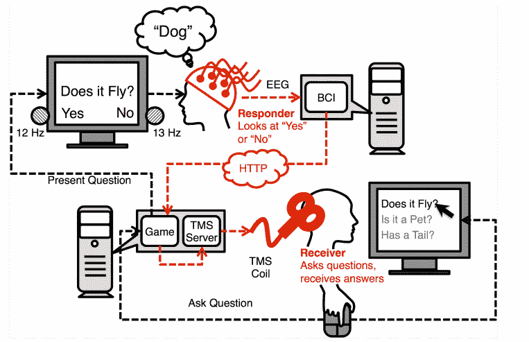
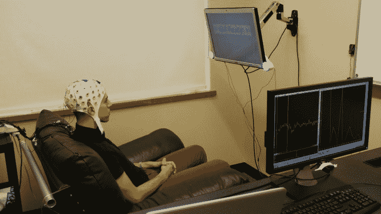
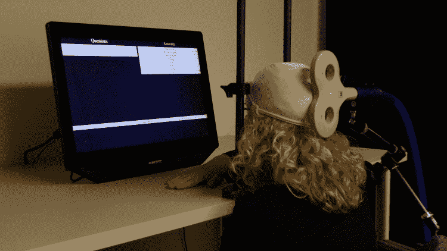

# 研究人员通过互联网连接两个人的大脑

> 原文：<https://thenewstack.io/researchers-link-two-human-brains-internet/>

人类之间的交流通常由手势和我们的嘴发出的各种有意义的声音组成。但是，如果有某种方法可以通过互联网直接连接大脑，使它们能够相互交流，那会怎么样呢？

这听起来像是科幻电影里的情节，但是华盛顿大学的科学家们相信他们已经实现了。在他们所谓的“迄今为止在人类身上完成的最复杂的脑对脑实验”中，该实验涉及几对个体在所谓的脑对脑接口(BBI)上玩一系列问答游戏，产生了一些令人惊讶的结果。

## 直接玩脑对脑的 20 个问题

这项研究最近发表在《PLOS 综合》上，详细描述了实验是如何进行的。第一个人，或者说“回答者”，戴上一顶与一台 [脑电图](https://en.wikipedia.org/wiki/Electroencephalography) (脑电图)机相连的帽子，这台机器记录大脑活动的电脉冲。然后在屏幕上向回答者呈现一个对象(例如，“鲨鱼”或“狗”)。第二个人，或“询问者”，其枕叶接收来自放置在头部附近的经颅磁刺激(TMS)线圈的信号，然后被呈现一系列可能的物体和相关问题，这将帮助他或她猜测回答者所看到的真实性质。

询问者触摸屏幕，选择要问回答者的问题，回答者通过关注显示器两侧两个 LED 灯中的一个来回答“是”或“否”，这两个 LED 灯以不同的速度闪烁。这种“是”或“否”的电脉冲通过 TMS 线圈在互联网上发送给询问者，但只有“是”的回答才会产生一个信号来刺激询问者的视觉皮层，在他们的视野中产生一种称为光幻视的视觉闪光。这些闪光有助于询问者确定所询问的正确物体——这基本上是一个二十个问题的游戏，但是是在互联网上直接的脑对脑连接中进行的。

虽然 EEG 和 TMS 技术都不是什么新东西，但这里的关键是光幻视的创新使用，该研究解释说:“因为光幻视对接收者来说是私有的，可以在各种条件下被感知，甚至在执行其他动作时，它们代表了比[以前的脑-脑接口]更通用和有趣的信息传输方式。”

[https://www.youtube.com/embed/wMY1acFZHxA?feature=oembed](https://www.youtube.com/embed/wMY1acFZHxA?feature=oembed)

视频

该实验建立在之前对动物进行的脑-脑接口实验和用于激活设备的[脑-机接口](https://en.wikipedia.org/wiki/Brain%E2%80%93computer_interface)以及该团队 2013 年的[实验](http://www.washington.edu/news/2014/11/05/uw-study-shows-direct-brain-interface-between-humans/)的基础上，该实验允许一个人通过互联网控制另一个人的手部动作。

UW 学习与脑科学研究所的心理学助理教授、第一作者安德里亚·斯托科解释说，这是同类实验中最复杂的直接脑对脑实验，没有对颅骨进行任何侵入性手术:“(实验)通过视觉感受的信号使用意识体验，需要两个人合作。”

为了确保测试对象只依赖于直接的大脑对大脑的交流，科学家们把回答者和询问者放在相距近一英里的黑暗房间里。“是”和“否”的视觉刺激在不同的游戏中有随机变化的强度，询问者必须戴上耳塞，这样他们就不能根据视觉刺激强度的不同声音进行猜测。这些游戏被设计成测试组的游戏和控制组的游戏混在一起，只有研究人员知道哪个游戏是哪个游戏。

结果令人吃惊:测试组的受试者能够得到 72%的正确答案，而对照组只得到 18%。

 

## 大脑辅导，转移大脑状态

虽然能够从你的大脑向另一个人的大脑发送信号本身就令人兴奋，但研究人员设想了这项新兴技术更潜在的有趣应用。首先，他们正在研究他们所谓的“大脑辅导”——一种直接的脑对脑治疗，以帮助有发育问题的人或因事故导致脑损伤的人，在这种治疗中，健康人的神经模式或“大脑状态”被转移到患者身上。知识和信息也可以直接在人与人之间传递，很像一个[瓦肯人的思维融合](https://en.wikipedia.org/wiki/Vulcan_(Star_Trek)#Mind_melds)。

合著者、UW 大学心理学副教授 Chantel Prat 是这样说的:

> “想象一下，有一个患有多动症的人和一个神经正常的学生。当非多动症学生集中注意力时，多动症学生的大脑会自动进入注意力更集中的状态。”

该团队的发现采取了一种不同的方法来促进思维之间的直接交流，而不使用一些可能导致某些东西在过程中丢失的中间媒介。尽管这无论如何都不是某种超自然的、内生的[心灵感应](https://en.wikipedia.org/wiki/Telepathy)，但它与“[随意的、不引人注目的技术](https://thenewstack.io/ikeas-concept-kitchen-of-2025-it-cooks-interacts-and-composts/)的趋势是一致的，这种技术将会无形地、无缝地嵌入我们的生活，甚至可能嵌入我们的身体，提供一种前所未有的交流水平。社交媒体提供的几乎即时的联系令人难以置信，但想象一下有一天能够通过你的大脑直接与许多其他人交流，这要归功于一些尚未实现的小工具，可能是可穿戴设备或植入物。

斯托科解释说，这个实验只是迈向潜在未来的一小步:“进化已经花费了大量的时间来寻找方法，让我们和其他动物从大脑中获取信息，并以行为、语言等形式与其他动物交流。但这需要翻译。我们只能交流大脑处理的部分内容。我们正在做的是一步一步地逆转这个过程，打开这个盒子，从大脑中提取信号，经过最少的转换，将它们放回另一个人的大脑中。”

图片来自华盛顿大学。

<svg xmlns:xlink="http://www.w3.org/1999/xlink" viewBox="0 0 68 31" version="1.1"><title>Group</title> <desc>Created with Sketch.</desc></svg>