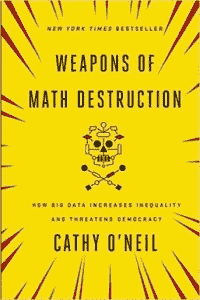

# 研究人员关注“算法殖民”如何阻碍人工智能

> 原文：<https://thenewstack.io/researchers-look-at-how-algorithmic-coloniality-may-hamper-artificial-intelligence/>

随着人工智能(AI)日益改变我们的世界，[一篇新论文](https://link.springer.com/article/10.1007/s13347-020-00405-8)提出了一种重新审视我们现在已经生活的社会的方法，以描绘出一条更好的前进道路。“计算机系统体现了价值观，”[解释说，论文合著者沙基尔·穆罕默德](https://twitter.com/shakir_za/status/1281275902811398144)，“为了建立对价值观和权力的更深刻理解，我们转向批判理论，尤其是非殖民化理论。”

该文件将“非殖民化”定义为“在历史殖民时期结束后，与恢复土地和生活有关的知识、政治、经济和社会工作”。它试图根除今天仍然存在的这种思想的残余，包括诸如“领土侵占、剥削自然环境和人类劳动以及直接控制社会结构是历史殖民主义的特征”等不健康的特征。

Mohamed 是人工智能研究公司 [DeepMind](https://deepmind.com/) 的统计机器学习和人工智能研究科学家。他与 DeepMind 高级研究科学家威廉·艾萨克(William Isaac)以及在牛津互联网研究所(Oxford Internet Institute)研究算法殖民性的博士生玛丽-泰蕾兹·巴纽(Marie-Therese Png)合作。他们共同撰写了一篇 28 页的论文，探讨了两种理论——后殖民和非殖民——在“理解和塑造人工智能正在取得的进步”中的作用

该论文包括一个警告，即人工智能系统“带来了巨大的风险，尤其是对已经很脆弱的人来说。”但最后也试图提供一些可行的解决方案。

## **关键视角**

研究人员的论文引用了凯茜·奥尼尔(Cathy O ' Neil)2016 年的著作《数学毁灭的武器》(Weapons of math destruction)，该书认为在警务、贷款和保险等高风险领域，“大数据增加了不平等并威胁到民主”。

对于行动中的算法(或自动化)压迫，该论文指出“预测性”监控系统“有可能巩固历史上的不公正，并放大用于发展这些不公正的数据中的社会偏见”，以及美国刑事司法系统中使用的算法“决策系统”，尽管有明显的证据表明存在缺陷，如将犯罪数据集与歧视性警务模式联系起来。

在评论这项工作时， [VentureBeat](https://venturebeat.com/2020/07/11/deepmind-researchers-propose-rebuilding-the-ai-industry-on-a-base-of-anticolonialism/) 建议作者“融入上个月在黑人的命也是命抗议期间发布的一封由人工智能和计算社区的黑人成员在[发表的公开信中表达的情绪，这封信要求人工智能从业者认识到他们的创造可能会支持住房、教育、医疗和就业等领域的种族主义和系统性压迫。”](https://venturebeat.com/2020/06/19/black-roboticists-on-racism-bias-and-building-better-ai/)

但是，尽管这是一篇非常及时的论文，但这主要是一个巧合，合著者[威廉·艾萨克](https://www.linkedin.com/in/wsisaac/?originalSubdomain=uk)说，他是 DeepMind 的高级研究科学家。他告诉我，这篇论文源于大约两年前 Shakir Mohamed 的一篇博客文章，其中概述了一些最初的想法，受到了数据殖民主义等相关领域工作的影响。去年，合著者 Marie-Therese Png 在牛津跨文化数字伦理研讨会期间帮助组织了一个小组，这导致了这篇论文。

在论文中，研究人员提供了一个令人震惊的例子，即 2002 年“高风险护理管理”医疗保健项目广泛使用的算法筛选工具，结果证明“依赖于个人医疗费用的预测效用”。最终结果？黑人患者比白人患者更经常被医疗保健计划拒绝，“加剧了美国医疗保健系统的结构性不平等。”

该论文还研究了使用算法的行业和机构参与者如何“通过不公平或不道德的手段利用(通常已经被边缘化的)人”，包括标记训练数据的“影子工人”，这种现象涉及一位研究人员称之为“殖民主义的旧断层线”的人群该论文还提供了一些例子，说明它所谓的“明显的剥削情况，即组织将自己国家以外的国家作为测试场，特别是因为他们缺乏关于数据及其使用的预先存在的保护措施和法规，或者因为测试模式会违反他们本国的法律。”

他们引用了剑桥分析公司(Cambridge Analytica)的例子，根据 Nanjala Nyabola 的“[数字民主，模拟政治](https://press.uchicago.edu/ucp/books/book/distributed/D/bo31262836.html)”beta 测试算法在肯尼亚和尼日利亚的选举中影响选民，部分原因是这些国家的数据保护法薄弱。

## **向前进**

那么，我们能做些什么来让事情变得更好呢？本文提供了三种方法，首先是培养人工智能的关键技术实践。利用批判的眼光，团队可以将多样性从道德要求(或建立更有效团队的问题)转化为持续的实践，通过这种实践“直接面对同质化、权力、价值观和文化殖民主义的问题”。这种多样性从根本上改变了团队和组织的思维方式。”

其次，他们建议追求“情感和政治社区的更新”。这篇论文警告说，艾“被当代政治社区的演变所塑造，并塑造了当代政治社区的演变”，认为非殖民化原则可以帮助塑造新的社区。最后，该论文还指出，殖民大国最终会从被殖民者那里学习，这是一种“反向监护”，研究人员希望能够发现并用于改变殖民观点。“决定什么是有效的知识，什么包含在数据集中，什么被忽略和质疑，是人工智能研究人员掌握的一种权力，不能被忽视。”

他们建议社区参与研究和“有意义的跨文化对话系统”2016 年，IEEE 甚至发布了关于符合伦理的设计的指南。)

该论文认为，受影响的社区需要在塑造人工智能系统方面发挥作用，包括挑战其结论的方法——以及由此产生的系统的所有权。已经有系统显示“家长式思维和权力与选择的不平衡……非殖民化的必要性要求从技术仁慈和家长式的态度转向团结。”

一种方法是:求助于现有的文化间对话的基层团体和已经在世界各地活跃的替代社区的例子。(研究人员的例子包括 Black Lives、深度学习 Indaba、Black in AI 和 Queer in AI 的数据。)

艾萨克告诉我，人工智能行业的工人可以带来很大的不同，并指出他们的论文提供了“一系列策略，研究人员或团队现在可以实施这些策略，以培养他们对工作更具批判性和自我反思的态度。”

“具体来说，团队可以开始利用现有工具，如[多元化声音方法](https://techpolicylab.uw.edu/project/diverse-voices/)或[公民陪审团](https://www.thersa.org/discover/publications-and-articles/reports/democratising-decisions-technology-toolkit)来整合来自受影响社区的反馈、[模型卡](https://modelcards.withgoogle.com/about)和[数据表](https://www.microsoft.com/en-us/research/publication/datasheets-for-datasets/)来促进数据收集和模型设计决策的内部反思和问责，或 [harms 建模](https://docs.microsoft.com/en-us/azure/architecture/guide/responsible-innovation/harms-modeling/)来提供对给定项目或应用的潜在影响的预测。

“虽然这些工具并不全面，但它们有望鼓励向更具批判性和反思性的研究和技术实践转变。”

该论文的结论敦促在人工智能发展中创造“利益相关者之间的包容性对话”的新方法，在这种情况下，边缘化群体可以影响决策，同时“避免掠夺性包容的可能性，以及持续的算法压迫、剥削和剥夺。”

正如艾萨克提醒我的那样，“我们在该领域都有共同的责任，以确保新的创新不会加剧当前和历史的偏见，并确保真诚和实质性地纳入受影响群体的关切和需求。”

* * *

# WebReduce

来自 Pixabay 的 John Hain 的特写图片。

目前，新堆栈不允许直接在该网站上发表评论。我们邀请所有希望讨论某个故事的读者通过推特或脸书与我们联系。我们也欢迎您通过电子邮件发送新闻提示和反馈:[feedback @ thenewstack . io](mailto:feedback@thenewstack.io)。

<svg xmlns:xlink="http://www.w3.org/1999/xlink" viewBox="0 0 68 31" version="1.1"><title>Group</title> <desc>Created with Sketch.</desc></svg>