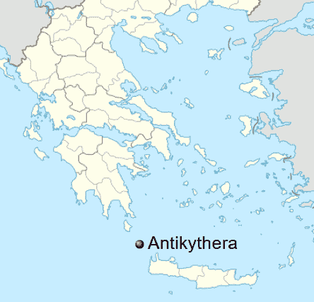
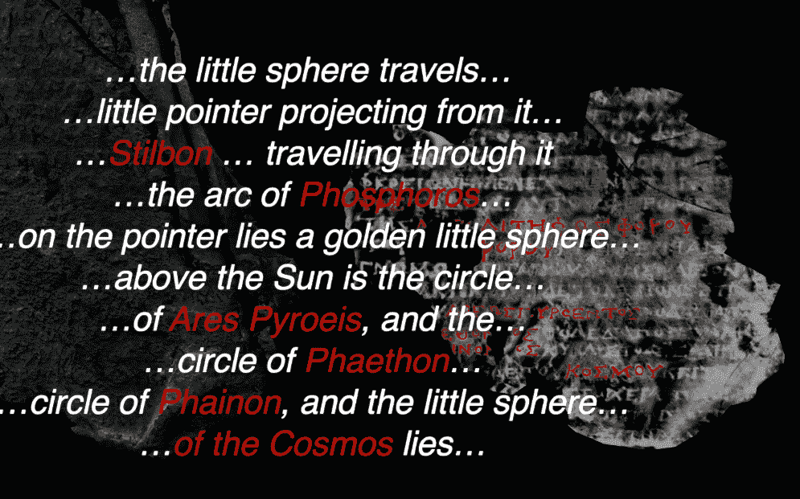
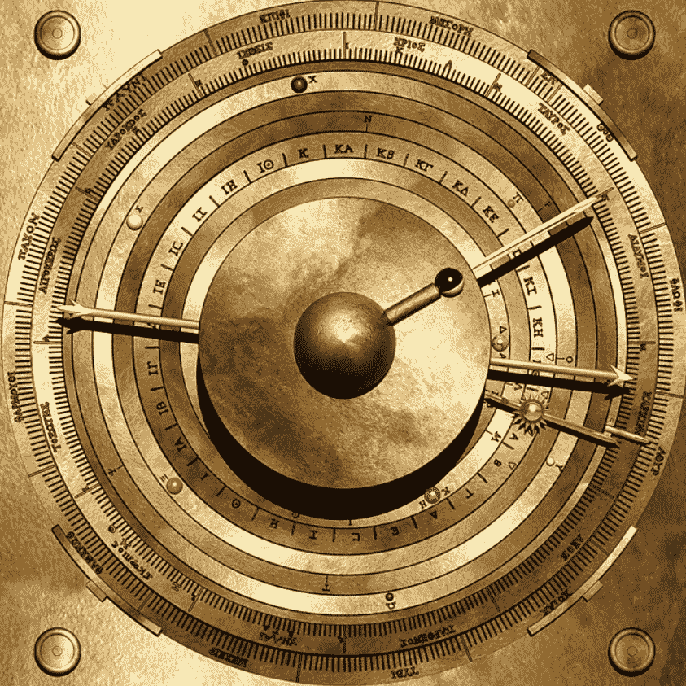

# 研究人员重新创造了世界上最古老的计算机安蒂基西拉机制

> 原文：<https://thenewstack.io/researchers-re-create-the-antikythera-mechanism-the-worlds-oldest-computer/>

研究人员认为，他们终于重现了通常被认为是世界上最古老的计算机。在一艘 2000 年前的沉船残骸中发现的[安蒂基西拉机械装置](https://en.wikipedia.org/wiki/Antikythera_mechanism)被[描述为](http://antikythera-mechanism.gr/project/overview)“古代世界已知的最复杂的机械装置。在接下来的一千年里，没有什么比这更复杂的了。”

“现在分裂成 82 个碎片，只有三分之一的原件存活下来，”最近的一篇文章解释道，“包括 30 个腐蚀的青铜齿轮。”

在现代技术的胜利中，伦敦大学学院的研究人员相信他们已经推断并破译了原始机器如何执行计算——并确定了所有相应的机械部件。为了匹配这个虚拟版本，他们现在正在建造一个物理模型来向世界展示他们的发现。

该团队上传到 Vimeo 的一段视频称其为“一个极其复杂的 3D 拼图——科学家们已经努力了一个多世纪来将它们重新组合在一起。”

他们将其描述为“迄今为止古代世界最复杂的工程”

## 组装零件

1901 年，潜水员在希腊的一个小岛附近收集海绵时发现了安蒂基希拉机械装置的遗迹

首次发现于 1901 年，这一发现让考古学家感到困惑。线索出现在 20 世纪 50 年代，当时第一次进行了 x 光检查——发现了 30 个相互啮合的齿轮。然后在 2005 年，研究人员试图使用更复杂的高分辨率 X 射线对碎片进行检测，使用了一种叫做微焦点 X 射线计算机断层扫描(X 射线 CT)的计算机辅助技术。在碎片的深处，“我们可以看到新的文本字符——成千上万的新文本字符，”机械工程师托尼·弗里斯在视频中说。有些文字已经被遗忘了 2000 多年，只是被重新发现了。

封面上留下的铭文列出了行星相对于太阳的轨道上的年份。但是还有另一个伟大的历史发现时刻。虽然封底丢失了，但它的一些铭文却因印在邻近的碎片上而被无意中保存了下来。

“你只能辨认出一些文字，但这是镜像书写，”视频解释道。

封底的题词实际上描述了当时所有五颗已知的行星，它们被展示在一个环形系统中——历史上此时已知的每一颗行星——以及太阳和月亮。该视频一度将这段铭文描述为“用户手册”，暗示它提供了可用于调出各种行星排列的数字，并允许古希腊人计算天体事件之间的天数。

但是研究人员能证明这一点吗？

## 另一个重要发现

根据人们对这款设备的了解，已经没有太多的空间来放置任何额外的齿轮了。对于像这样的设备，它的设计似乎是基于行星在一定数量的年内围绕太阳运行的轨道数量。不幸的是，他们的[研究人员的论文](https://www.nature.com/articles/s41598-021-84310-w#Fig1)指出，金星的准确数字应该是每 1151 年运行 720 圈——“需要一个 1151 齿的齿轮。”(因为 1151 是一个质数，所以不可能用更小的数来达到同样的结果。)

但在 2016 年，研究人员有了一个重要的发现:封面铭文的剩余文本中又多了两个数字。数字 462 出现在金星部分，442 出现在土星部分。因此，他们的新论文最终提出了一种理论，解释古代天文学家是如何得出这些数字的——然后使用该理论来计算该设备的其他三颗行星的缺失数字。

简短的回答是:它们是相对精确的近似值——也允许最简单的齿轮设计。因为值得注意的是，研究人员为金星部分假设的缺失的第二个数字与水星的相应数字共享一个因子 17，研究人员指出，这使得这些数字“适合用于共享齿轮设计”(具体来说，水星和金星都是“单一固定的 51 齿齿轮”)。类似地，火星和木星的模式与土星有 7 倍的相似性，允许一个 56 齿的齿轮处理三个行星，并且“导致非常经济的设计……如果没有这些可以安装在同一个板上的紧凑系统，就不可能将齿轮安装到可用的空间中。”

所以这个关于这个装置模拟的计算的新理论也提供了关于它是如何建造的线索。他们还计算了幸存齿轮的齿数，并检查了固定在齿轮上的圆盘，这些圆盘控制着金属板的位置。该设备的足够多部分幸存下来，以表明月球的位置和相位是如何显示和计算的——但“对于太阳和行星，我们需要开发理论机制。”

但最终:他们做到了。他们的论文称，他们已经提出了“新的理论行星机制”，并提供了所有的技术细节。对于 35 个幸存的齿轮，他们推测还有 34 个额外的齿轮(总共 69 个)，每个轨道上这些年的质数因子(根据铭文)决定了这些齿轮如何组合在一起。

## “绝对漂亮”

当然，他们的论文包括证明这些机制确实产生了预期的结果。他们欢呼这是第一次所有已知的功能和组件都得到了解释。他们还创造了一个最终结果的金色计算机模型:“一个优雅的古希腊机械宇宙”，其中“行星由行星环上的半宝石识别。”月亮的相位甚至用一个在洞中旋转的黑白小球来指示。

为了进一步证实，他们注意到古希腊数学家阿基米德已知已经[建造了类似的装置](https://en.wikipedia.org/wiki/Archimedes#Antikythera_mechanism)来预测月球和行星的运动。“这不是复杂的数学。这是简单的算术，也是简单的几何，”弗里斯在视频中说，“但以一种绝对美丽的方式放在一起。”

该机制在更大的技术历史中也占有非常特殊的地位。“这是已知的第一个将科学理论预测机械化的设备，”论文总结道。由于这些时间间隔很难计算出任何其他时间间隔，该论文还提出了另一种有趣的可能性:该设备“可以自动完成其自身设计所需的许多计算。”这将使它成为技术迈向文明的一个独特的里程碑:“数学和科学机械化的第一步。”

“我们的工作揭示了 Antikythera 机制是一个美丽的概念，由高超的工程技术转化为天才的装置。”

此外，“它挑战了我们对古希腊人技术能力的所有先入之见，”视频说道。

* * *

# WebReduce

<svg xmlns:xlink="http://www.w3.org/1999/xlink" viewBox="0 0 68 31" version="1.1"><title>Group</title> <desc>Created with Sketch.</desc></svg>