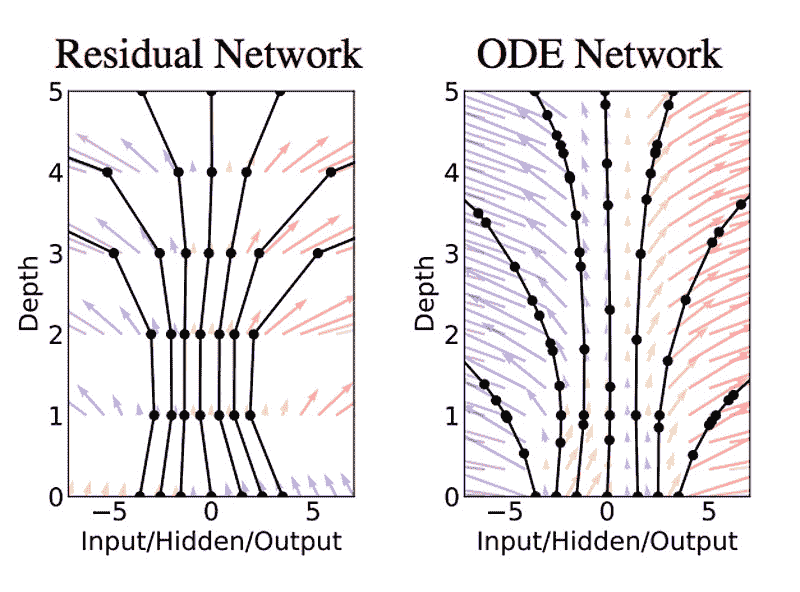
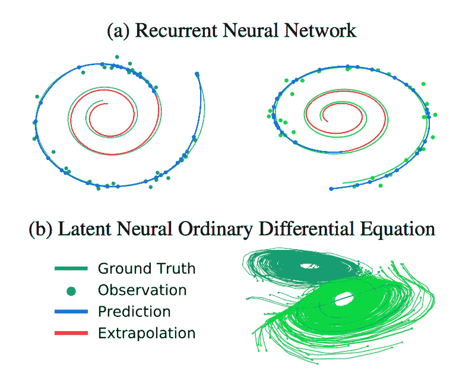

# 研究人员为不断变化的数据重新设计神经网络

> 原文：<https://thenewstack.io/researchers-redesign-neural-networks-for-continuously-changing-data/>

近年来，当谈到将人工智能应用于我们的日常生活时，我们已经看到了太多的可能性——无论是在支撑我们许多人享受的数字服务的[推荐引擎](/40-something-dude-asks-for-music-recommendation-redditors-point-to-the-algorithms/)中，还是在引导自动驾驶汽车的[系统](/deep-learning-algorithm-helps-driverless-cars-recognize-pedestrians-better/)或帮助我们开发[尖端超材料的](https://thenewstack.io/researchers-use-ai-to-create-super-compressible-meta-material/)背后。特别是，所谓的[深度学习](/five-essential-pieces-deep-learning-puzzle/)——一系列试图模拟人脑内部工作的先进机器学习技术——正在帮助我们为新的[救命药物](https://thenewstack.io/new-machine-learning-algorithms-accelerate-drug-discovery-desktop-computers/)、[增强自然语言处理](/recent-advances-deep-learning-natural-language-processing/)，甚至[识别遥远的星系](/facial-recognition-aigorithm-re-trained-to-recognize-faraway-galaxies/)铺平道路。

虽然有很大的潜力，但在数据分布在连续时间跨度上的情况下使用深度学习人工智能时，仍有一些问题需要解决——例如跟踪患者的健康信息，或金融市场中特定股票的涨跌(也称为[时间序列](/time-series-data-care/)数据)。这是因为深度学习依赖于[人工神经网络](/playtime-neural-network/) (ANN)，它由堆叠在不同层的互联计算节点组成。这些层都协同工作，在数据过滤时检测数据中的模式，但由于这些层的结构方式，人工神经网络更擅长处理以固定时间间隔出现的离散数据块，因此不太适合处理随时间不断变化的时间序列类型的数据。

难怪去年年底，当多伦多大学的一组研究人员提议重新思考人工神经网络的设计方式时，该领域的其他专家注意到了。该团队的[论文](https://arxiv.org/pdf/1806.07366.pdf)提出了所谓的**神经常微分方程**，它通过将微积分中的概念融入深度学习过程来解决这个问题，而不是利用离散层。您可能还记得，[微积分](https://betterexplained.com/articles/a-gentle-introduction-to-learning-calculus/)是研究连续变化的数学分支，因此这意味着团队的方法更适合于不定期输入的数据，如患者一生中的健康数据，而不是将数据分解成单独的部分。

“一些机器学习模型非常容易解释，但在现实世界中太简单而不准确，”论文合著者、多伦多大学研究生 Ricky Chen[告诉新堆栈。统计学家经常使用这些方法，但是它们的简单性会导致错误的结论。其他人是高性能的，但不承认他们的预测简单的解释。这些通常用于计算机视觉和自然语言处理，在现实世界的应用中具有非常好的性能，但对于更敏感的任务(如自动驾驶汽车)来说太不可靠，因为它们的性质无法解释。我们希望建立既可解释又足够复杂的模型来反映现实世界的现象。从物理学家最喜欢的模型——微分方程中获得灵感，似乎是朝着这个方向迈出的自然一步。"](http://www.cs.toronto.edu/~rtqichen/)

左图:残差网络定义了有限变换的离散序列。右图:一个常微分方程(ODE)网络定义了一个不断变换状态的场。

## 更好地模拟持续变化

该团队的方法不仅在计算上更加高效，另一个主要优势是，它甚至可以应用于团队的算法不知道正在发生什么的情况下，这使得它比其他方法更加通用。这种机器学习工具对于学习复杂的、现实世界中不断产生变换数据的现象非常有用。

“这包括物理交互，如学习和预测简单的物理，如物体如何碰撞，以及更复杂的场景，如天气或龙卷风预报，以及受益于连续预测的应用，如模拟患者的健康记录-例如，可以用来确定患者何时应该在不良症状出现之前进行某些测试，”陈解释说。

通过递归神经网络(a)和团队的模型(b)重建和外推具有不规则数据点的螺旋。

目前，在神经常微分方程获得更广泛的实施之前，还有一些路要走，尽管很明显，这种新的深度神经网络模型家族的未来影响可能会非常广泛。令人鼓舞的是，它已经被应用于其他研究项目，专注于 3D 图形中的点云，更准确地说是医学成像中识别结肠腺的 T2。目前，该团队正致力于将更多的机制引入他们的模型，例如在未来的预测中纳入考虑随机性和不确定性的元素。

[https://www.youtube.com/embed/AD3K8j12EIE?feature=oembed](https://www.youtube.com/embed/AD3K8j12EIE?feature=oembed)

视频

图片:多伦多大学

<svg xmlns:xlink="http://www.w3.org/1999/xlink" viewBox="0 0 68 31" version="1.1"><title>Group</title> <desc>Created with Sketch.</desc></svg>