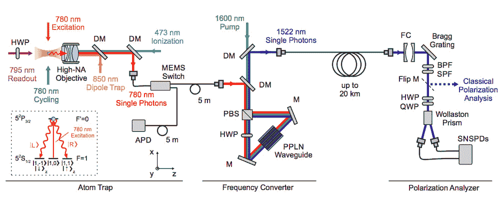

# 研究人员为未来量子网络创造新的量子纠缠记录

> 原文：<https://thenewstack.io/researchers-set-new-quantum-entanglement-record-for-future-quantum-networks/>

由于网络犯罪和大规模数据泄露的增加，专家们现在正在努力建立[不可破解的量子网络](/scientists-adapt-1930s-radio-tech-help-build-unhackable-quantum-internet/)，这种网络能够安全地接收、发送、存储和处理单个光子携带的量子信息。理论上，这些网络被认为是不可破解的，因为如果未经授权的第三方访问这些信息，这些单个光粒子将被不可逆转地转化或破坏。但在现实中，这些量子系统仍有一些问题需要解决——例如找到一种可靠地长距离发送光子而不丢失任何信息的方法。

现在，建立一个可靠的、不可破解的量子互联网的希望更近了一步，这要归功于来自 [Ludwig Maximilian 大学](http://www.en.uni-muenchen.de/)和[萨尔州大学](https://www.uni-saarland.de/en/)的一组德国研究人员，他们创造了在 20 公里长的光纤电缆上发送量子信息的新纪录。之前的记录只有 700 米，这一新的基准可能意味着安全的量子网络——连接世界上独立的量子计算机——可能不会太遥远。

为了实现这一点，研究人员不得不使用量子力学[中的一种属性](https://www.britannica.com/science/quantum-mechanics-physics)，称为[纠缠](https://www.youtube.com/watch?v=5_0o2fJhtSc)，当一对粒子通过不确定但相关的量子状态联系在一起时，就会发生这种情况。奇怪的是，一个粒子的状态取决于另一个粒子，这意味着作用于一个粒子会导致其孪生粒子的状态发生变化，即使它们相距较远，这与经典力学告诉我们的一切都是可能的。

## 转换量子频率

毫不奇怪，许多专家已经试验了利用量子纠缠的不同方法来创建量子网络。该团队在 [*物理评论快报*](https://journals.aps.org/prl/abstract/10.1103/PhysRevLett.124.010510) 上发表的论文描述了他们如何能够利用量子纠缠，通过使用单个光子作为信息载体和单个被捕获的[铷](http://www.chemicalelements.com/elements/rb.html)原子，创建一个[量子通道](https://www.sciencedirect.com/topics/mathematics/quantum-channel)来连接量子系统的两个节点。为了携带量子信息，光子需要通过被称为[极化](http://farside.ph.utexas.edu/teaching/qm/lectures/node5.html)的过程与原子的内部状态“纠缠”。

“这样一种纠缠的原子-光子状态如今可以例行公事地产生，但光子有一个问题:如果我们看看基于光纤的网络，如果它们的波长在低损耗电信窗口内——通常在 1500 纳米左右，光子才是信息的主要载体，”德国萨尔州大学实验物理学教授克里斯托夫·贝歇耳说，他也是这项研究的合著者之一。

为了解决这种波长差异，该团队开发了他们所谓的量子频率转换器(QFC)版本，它改变光子的波长，以便量子纠缠可以在更长的距离内保持，而不会有明显的信号损失。该团队首先在激光原子阱中捕获铷原子，然后将它们冷却到接近绝对零度的温度。

实验装置图，展示了量子纠缠是如何产生和观察的。

然后通过使用高度聚焦的激光束(这种技术被称为使用“[光镊](https://physicsworld.com/a/optical-tweezers-where-physics-meets-biology/)”)从束中选择一个单独的原子，然后用短激光脉冲轰击，以“激发”它，将其推至两个相邻的能量状态，这可以被描述为那个[激发态](https://www.thoughtco.com/definition-of-excited-state-605112)的“自旋向上”和“自旋向下”形式。受激原子发射光子，然后在原子衰变过程中，原子自旋态与发射光子的偏振态纠缠在一起。这种极化光子随后被捕获，其波长从 780 纳米转换为 1522 纳米，这更适合电信应用，因为它允许光子沿着 20 公里(12 英里)的光纤电缆放大，而信号强度没有降低，同时保留 78%的量子纠缠。

“量子态非常脆弱，很难让它们‘存活’足够长的时间，以适应光子超过 20 公里的旅行时间，”贝歇耳解释道。“实验中光子的任何损失都会增加你运行实验的时间，以便验证量子态确实是纠缠态。每一个光子都很重要！[所以]20 公里的距离对于铷原子平台来说是一个巨大的进步，与最近使用捕获离子或原子系综的实验不相上下。”

该团队现在已经证明，建立一个能够单向发送信息的量子通道是可能的。接下来，它计划开发一种方法，使信息可以双向流动，创建一个能够保持节点到节点纠缠的“量子段”——这是建立量子中继器的另一个关键步骤，量子中继器将在远程量子网络上有效地分布纠缠态。

图片:慕尼黑路德维希马克西米利安大学和萨尔州大学

<svg xmlns:xlink="http://www.w3.org/1999/xlink" viewBox="0 0 68 31" version="1.1"><title>Group</title> <desc>Created with Sketch.</desc></svg>