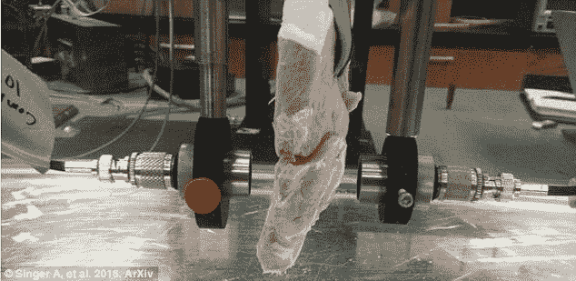
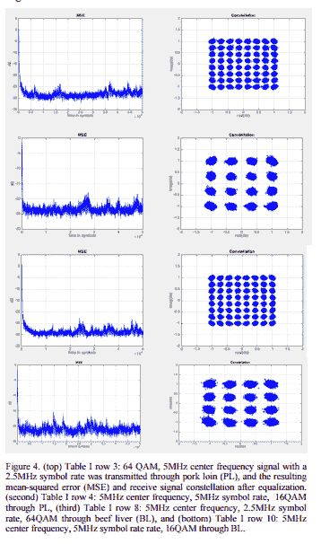

# 研究人员通过牛肉和猪肉传输 WiFi 数据

> 原文：<https://thenewstack.io/researchers-stream-wifi-data-beef-pork/>

你的肠子是不是要加入物联网了？

也许吧。伊利诺伊州研究员[安德鲁·辛格](https://www.ece.illinois.edu/directory/profile/acsinger)，他以前在海军潜艇上研究超声波，[意识到](http://arxiv.org/abs/1603.05269v1)同样的水下传输技术可以用来改进目前用于传输我们体内数据的医疗设备。

对辛格来说，水下数据传输的联系似乎是显而易见的，他告诉《新科学家》，“你是[一大袋盐水](https://www.newscientist.com/article/2084429-wireless-signal-sent-through-meat-fast-enough-to-watch-netflix/)，里面有一些骨头和一些其他组织。”所以他买了一些猪里脊肉和牛肝——仍然用塑料包裹着——并带领他的研究团队进行了一项实验，证明标准的商业传感器实际上可以通过肉类传输数据。

现在我们知道我们可以通过肉类传输数据。而不仅仅是涓涓细流。辛格的实验测得的数据速度高达 30 Mbps，他简洁地描述为“例如，足以观看网飞”

如今，大多数医疗设备都使用射频信号，这极大地限制了可用带宽，并且还存在一些信号丢失的固有问题。但是转换到“感应信号”将开启高清视频的可能性，从体内实时传输。

第一个使用案例可能是心脏病人——想想起搏器和除颤器——但最终这项技术可能适用于从血糖监测器和胰岛素泵到从消化道内部发回照片的可摄取相机的所有东西。

辛格在一份声明中说:“你可以想象一个为了对消化道成像而吞下的设备，但它具有将高清视频连续直播到外部屏幕的能力。”

 
歌手的作品迅速引发了轰动，成为网络头条。"现在，这是一个增强的无线网络！"英国《每日邮报》开玩笑说，“通过肉发送的无线信号证明我们的身体[可能很快就会连接到网络](http://www.dailymail.co.uk/sciencetech/article-3541640/Now-s-beefed-Wi-Fi-network-Wireless-signals-sent-meat-prove-BODIES-soon-connect-web.html)，‘承诺好处’不仅仅是通过烤猪肉传输网飞。”

《大众科学》指出了另一个优势:我们现在已经使用超声波来拍摄身体的图像，并且已经使用了几十年，所以这是一项被广泛接受的安全有效的技术。事实上，他们最担心的似乎是黑客。“如果设备将通过超声波发送数据，研究人员可能只需确保他们加密了数据。”

但研究人员的下一个挑战将是证明它在不同种类的组织和多层器官中有效。伦敦玛丽皇后大学的副教授 Akram Alomainy 告诉《新科学家》,数据可能会因人体组织的不同层而变慢。

但是辛格和他的团队坚持不懈——即使科学小报觉得这有点奇怪。辛格在一份声明中说:“这在今天看来可能像科幻小说，但科幻小说的根本是关于什么是可能的问题。

“我们想证明这是可能的，而工程总是要达到邻近的可能。”

* * *

# WebReduce

通过 Pixabay 的特征图像。

<svg xmlns:xlink="http://www.w3.org/1999/xlink" viewBox="0 0 68 31" version="1.1"><title>Group</title> <desc>Created with Sketch.</desc></svg>