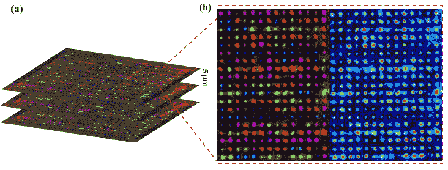

# 研究人员揭开数十亿年的数据存储

> 原文：<https://thenewstack.io/researchers-unveil-billion-year-data-storage/>

南安普敦大学正在开发的一项新技术可以在每张磁盘上存储高达 360 兆字节的数据。这是 DVD 存储容量的 75，000 多倍，蓝光光盘容量的 7，000 多倍。

然而，比它巨大的容量更好的是它的坚韧。在室温下，这些光盘预计将持续 138 亿年，这是地球年龄的三倍多。另外，它可以承受高达 1800 华氏度(1000 摄氏度)的高温。

早在 2013 年，[团队负责人解释说](http://www.orc.soton.ac.uk/5dopticalstore.html)“我们正在开发一种非常稳定和安全的使用玻璃的(高密度)便携式存储器”，并指出它可能“对拥有大量档案的组织非常有用”他们的最新研究于上周在旧金山举行的国际光学工程学会光子西方会议上发表。

[https://www.youtube.com/embed/OP15blgK5oU?feature=oembed](https://www.youtube.com/embed/OP15blgK5oU?feature=oembed)

视频

这些规格听起来像是科幻小说中的技术。使用一种叫做超快激光的东西，研究人员将数据写在熔融石英上，熔融石英的熔点比普通玻璃高得多。

在过去的实验中，激光分裂成 256 个较小的光束，每个激光印记点存储 3 位信息。这些点影响了光线穿过玻璃的方式，可以使用光学显微镜和偏振器读取，被描述为类似于太阳镜的效果。它被认为是五维数据存储，因为信息是由三维的值、数据的方向和光的强度来表示的。

“激动人心”，这是该小组的一位教授对这项创新的描述。“这项技术可以保护我们文明的最后证据:我们所学的一切不会被遗忘。”

出于这个原因，他们称之为“超人记忆水晶”，他们已经保存了《圣经》和《大宪章》的副本，他们认为它们可能比人类更长寿。“我们可以编码任何东西，”该项目的一名研究生[告诉 *The Verge*](http://www.theverge.com/2016/2/16/11018018/5d-data-storage-glass) 。“我们有能力将人类的文化、语言和精髓储存在一块简单的玻璃中。未来的文明——或者其他任何存在的东西。”

他们的下一步？当然是商业化，包括寻找行业合作伙伴，开发他们的日常使用技术。甚至早在 2013 年，该团队就在一份报告(PDF)中写道，“我们通过飞秒激光写入实验演示了 5D 光学数据的记录和读出过程。”

"这次演示是基于超快激光的光学数据存储走向商业化的关键一步."

* * *

## WebReduce

<svg xmlns:xlink="http://www.w3.org/1999/xlink" viewBox="0 0 68 31" version="1.1"><title>Group</title> <desc>Created with Sketch.</desc></svg>