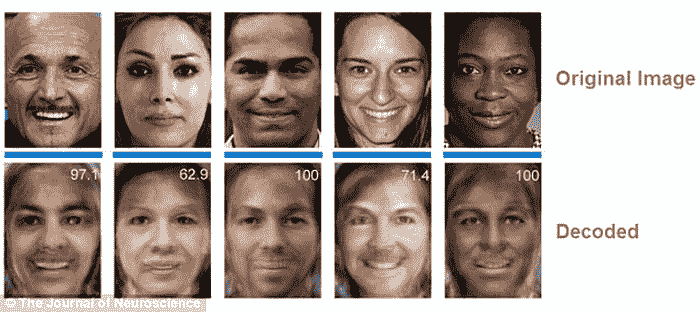
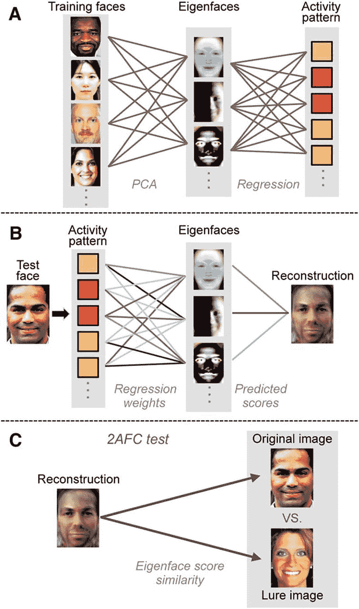
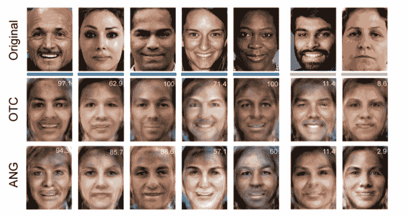

# 人工智能如何重建你的记忆

> 原文：<https://thenewstack.io/researchers-use-ai-read-reconstruct-memories/>

我们没有一天不听到人工智能可以做一些令人惊讶的新事情。从击败人类象棋冠军、[围棋冠军、](https://thenewstack.io/alphagos-win-human-go-champion-means-ai/)扑克冠军、到帮助[发现药物、](https://thenewstack.io/new-machine-learning-algorithms-accelerate-drug-discovery-desktop-computers/)和[管理分布式微型电网](https://thenewstack.io/power-blox-uses-swarm-intelligence-create-distributed-micro-energy-grids/)，人工智能正在执行曾经想不到的任务。

但是几乎不可能的事情正在发生，而且发生得很快。我们已经听说了研究人员现在如何训练人工智能解码人脑中的复杂想法。现在，来自俄勒冈大学的一组科学家正在使用人工智能来实际获取某人的记忆，并且几乎是从他们的大脑中“提取出来”——或者至少是一幅图像。

该团队的发现最近发表在神经科学杂志上，详细描述了如何从人类大脑的角回中检索编码记忆的内容，角回是后外侧顶叶皮层的一部分，它控制着许多功能，包括语言，数字处理，空间认知，注意力和记忆检索。

## 计算机视觉

以下是多部分实验的设计。在实验的第一部分，研究中的 23 名参与者在观看一系列照片时，每个人的大脑活动都在 fMRI(功能性磁共振成像)机器中进行扫描，每张照片都描绘了一个不同的人的头像。

然后，fMRI 会检测这些参与者在看到这些照片时大脑循环流量的任何变化，这些轻微的变化会被人工智能软件实时记录和处理。肤色、眼睛形状和其他明显的面部特征被分解成所谓的[特征脸](https://en.wikipedia.org/wiki/Eigenface)——或计算机视觉和面部识别软件计算中使用的向量值。

研究人员写道:“使用受计算机视觉方法启发的人脸识别方法，我们将主成分分析应用于大量人脸图像，以生成特征脸。”

这些特征脸然后在一个编号系统中进行评级，以便它可以被翻译成人工智能可以解析为训练数据的东西。

“然后我们模拟了特征脸值和 fMRI 活动模式之间的关系，”研究小组解释道。“然后，由每个人的脸引发的活动模式被用来生成预测的特征脸值，这些值可以被转换成每个人的脸的重建图像。”

## 重建的记忆

对于实验的第二部分(或者可以称为“读心术”)，人工智能随后被测试其重建新一轮面部照片的能力，只使用通过 fMRI 机器收集的参与者记录的大脑活动数据。基于上一轮的训练数据，人工智能能够将测试对象的神经模式“翻译”成构成重建图像基础的特征脸。下面是出现的内容:

这并不令人难以置信的准确，但与此同时，一些可怕的不可思议可能正在这里出现。

在另一项测试中，参与者被要求在他们的记忆中回忆某人的面孔，这些记忆是从大脑的角回中存储和检索的。这些人工智能驱动的重建出人意料地成功，在很大程度上，人工智能能够得出不同的品质，如性别、肤色和情感表达。

为了验证他们的结果，并获得对大脑内部工作的一些见解，研究小组比较了由记忆检索角回(ANG)和使用枕颞皮质(OTC)进行的重建，枕颞皮质对面部特征很敏感。

研究人员写道:“令人惊讶的是，我们还发现，在面部感知期间接受 ANG 活动模式训练的模型能够成功重建一组独立的面部图像，这些图像保存在记忆中。”“…角回的[活动]模式[支持]感知和记忆面孔的成功重建，证实了该区域在积极呈现记忆内容中的作用。”

正如你在这里看到的，所谓的机器读心术还没有完全实现。正如研究人员指出的那样，结果也证明了这一点，人们仍然能够控制他们的记忆是如何形成的，例如，在这个实验中看到的重建记忆还不足以让人们在精神上准确地识别出一个毫无疑问的嫌疑罪犯。但是，这项技术似乎正在取得进展，我们可能最终会在某一天达到这一点。

在 *[《神经科学杂志》](http://www.jneurosci.org/content/36/22/6069.full)阅读全文。*

图片:俄勒冈大学

<svg xmlns:xlink="http://www.w3.org/1999/xlink" viewBox="0 0 68 31" version="1.1"><title>Group</title> <desc>Created with Sketch.</desc></svg>