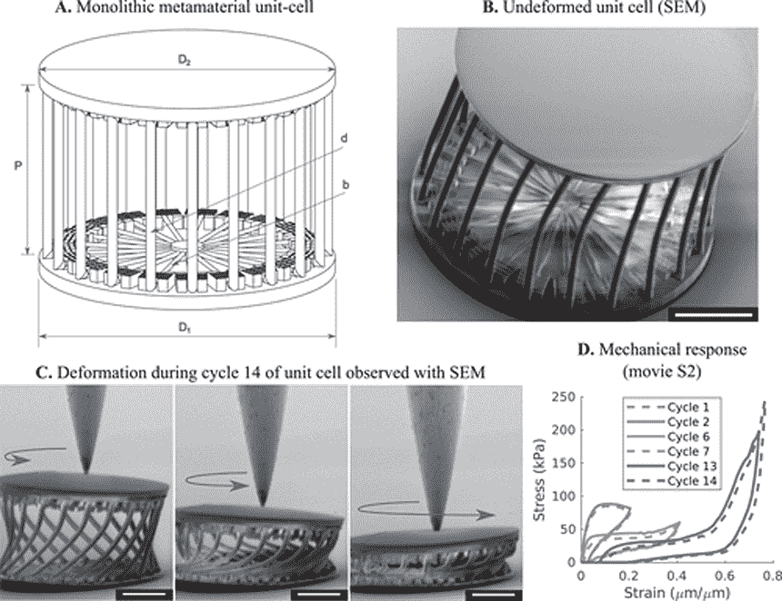
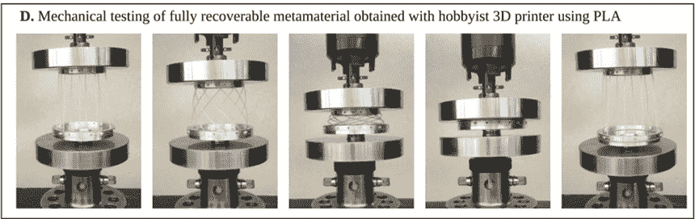
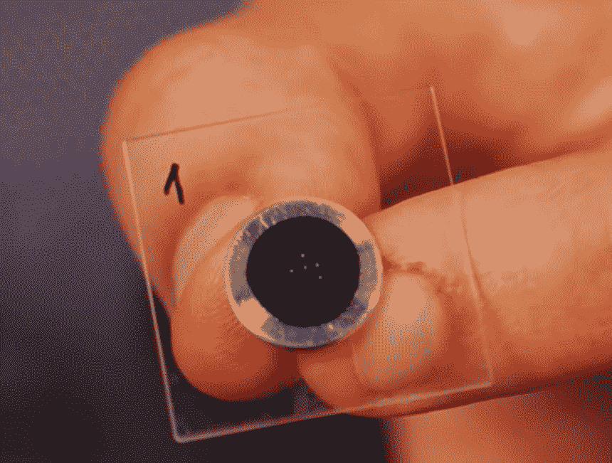

# 研究人员利用人工智能创造超可压缩超材料

> 原文：<https://thenewstack.io/researchers-use-ai-to-create-super-compressible-meta-material/>

我们正在慢慢但肯定地习惯于在我们的日常生活中拥有某种形式的人工智能的想法，从[智能个人助理](https://thenewstack.io/rebuilding-ai-toward-a-feminist-alexa/)到驱动[在线推荐引擎](https://thenewstack.io/40-something-dude-asks-for-music-recommendation-redditors-point-to-the-algorithms/)的算法。毫不奇怪，人工智能也在帮助加速广泛领域的发现过程——无论是发现新的、拯救生命的[药物](https://thenewstack.io/new-machine-learning-algorithms-accelerate-drug-discovery-desktop-computers/)，还是展示非凡性能的创新材料——所有这些都不依赖于通常的实验试错过程。

对于荷兰代尔夫特大学的研究人员来说，人工智能在他们开发一种超级可压缩的超材料中发挥了重要作用，这种材料通常是易碎的。有了这种新的超材料，像自行车或家具这样的物体可以由这种超级可压缩的物质制成，然后压缩成可以放进口袋的东西。看一看:

[https://www.youtube.com/embed/cWTWHhMAu7I?feature=oembed](https://www.youtube.com/embed/cWTWHhMAu7I?feature=oembed)

视频

与自然产生的材料相比，超材料是人工设计的，具有自然界中没有的属性，这意味着它们可以做一些非常惊人的事情——比如被“编程”为自动变形。尽管超材料听起来是高科技，但它们的开发方式通常还是相当传统的。

“超材料的设计依赖于大量的实验和试错法，”该研究的合著者米格尔·贝萨说，他是代尔夫特大学材料科学与工程的助理教授。“我们主张通过使用机器学习来探索新的设计可能性，同时将实验减少到绝对最低限度，从而逆转这一过程。”

虽然乍一看，这种方法对我们这些习惯于利用现实世界的实验来制定解决方案的人来说似乎是违反直觉的，但这种新的人工智能辅助方法对于寻求更省时、更具成本效益的研发方法的公司或机构来说是有意义的，它允许人类专家产生否则不会出现的新想法。

在设计他们的新材料时，团队遵循了计算数据驱动的方法。特别是，他们专注于利用[贝叶斯机器学习](https://thenewstack.io/bayesian-inference-a-key-building-block-of-an-ai-foundation/)，这使得他们一方面可以动态地调整他们的模型，以适应不同的目标属性和基础材料，以及各种规模和制造方法。人工智能通过模拟来测试虚拟的超材料，尝试各种几何形状和配置，从失败的模拟中逐步学习，以便提出功能良好的东西。

“重要的是，机器学习创造了一个机会，通过从实验引导的调查转向计算数据驱动的调查来逆转设计过程，即使计算机模型丢失了一些信息，”Bessa 解释道。“基本要求是，关于感兴趣问题的‘足够’数据是可用的，并且数据足够准确。”

该团队的宏观设计的真实测试使用了人工智能虚拟创建的超材料。

使用机器学习来模拟他们的超材料的行为，该团队制作了两种设计。一种设计是在宏观尺度上创造的，并面向最大的可压缩性，这要归功于它的双环排列，可以扭曲和挤压成几乎平坦的轮廓。在他们的计算机上进行虚拟调整后，该设计通过熔融细丝制造和使用聚乳酸(PLA)材料在桌面 3D 打印机上打印出来，最终结果具有近 100%的可压缩性。类似地，第二个设计是超材料的微型版本，为高强度和刚度量身定制，表现出大约 80%的可压缩性。

该团队的微米级超材料。

可以想象，这种数据驱动的方法将极大地简化和微调设计过程。根据研究团队的说法，通过将人工智能添加到组合中，专家将能够放弃材料科学和其他领域通常进行的大量繁琐耗时的反复试验，这可能会彻底改变我们创新和科学发现的方式。

你可以在这里阅读团队的论文，在 [Github](https://github.com/mabessa/F3DAS) 上找到团队的代码。

图片:代尔夫特大学

<svg xmlns:xlink="http://www.w3.org/1999/xlink" viewBox="0 0 68 31" version="1.1"><title>Group</title> <desc>Created with Sketch.</desc></svg>