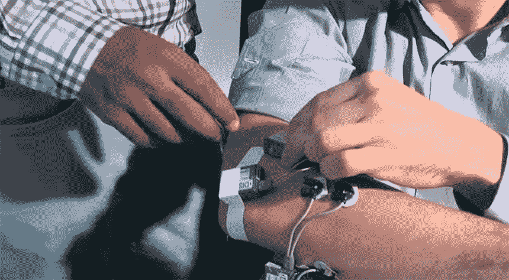
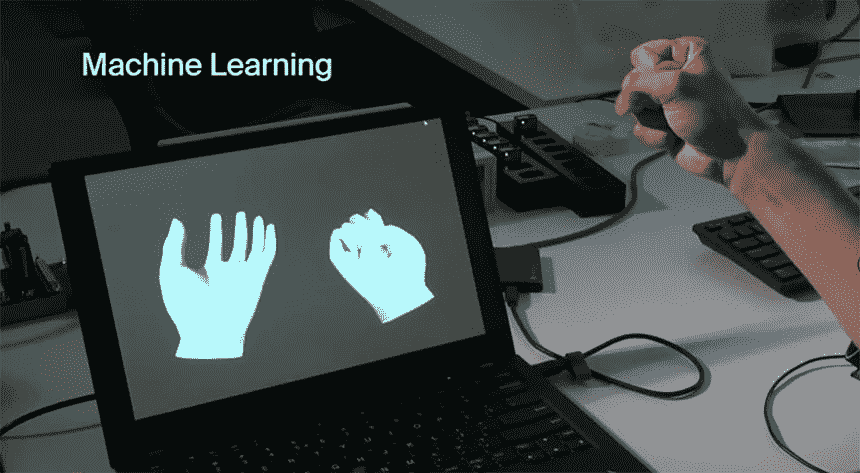
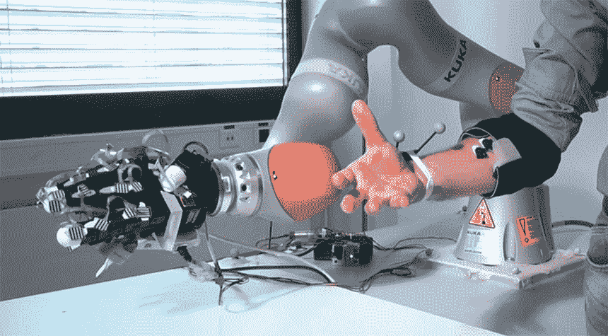
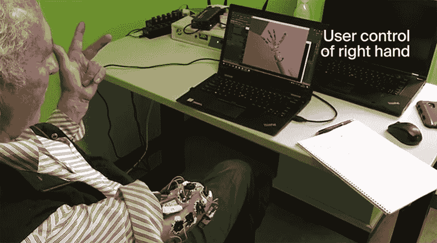

# 研究人员使用人工智能让截肢者“共享控制”神经假体手

> 原文：<https://thenewstack.io/researchers-use-ai-to-give-amputees-shared-control-of-neuroprosthetic-hand/>

失去肢体是一个改变生活的事件，会对一个人生活的各个方面产生重大影响。但是，今天新的和改进的假肢可能会在一定程度上简化调整过程，这要归功于最近的进步，如 [3D 打印假肢](https://thenewstack.io/victoria-hand-project-applying-3d-printing-to-prosthetics/)既可以负担得起又可以为用户量身定制，以及增加了人工智能算法，可以帮助[快速有效地“调整”假肢](https://thenewstack.io/ai-algorithm-automatically-tunes-prosthetics-within-minutes/)，以及其他机器学习技术，允许用户[只用思想控制机器人肢体](https://thenewstack.io/control-robotic-arm-mind-using-machine-learning/)。

诸如此类的创新正在开辟新的领域，如[神经假体](https://en.wikipedia.org/wiki/Neuroprosthetics)，它将神经科学与生物医学工程的元素交织在一起，创造出可以替代或增强受损运动、感觉或认知能力的设备，如使用微电极阵列处理听觉信号的耳蜗植入物。

但是，即使有了所有这些改进，对于截肢者来说，在精确抓取东西时，控制假肢仍然不容易。为了解决这个问题，瑞士洛桑联邦理工学院( [EPFL](https://www.epfl.ch/en/) )的研究人员正在使用机器学习来让假肢手的用户更好地控制每个手指，同时也自动化抓取和操作过程。听他们解释这个“共享控制”系统是如何工作的:

[https://www.youtube.com/embed/L_jhQxMF8R4?feature=oembed](https://www.youtube.com/embed/L_jhQxMF8R4?feature=oembed)

视频

这里的想法是让人工智能翻译和增强假肢用户的预期运动，特别是在用户的肌肉活动不足以完成任务的情况下，比如抓瓶子。也许这个人可能会失去抓力，这意味着在物体开始下落之前，他们只有几毫秒的时间做出反应并重新调整抓力。这就是人工智能可以提供帮助的地方，它可以自动解释用户的肌肉信号，以确保机器人的手不会在不应该松开的时候松开，甚至在人脑可能察觉到瓶子即将滑落之前。

“因为肌肉信号可能有噪音，我们需要一种机器学习算法，从这些肌肉中提取有意义的活动，并将它们解释为运动，”[解释道](https://actu.epfl.ch/news/a-smart-artificial-hand-for-amputees-merges-user-a/)凯蒂·庄，[研究](https://www.nature.com/articles/s42256-019-0093-5)的第一作者，最近发表在*自然机器智能*上。

该系统的工作原理是，首先让假肢佩戴者通过一系列手部运动“训练”一个机器学习模型，而放置在用户截肢末端的传感器收集肌肉活动的数据。然后，该算法能够通过分析和识别这些数据中的模式，学习如何实时解读用户的意图，然后允许它预测用户打算的手部动作。一旦学习了这些模式，这就允许系统帮助用户更精确地控制假手的单个手指，从而为用户提供比传统假肢更大的灵活性。

但仅仅预测运动只是开始:下一步是进一步调整算法，以便当假肢佩戴者试图捡起一个物体时，自动化过程就会发生。由于压力传感器排列在假手的每个手指上，当手指实际接触到物体时，算法将发送信号让假手关闭。这是该团队开发的一个方便(没有双关语)的功能，基于之前的工作，即利用仅从触觉收集的数据，赋予机器人肢体检测和抓取物体的能力。当这个人想要释放对象时，他们会启动放手的动作，算法会将控制权交还给用户。因此，通过用户手臂上的传感器、机器人手和算法的协同工作，该过程在某种程度上是自动化的，允许用户以足够的力轻松抓住目标物体，而不用担心他们会意外掉落。

根据该团队的说法，他们的智能假肢成功地应用于三名截肢者和七名健全的测试对象。虽然这种“共享控制”系统准备投入商业市场还需要一段时间，但研究人员预计它将用于[脑机接口](https://thenewstack.io/elon-musks-neuralink-brain-reading-threads-will-be-robotically-implanted/)，以及其他需要某种程度自动化和辅助运动的仿生假肢。随着我们的人口老龄化，人们可以想象这种人工智能辅助设备不仅可以帮助截肢者，还可以帮助那些行动受限或其他年龄相关疾病的人改善他们的整体生活质量。

更多阅读请点击 [*自然机器智能*](https://www.nature.com/articles/s42256-019-0093-5) 。

图片:EPFL

<svg xmlns:xlink="http://www.w3.org/1999/xlink" viewBox="0 0 68 31" version="1.1"><title>Group</title> <desc>Created with Sketch.</desc></svg>