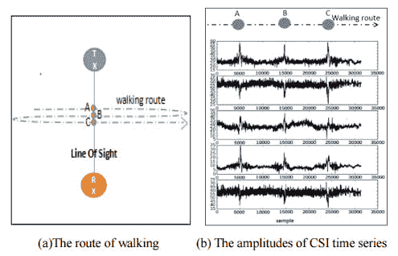

# 研究人员使用 WiFi 波来识别人

> 原文：<https://thenewstack.io/researchers-use-wifi-waves-identify-people/>

在一个新兴的物联网中，物理物品的世界正变得越来越相互关联:可以通过智能手机控制的智能电器和恒温器、支持互联网的监控摄像头，甚至可以让孩子向父母发送电子信息的交互式儿童玩具。

> 这是一个方便的、无设备的替代方案，不需要向已经拥挤的设备生态系统添加任何额外的摄像头、扫描仪、麦克风、可穿戴标签、传感器或卡。

虽然这些联网设备提供了更大的便利和个性化，但其中许多设备是不安全的，这意味着它们容易受到黑客攻击，正如我们所看到的监视你的安全摄像头、[秘密连接到巨大的点对点网络](https://thenewstack.io/snooping-webcam-reveals-security-dangers-internet-things/)或 [WiFi 连接玩具，它们可能会无意中泄露你的数据](https://thenewstack.io/securing-internet-vulnerable-things/)。

改进的认证模式将是未来设计安全、智能对象的关键因素。虽然已经提出了许多用于身份识别的方法，如[面部识别](https://thenewstack.io/affective-computing-emotionally-intelligent-machines/)，步态识别和使用指纹等生物统计数据，但这些扫描设备中的一些本身可能会被黑客攻击，或者需要非常接近才能工作，此外，还需要更多的辅助设备，如扫描仪，同时可能会非常具有侵入性。

然而，现在，来自中国西北理工大学的一组研究人员提出了一种更好的物联网认证替代方案。正如[主板](http://motherboard.vice.com/read/wifi-signals-can-id-individuals-by-body-shape)所报道的，该方法使用 WiFi 几乎无处不在的无线电波频率(RF)来识别个人，根据他们独特的体形和步态，通过精确定位他们四处移动时产生的独特扰动模式并中断这些信号。

## 跟踪独特的扰动

这种方法被称为 FreeSense，可以跟踪 WiFi 信号在发射器和接收器之间传播时的信道状态信息(CSI)的变化。

“由于体形和运动模式的差异，每个人在室内移动时都会对周围的 WiFi 信号产生特定的影响模式，从而在 WiFi 设备的 CSI 时间序列上产生独特的模式，”研究人员在他们的[论文](http://arxiv.org/abs/1608.03430)中解释道。“与现有的(人类识别)方法相比，FreeSense……是非侵入性的，而且保护隐私。”

该团队详细描述了 FreeSense 在数学上是如何工作的:“具体来说，一种结合了[主成分分析](https://en.wikipedia.org/wiki/Principal_component_analysis)(PCA)[离散小波变换](https://en.wikipedia.org/wiki/Discrete_wavelet_transform) (DWT)和[动态时间弯曲](https://en.wikipedia.org/wiki/Dynamic_time_warping) (DTW)技术的技术被用于基于 CSI 波形的人体识别。”

该实验使用传统的 WiFi 路由器和笔记本电脑，在一个配备家具、322 平方英尺的智能家居环境中跟踪了九个人。研究人员首先用从每个人直线走过房间时的步态中收集的数据来训练他们的系统。随后，研究人员反复让测试对象走过房间，看看该系统在识别每个人时有多准确。

令人惊讶的是，该系统表现相当好。当房间里只有一个人时，它在 75%的时间里能够分辨出他或她；对两个人来说，准确率高达 95%。有六个人在房间里走动，FreeSense 能够以大约 90%的准确率识别每个人——考虑到一些人可能更难区分他们是否以相似的方式移动或具有相同的体形，这是一个相当不错的结果。

研究人员现在正在努力提高该系统在各种场景下的性能。

虽然我们中的一些人可能会觉得基于 WiFi 的跟踪有点令人不安，但在一个将人们与智能设备网络联系起来的日益互联的世界中，当然需要更好的安全协议，而通过 WiFi 进行身份识别可能是这些工具中的一种。

使用 WiFi 信号进行身份验证有一些明显的优势。首先，它是一种方便的、无设备的替代方案，不需要向已经拥挤的设备生态系统添加任何额外的摄像头、扫描仪、麦克风、可穿戴标签、传感器或卡，而是依赖于现有的 WiFi 基础设施来运行。

与摄像头不同，无处不在的 WiFi 信号不需要足够的光线和视线来帮助识别用户。与面部识别和指纹识别等方法相比，它的侵入性和乏味程度肯定更低，似乎非常适合家庭等家庭小规模应用，或者医院或配备智能设备和技术的辅助生活环境中的监控应用。

在任何情况下，随着跟踪和识别人们的潜力，通过 WiFi 充电的[无电池设备的可能性](https://thenewstack.io/delivering-power-with-wi-fi-signals-to-the-next-billion-devices-no-batteries-required/)，或[无线供电的编程和计算](https://thenewstack.io/battery-free-programmable-devices-run-radio-waves/)，这些围绕在我们周围的无形波可能比我们想象的更有能力连接我们。

图片:[Sunil Soundarapandian](https://www.flickr.com/photos/sunil_soundarapandian/16199008854/in/photolist-qFs9Y7-7mBhTH-eyzbiN-pr2JL-64e6Y3-ht59g-9KzKxC-6CL5Xg-krDXk-6Dgbc2-gcBHh-2EDqRP-8AiBT6-8r99Qw-pEPyCu-owDF3-3Yv1B-dM7ghb-gcBHQ-7vquxx-dECVL6-pr3SD-owDF7-jYQTKv-aJzPVn-6rk47A-9hHpjg-ehYV66-7DLqb-gcBJx-pr3SB-xDxp3-7vuiGs-owDEZ-pr3SF-owDEU-hn2NpS-yRrND-owDEW-yRrtq-yRs5d-hn3YeD-owDFc-5MGJDm-hn3Q8Z-yRrAq-yRrX1-7zo68g-5wsLaD-2aGame)([CC BY 2.0](https://creativecommons.org/licenses/by/2.0/))。)

<svg xmlns:xlink="http://www.w3.org/1999/xlink" viewBox="0 0 68 31" version="1.1"><title>Group</title> <desc>Created with Sketch.</desc></svg>