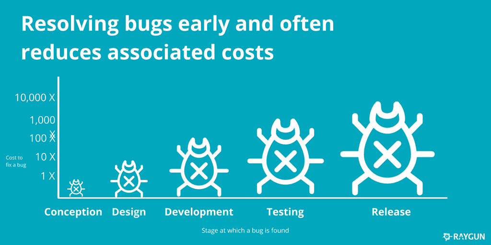

# 弹性是 R&D 的问题，不仅仅是 SRE 的问题

> 原文：<https://thenewstack.io/resilience-is-an-rd-problem-not-just-an-sre-problem/>

 [埃莉诺·斯维尔

埃莉诺是 Rookout 公司的一名解决方案工程师。她来自新西兰，热衷于确保人们更多地采用新的尖端技术。当她不推广新技术时，你会发现她在探索新的地方或在海滩上。](https://www.linkedin.com/in/elinorswery/) 

想象一下，你正在参加公司的全体会议，其中一名销售人员自豪地敲响办公室的锣，庆祝与世界另一端的客户达成一笔大交易。这很重要，因为这是一个重大项目。他们的标志会在你的网站上看起来很时髦，你最终会进入一个新的世界。但是项目开始两个月后，情况看起来并不乐观。出现了无数的问题，现在客户被告知您的应用程序有一个严重的问题，这使得他们无法向客户提供服务。真是一团糟！

但是没关系。所有人都知道，你不可能开发出没有 bug 的代码；这只是生活的一部分。接受这一事实后，您需要通过构建更好地处理这些问题的流程来学习如何处理它。

因此，您的公司有一个由才华横溢的站点可靠性工程师(SREs)组成的团队来创建可扩展的、高度可靠的软件系统，以最大限度地减少错误的影响。他们将处理客户问题，花时间打电话，并提供人工干预的帮助。当涉及到与客户错误斗争时，它们是你的前线防御系统。

但是关键要记住的是，不管你的 sre 有多棒，在开发过程的早期解决一个 bug 的成本要比它已经发布的时候低得多。[一项研究](https://techmonitor.ai/techonology/software/cost-fixing-bugs-sdlc)报告称，修复在实施阶段发现的 bug 的成本比在设计阶段发现的 bug 大约贵 6 倍，如果已经处于维护阶段，则贵 100 倍。

因此，重要的是要理解和接受这种弹性——即当问题出现时，你处理问题的能力如何——是一个研发(R&D)问题，而不仅仅是 SRE 的问题。毕竟，预防就是治疗。

开发过程中解决 bug 的成本(来源: [Raygun](https://medium.com/@raygunio/how-much-could-software-errors-be-costing-your-company-b44f19b3411e)

那么，如何着手创建有弹性的软件呢？从看看你的 R&D 团队开始。他们是你的核心。如果 SREs 是您的第一道防线，那么 R&D 就是确保产品坚固耐用的人。它们是你的免疫系统。R&D 是一个团队，必须确保并不断验证，在到达客户之前，可以处理的一切都已完成。

为了确保这一点，你应该注意以下几点:

*   使用各种工具和技术，如架构风险分析，在开发阶段识别问题。
*   确保您建立并遵循一个结构化且严格的代码审查过程。让你的同事检查你的代码提供了另一双眼睛来确保没有遗漏任何东西。
*   在发布软件之前，进行渗透测试以识别任何问题，并确保您之前发现的错误已经得到解决。
*   设置自动化测试，跟踪和监控代码的性能，以防止客户遇到任何问题。
*   确保您已经建立了必要的基础设施，以便在代码投入生产后能够对其进行调试。

所有这些最终都会影响到底线。在开发过程的早期创建健壮的代码可以最大限度地减少 bug 的数量，如果发现了任何 bug，修复它们将会很容易并且相对便宜。生产中健壮且有弹性的代码确保您公司中的 sre 可以专注于与客户合作并解决客户特定的问题，而不是回到 R&D 解决代码中的核心问题。

公司范围内的弹性对于确保你能够应对突发事件至关重要。有很多方法可以增强你的应变能力([查看这篇文章](https://www.rookout.com/blog/resilience-the-muscle-we-always-need-to-train))，但重要的是要记住，这不仅仅是那些直接与你的客户打交道的人需要担心的事情。研发部门越多地参与确保公司范围内的弹性，你就越能享受成为平稳运转的机器的一部分。

<svg viewBox="0 0 68 31" version="1.1" xmlns:xlink="http://www.w3.org/1999/xlink"><title>Group</title> <desc>Created with Sketch.</desc></svg>