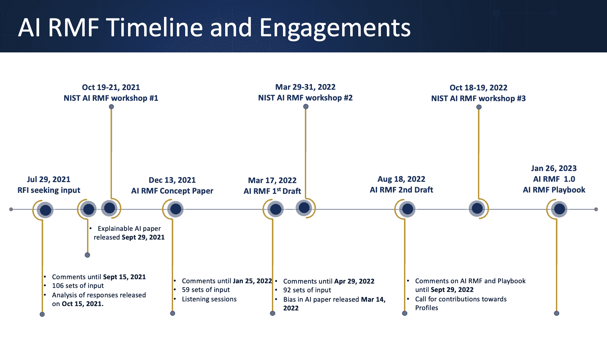

# 亚马逊网络服务中负责任的人工智能:Diya Wynn 问答

> 原文：<https://thenewstack.io/responsible-ai-at-amazon-web-services-qa-with-diya-wynn/>

迪亚·韦恩

去年发布的 [ChatGPT](https://thenewstack.io/beware-chatgpt-a-language-model-in-the-shape-of-shakespeare/) 让许多人注意到了机器学习已经取得的[巨大进步](https://thenewstack.io/chatgpt-writes-scientific-abstracts-well-enough-to-fool-experts/)，并且在未来几年将继续取得进步。但是，我们如何确保这种强大的力量被负责任地使用，没有偏见和恶意？

对于[亚马逊网络服务](https://aws.amazon.com/?utm_content=inline-mention)， [Diya Wynn](https://www.linkedin.com/in/diyakwynn/) 是[负责 AI](https://thenewstack.io/stop-talking-about-responsible-ai-and-put-it-into-practice/) 的高级实践经理。最近，她与新栈坐下来讨论所有负责艾的事情。

在 AWS，Wynn 创建了面向客户的负责任的人工智能实践，并建立了一个由具有不同背景的个人组成的团队，包括 LGBTQIA+和不同能力社区的成员。她的目标是通过一个包容、负责任的人工智能使用的七支柱框架，将负责任的人工智能带给 AWS 客户。

在回答了大量客户问题后，她意识到有必要建立一个面向客户的部门来帮助开发和实施负责任的人工智能实践。

Wynn 是一名终身的技术专家，在三年级时表达了对工程职业的渴望，并同时因为阅读和数学高分获得了她的第一台计算机，当时不是每个家庭都有计算机。她在斯佩尔曼学院继续接受本科教育，并在 NYU 坦登工程学院学习技术管理，然后在哈佛大学专业学院和麻省理工学院斯隆管理学院学习人工智能和伦理..

**新的堆栈:在如此多样化的背景下，为什么要将重点放在道德方面而不是其他方面？**

Diya Wynn :我带来了一种声音和观点，不仅仅是作为一个训练有素的技术专家，也是作为一个整体思考世界及其互动的人。技术有办法塑造和改变我们参与世界的方式，这很重要，尤其是当我们开始思考我们的未来时。

我有两个儿子。我最大的在高中，最小的在中学。我们是否在为我们的孩子将来会遇到的事情做准备？对我来说，这实际上是关于他们能够从事的工作和将要从事的工作所需要的培训和教育。我不认为我们的教育系统在帮助学生为明天的工作做准备方面做得足够好。

我开始探索，发现了三件重要的事情。一个是数据，数据的相关性、重要性和价值，以及它如何塑造我们从事工作的方式。第二个是人工智能和机器人，第三个是虚拟世界，AR/ VR。所有这些都有一个推动和塑造世界发展方式的因素。

它缺少像我和我儿子一样的人的声音和观点。这就是为什么我开始探索，想要对技术产生影响和作用，以及这意味着什么。

**什么是责任 AI？**

负责任的人工智能是一种全面的方法，它提供了治理、结构、流程、协调人力资源和技术解决方案，可以用来解决偏见、风险、绩效和其他类别。

AWS 有一个指导性的结构和定义，它是随着时间的推移在整个组织的许多不同的团队中形成的。虽然团队跨业务工作，以帮助我们看待负责任的人工智能的方式，但每个团队都有围绕透明度和可解释性的所有权和责任，表明存在公平、稳健、隐私和安全。他们都有责任为他们正在开发的服务建立人工智能。

**AWS 正在做什么来让负责任的人工智能民主化？**

AWS 有一个广泛的战略。我们承诺将理论转化为行动。这意味着我们将如何改变和影响我们构建服务的方式以及我与客户一起工作的方式——参与并帮助他们将这种做法付诸实践，并在其组织内实施。

我们投资教育和培训，打造更加多元化的未来劳动力。有一个人工智能/人工智能奖学金计划，将那些通常可能被低估的人纳入进来，帮助他们研究人工智能和机器学习。我们还专注于培训和教育那些参与产品和机器学习生命周期的人，因为他们需要了解和意识到潜在的风险领域以及我们如何减轻它们。

从公司的角度来看，最后一个领域是关于我们如何投资推进围绕负责任的人工智能的科学。我们已经进行了巨额投资，并继续与机构合作，我们有奖学金或研究补助金，以国家科学基金会的方式提供，有助于鼓励在负责任的人工智能领域的研究。我们正在与推进和致力于标准的机构合作，所有这些都有助于关注这一主题的个人生态系统的发展。

**我们来谈谈偏见……**

有一个非常真实的理解，即缺乏多样性可能会产生偏见，另一个现实是，我们所有人都有偏见，对吗？有时我们会将这些偏见植入我们的系统。我们正在利用存在偏见的数据，尤其是在我们查看历史数据时。

我们需要创建一个结构，不仅理解这一点，而且引入我们如何通过消除偏见或基于偏见存在的意识做出决策来接近和解决它的意图。

如何解决这种偏见？

我们可以做许多不同的事情。我们需要有意识地把声音带进房间。教育是关键，让人们和团队意识到他们需要注意这一点。我们可以通过清单和其他方式做一些事情，比如定义人物角色，让人们思考还有谁被包括在内。我们是否考虑了相关人员和/或我们的产品/服务应该服务的所有人？我们是否引入了每个视角？

当然还有人的身体方面，我承认这是技术上的一个挑战，因为我们没有我们想要的跨所有人口统计的多样化代表。但是让我们现实一点，我们并不期望当我们进去和客户谈论一个项目时，我们期望他们雇佣一个新的团队，因为我们希望带来多样性。我的团队带来的价值观之一是一组不同的个人、不同的背景、不同的学科，他们聚在一起实际上帮助支持客户。

你可以做的另一件事是利用你的首席多元化和包容性(DEI)官。团队正在投资并引进 DEI 官员，这些官员经过培训，能够思考偏见、理解包容，并寻找其流程和结构能够带来代表性和观点的方式，但在更广泛的意义上，是尊重、认可和承认他人的观点。

**客户对实施负责任的人工智能实践的接受程度如何？**

顾客将分为三类。有些客户有过这样的经历，他们发现自己的系统受到了一些影响，或者承认存在偏见。这方面的一些例子是公开的。由于这种暴露，他们对解决或实施一些实践来减轻这些痛苦感兴趣。

另一组客户真正感兴趣的是做正确的事情。他们理解并意识到一些潜在的风险，并且真的想要构建他们的客户信任的系统。他们在问问题，“我们能做什么？”“有我们可以建立的实践吗？”

我们看到另一群客户愿意等待。随着对话的展开和技术及产品的发布，他们对正在发生的事情感兴趣，听到和看到他们的市场和行业正在发生的事情。他们提出问题，但等待监管。因为没有什么迫使他们做出改变或建立新的实践，他们还没有准备好进行投资。但是我们离它不远了。

NIST 人工智能风险框架(AI Risk Framework)于今年 1 月刚刚发布，这意味着现在有了客户希望个人和公司遵守的标准。[ISO 42001](https://www.iso.org/standard/81230.html)即将到来，其中包括风险管理和治理结构。欧盟人工智能法案预计将于明年签署。

NIST 的人工智能风险管理框架时间表。

**你认为我们前进面临的最大挑战是什么？**

心态。心态挑战的第一部分是，我们经常将前两个领域的偏见与性别和种族联系起来，这让一些人认为，“这不适用于我。”我们必须考虑负责任的人工智能，不管我们服务的应用程序是否涉及到某人的性别或种族。

例如，如果在商业数据集上训练的模型用于宗教或公共部门环境，它不会以同样的方式获得洞察力，因为它偏向于商业。有助于支持宗教或公共部门背景的数据并不存在。重要的是要有一个更整体、更全面的外观。

另一个思维挑战是，我们知道代表性和多样性在我们设计产品的方式中很重要，多样化的视角可以改善企业的成果和结果。我们知道这一点，研究也证明了这一点，但为什么还没有这样做呢？

我们没有我们需要的多样性，因为这需要心态的转变，而这并不是一件容易的事情。如果我们知道事情是不公平的，而改变它所需要做的就是让它变得公平，那么我们就不会有这次谈话，问题就会得到解决。但这比那更难，因为这涉及到重塑我们的思维。

最后，还有一个我们尚未完全解决的技术问题。我们正在进行研究和投资，以发现我们可以全面支持技术和价值包容的方式，确保模型公平并消除偏见。

你认为学习模型和人工智能技术的广泛可用性是在推动负责任的人工智能前进还是后退？

我认为这绝对提升了负责任的人工智能的重要性。我们一直在谈论人工智能，但在过去的五到七年里，这种讨论越来越多。在某些方面，我们可能会说这是另一个炒作周期，但我认为这也为我们为什么需要负责任的人工智能提供了很好的证据。

我无法告诉你我有过多少次谈话，人们会说，“哦，我的天哪！”它查看所有这些数据，有些数据是有偏差的，人们会问，“为什么我会得到那个结果？”嗯，这是因为数据是有偏差的，所以我们必须做些别的事情，而不仅仅是提取大量数据并反馈回来。这无疑有助于推进对话。

<svg viewBox="0 0 68 31" version="1.1" xmlns:xlink="http://www.w3.org/1999/xlink"><title>Group</title> <desc>Created with Sketch.</desc></svg>