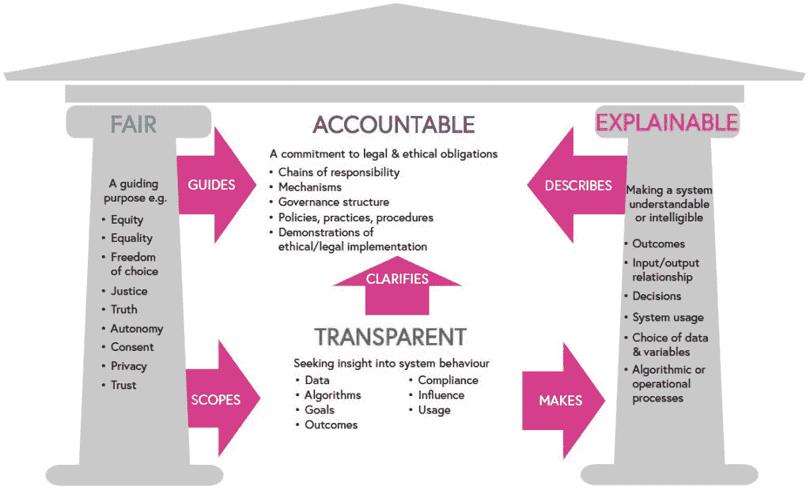

# 持续交付世界中负责任的技术

> 原文：<https://thenewstack.io/responsible-tech-in-a-world-of-continuous-delivery/>

套用费里斯·布勒的话来说:科技发展非常快。如果你不偶尔停下来四处看看，你会把事情搞砸的。

技术伦理，人工智能伦理:它们是引人注目的标签，但它们是相当深奥的陈述，我们通常不会想到，除非是在大一新生性别教育课上。

我们在一个推动持续交付和自动化的世界中工作。但是我们很少停下来考虑何时何地需要刹车。这是一个严重的错误。开发不负责任的技术可能会让你失去员工、客户和声誉。

新的团队由科技行业的观察者和参与者组成。在这个功能中，我们不假装画线或知道答案。但是，当你开发一个新项目时，当你急于发布新功能时，我们会与帮助你提出正确问题的人交谈，了解负责任的技术在你的下一次冲刺中意味着什么。

## 你如何定义负责任的创新？

负责任的科技智库 [Doteveryone](https://www.doteveryone.org.uk) 对英国 1000 多名科技工作者进行了一项名为“[科技工作者眼中的人、权力和科技](https://www.doteveryone.org.uk/report/workersview/)的调查。“结果很明显:科技员工受够了快速移动和打破常规的思维模式。不仅仅是渴望一个更体贴的过程。调查结果开始解释是什么原因导致一小部分科技工作者因道德冲突而辞去科技工作，包括在亚马逊和谷歌等公司。

调查的主要发现是，工人们:

*   需要指导和技能来帮助应对新的困境。
*   渴望更负责任的领导。
*   想要明确的政府监管，这样他们才能有意识地创新。

80%的受访者“认为公司对社会有责任确保他们的技术不会对人类和社会产生负面影响。”大约四分之一的技术人员已经经历过他们认为会对社会产生负面影响的决定，而大约 60%的人工智能(AI)工作人员经历过。

18%到 26%的受访者已经因为预见到他们正在建设的东西的负面结果而离职。

但是为了定义负责任的建设策略，你首先要定义你的目标。

> “随着人们越来越难以摆脱以技术为媒介的生活，如何正确对待技术的伦理问题变得越来越紧迫。”凯特琳·麦克唐纳博士。前沿论坛

前 Doteveryone 项目经理、现[社区利益公司](https://www.linkedin.com/company/consequentialri/)的联合创始人萨姆·布朗说，负责任的技术始于你如何将责任编入你的产品的大局。

她说，这应该从大多数成功企业开始的地方开始，“探索你的生态系统，构建你的更大图景——这是组织的意图。阐明组织试图实现的目标，然后制定组织价值观和原则，说明人们在执行该目标时应该如何表现，这是起点。

她继续说道，“因为如果你不花时间去构建你的愿景，去理解你的利益相关者和生态系统，那么你很可能会开发出一些不符合你的大局，也不尊重你所在的社区的东西。”

布朗说，经常被忽略的第一步是将这些行为和价值观扩展到技术产品的设计中。

她说，“负责任的产品原则应该基于一个组织的核心原则来制定，清楚地陈述产品的意图，并不断地质疑谁可能会受益或谁可能不会受益。这些原则的作用应该是让组织中的每个人对后果有一个共同的理解和集体责任。”

毕竟，[法律责任并不是所有开发商都在考虑的事情。对布朗来说，更多的是责任而不是道德。责任是关于考虑技术的后果——可能是有意的，也可能是无意的。然后问:这在日常生活中意味着什么，我们如何对这些后果负责？](/are-programmers-ethically-and-legally-responsible-for-their-code/)

她继续说，负责任的技术是持续的利益相关者映射——谁是将受到你的技术决策影响的人和系统？

> “负责任的技术始于你的大图，以及你如何将责任编入你的产品。”—山姆·布朗，每个人

前沿论坛的数字人类学家凯特琳·麦克唐纳博士写道:“在一个真正的道德框架中，所有的利益相关者都有影响他们行为决策的机制。”

这些利益相关者必须共同理解某种指导原则。

“我经常发现，在创造符合道德的技术时，团队并不真正知道责任所在的位置，”McDonald 说。

她认为道德经常被归入合规和法律事务。她继续说，只有通过集体问责才能实现责任。

“没有问责制，你可以建立关于你的技术将如何负责或道德的美好愿景声明，但你没有办法通过允许利益相关者影响或纠正影响他们的技术来实现这一愿景，”麦克唐纳说。

她继续说，“引入问责机制是将道德框架从蓝图提升到现实系统的手段——一种真正负责任的行为。”

下面包括的数字来自她关于可持续数字伦理的[立场文件](https://leadingedgeforum.com/research/stemming-sinister-tides-sustainable-digital-ethics-through-evolution/),进一步说明了没有公平、透明和可解释的交集，问责制是如何无法存在的——越来越多的人工智能项目似乎严重缺乏这些东西。

最后，对于瑞典于默奥大学的人工智能教授、《负责任的人工智能》一书的作者[弗吉尼亚·迪格纳姆](https://twitter.com/vdignum)来说，虽然她通过人工智能的视角来考虑所有问题，但她认为视角是完全可以转移的。

负责任的技术是“显然是为了与健全的法律和道德原则保持一致而开发的系统。而且是按照盒子上说的那样制造的，”她说。

“所有这些都应该是可以证实的。审核、测试、评估和验证这些系统，以确保它们能满足我们的期望。”

迪格纳穆继续说，负责任的技术和这些机制应该激发对品牌和产品的信任。

> “责任不仅仅来自开发商和决策者。作为用户和公民，我们也有我们的责任。其中一部分是你的声音来纠正别人的责任。我们中没有一个人做得足够好。我们太容易接受扔给我们的东西了。”弗吉尼亚·迪格纳姆，于默奥大学

## 量化新冠肺炎追踪应用程序中的责任

当然，当被问到时，她承认这些治理机制很少到位。

她说，她典型的人工智能软件开发人员受众通常是满足某个产品的技术要求。法律上的也是。

“不幸的是，伦理和验证要求往往没有被考虑在内，即使被考虑在内，也是不言而喻的，”Dignum 说。

她继续说，绝大多数组织“并不清楚事物被设计成一套足够可验证和可解释的价值观。”

上周，她与人合著的一篇论文发表了关于建立一个“[数字接触追踪的社会技术框架](https://arxiv.org/ftp/arxiv/papers/2005/2005.08370.pdf)”他们通过了三个新冠肺炎接触者追踪应用程序，加上欧洲委员会通过相同的评估标准提出的建议，包括委员会的决定，伦理和科学委员会给政府的信，以及通过媒体听到的公众。

这些是围绕评估三个应用考虑因素组织的:

1.  **对公民的影响:**这融合了安全、健康、不歧视、无障碍、包容和结社自由。它还涵盖了数据使用和控制，以及防止感染者受到侮辱等内容。
2.  **技术:**强调互操作性、安全性和隐私性，以及[数据最小化](https://ico.org.uk/for-organisations/guide-to-data-protection/guide-to-the-general-data-protection-regulation-gdpr/principles/data-minimisation/)。它注意到推荐开源代码和方法，但没有开放贡献。
3.  **治理:**可能的情况下国有。自愿使用。它有一个明确的日落条款——因为我们多久从手机上删除一次应用程序？

在根据这个框架审查了他们三个国家追踪应用程序后，Dignum 说，“它们都很糟糕。”

以下是学术团队评估的接触者追踪计划及其合规性得分:

这些应用程序和 EDPB 指南被选为如何将该框架应用于其他应用程序的范例。

该项目意识到,“新冠肺炎疫情揭示了两种相互冲突的观点:政府需要足够的流行病学信息来管理疫情，而公民在希望安全的同时又担心隐私、歧视和个人数据保护。为了确保实现这两方面的目标，与收集和处理个人数据相关的问题的透明度至关重要。”

虽然这种社会技术责任框架对当前疫情的应用程序很有用，但这些考虑可以也应该应用于所有的应用程序开发，特别是那些收集个人和地理位置数据或任何人工智能的应用程序。

在所有负责任的技术中，透明度是关键。

> “责任不在于从一开始就尽善尽美，而在于愿意衡量自己的表现，并愿意采取措施加以改进。”弗吉尼亚·迪格纳姆，于默奥大学

科技行业最大的差距之一仍然是治理。不仅仅是组织内部的治理，而是公众如何看待和限制那些生活在我们生活中最亲密的部分之一——我们的手机——的公司的权力。毕竟，正如 Dignum 指出的，很多隐私条例在二战后就已经存在了。同样，9/11 后的机场安全条例看起来不会很快改变或消失。

她说，为了抗击疫情，我们现在愿意放弃我们的隐私来提供帮助，但我们只想暂时这么做。

## 后果扫描的敏捷实践

去年，Doteveryone 发布了一份[后果扫描](https://www.doteveryone.org.uk/project/consequence-scanning/)手册，这是负责任的创新者的敏捷实践。它是关于确保一个组织的产品或服务符合其文化和价值观，但它也是关于反映三个不同的领域:

*   该产品或功能的预期和非预期后果是什么？
*   我们想要关注的积极后果是什么？
*   我们想要减轻的后果是什么？

对于组织来说，拥有自愿的道德团队是很普遍的，他们有时会聚在一起。允许员工围绕他们感兴趣的主题进行自我组织是好的，但这还不够。后果扫描应在产品团队中进行，应包括参与产品日常制作的任何人、与最终用户关系更密切的任何人、任何高级利益相关者，以及在产品上工作的任何安全、基础架构、风险和法规遵从性专家。

每次复习不应超过 45 分钟。从你公司的愿景、使命和价值观开始，然后集思广益，投票决定优先顺序，并讨论前景产品或功能及其预期和非预期的后果。

每个人都指出了六种通常意想不到的——但不一定是负面的——数字技术的后果:

*   **利益失衡**——造成更大的数字鸿沟。
*   **改变用户的规范和行为**——几代人如何以非常不同的方式相互交流、养育子女和约会。
*   意想不到的用途——比如:“赞”现在是行业标准。
*   **环境影响**——即:建造和使用你的产品所耗费的能量与人工智能帮助衡量影响。
*   **流离失所和社会变迁**——即:失业、在线宗教团体和改变人们的工作方式。
*   **信任的侵蚀** —安全政策和阻止数据泄露，不仅仅是你自己组织的透明度，还有你的供应商。

分为三类:

*   **行为**——参与者控制范围内的后果，以采取行动。
*   **影响** —哪些事情你无法控制，但你可以影响其结果。
*   **监控** —这完全不在你的控制范围内，但它们可能会影响你的产品，所以你需要了解更多。

确保确定任何后果的影响范围。记录一切以确保跟进。

当你在产品想法的愿景阶段快速移动和迭代时，更频繁地举行这些会议。然后，随着你的技术和用户基础越来越清晰，你应该在路线图阶段减少这样做的频率。布朗说，这可以发生在你实际的冲刺周期中，也可以发生在你引入新事物的任何时候，比如决定是否要引入一个新功能。然后你优先考虑你想减轻的。

今年早些时候，在与美国移民当局做生意遭到强烈反对后， [Salesforce 决定聘请一名首席道德和人道官](https://www.wsj.com/articles/how-salesforce-makes-decisions-on-ethics-and-social-issues-11581955201)，帮助指导公司就“复杂的政治问题”做出决策他们现在使用后果扫描来进行伦理分析，通常由员工标记出来。这种做法引发了一项公司政策，禁止客户使用 Salesforce 软件向私人公民出售军用武器。他们还在人工智能产品中创建了“受保护的字段”，可以从偏向结果中排除任何数据，如种族。

来自 Pixabay 的 Siggy Nowak 的特写图片。

<svg xmlns:xlink="http://www.w3.org/1999/xlink" viewBox="0 0 68 31" version="1.1"><title>Group</title> <desc>Created with Sketch.</desc></svg>