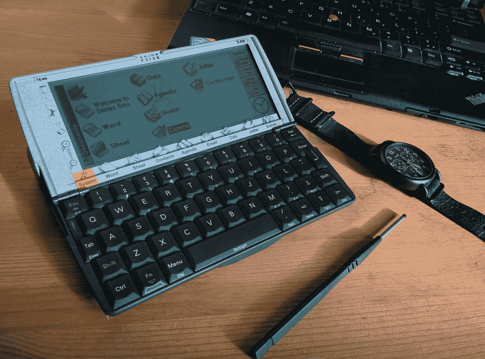
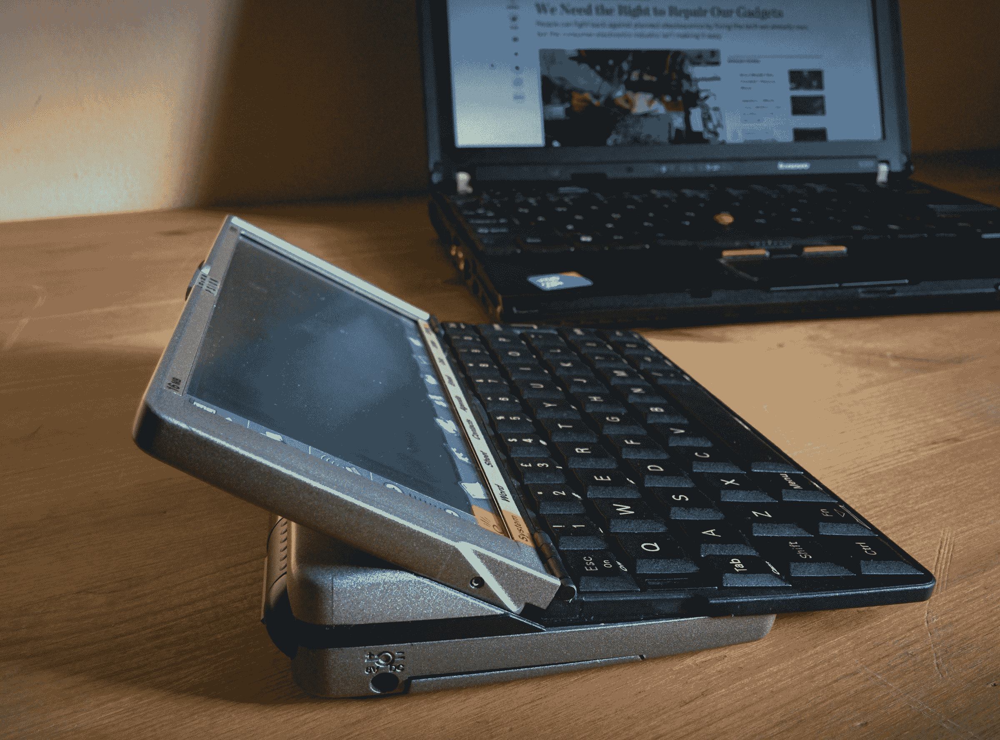
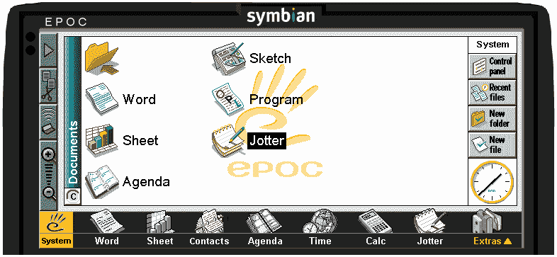
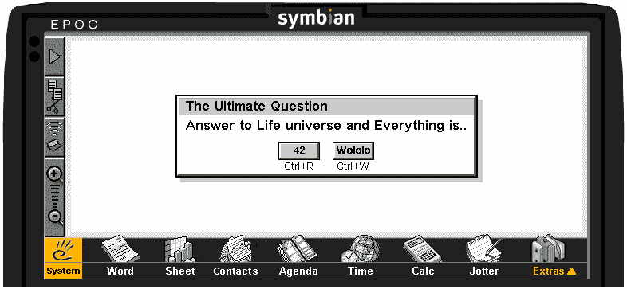

# 现代的逆向计算:重新发现心灵感应系列 5mx

> 原文：<https://thenewstack.io/retrocomputing-in-modern-times-rediscovering-the-psion-series-5mx/>

编程语言和旧电脑吸引着我。然而，我必须告诉你，花在这些设备上的时间和金钱会很快失控。但是修复和重新发现杰作——这些逝去时代的机器的操作系统、语言和编程环境——的快乐是无价的。对一门古老语言的偶然发现，会慢慢变成执念。一个这样的偶然发现是 Open 开放编程语言 T1 和 T2 的 Psion 系列 5 T3。

## 小玩意

Psion 是手持管理器和 PDA 的先驱之一。1984 年，他们推出了 [Organizer I](https://en.wikipedia.org/wiki/Psion_Organiser) ，并在加拿大将其宣传为世界上“第一台实用的袖珍计算机”。继续他们令人印象深刻的工作，他们随后推出了系列 3(16 位掌上电脑)及其继任者(32 位 Psion 系列 5)。我认为 Psion 系列机器，尤其是 5mx，是他们那个时代的奇迹。



于 1999 年推出的[系列 5mx](https://en.wikipedia.org/wiki/Psion_Series_5) 拥有你想要的那个时代可用电脑的一切——就在你的掌中。它有一个背光灰度液晶显示器，以及一个非常令人印象深刻的 QWERTY 键盘——这是这种尺寸的小工具中最好的一个，当打开时，它会优雅地从翻盖中轻轻滑出，并且是一个打字的魅力。

> 如果手持键盘是钻石，这将是它们中的“T9”Koh-I-Noor。

5mx 有一个基于 ARM710 的 36 Mhz 处理器，通常有 16MB 内存。Psion Series 5 最与众不同的特点之一是令人惊叹的触摸屏和触控笔，它们可以存放在设备中一个不显眼的插槽中。你仍然可以用手写笔做一些严肃的艺术作品，重申触摸屏技术在那个时代已经相当先进的事实。有一个串行和红外接口用于外部通信，还有一个 CF 卡插槽，可以非常轻松地运行 1GB CF。当我第一眼看到它的时候，我就知道有一天我会得到它，在我知道之前，我已经冲动购买了易贝。



## 操作系统

5 系列电脑的基础操作系统是 EPOC 32(T1)，这是 T2 塞班操作系统(T3)的前身，也是 T4 Psion 3 系列(T5)电脑使用的 EPOC16 的继任者。该操作系统是专为嵌入式计算机设计的先发制人的多任务系统。操作系统的设计，在所有的层面上，都是高度面向对象的，而且大部分是用 C++完成的。操作系统面向对象设计的效果反映在 EPOC32 上运行的应用程序，以及它的后继操作系统 Symbian 操作系统，在某个时间点上运行了全球超过 44%的智能手机。EPOC 操作系统的应用程序类似于桌面图形用户界面，非常实用和直观。例如，左上角的三角形打开当前应用程序的浮动上下文菜单，显示常见的桌面元素，如文件、编辑、视图等。如果您是一个更喜欢研究的人，您可以安装 SDK 的一部分，在您的桌面上运行 EPOC32 仿真器。从这里获取模拟器，然后将其安装在您的 Windows 机器或 Linux 机器上(通过 [Wine](https://www.winehq.org/) )。我已经在一个[要点中给出了在 Linux 上设置](https://gist.github.com/tuxology/3bc4f18d1152c67871b2)的说明。一旦模拟器启动，迎接你的将是一个不太熟悉的界面供你探索。



显示默认主屏幕的 EPOC 模拟器

用户界面在某些方面非常独特。例如，如果你仔细观察照片和模拟器，图标——系统、单词、表格——实际上是屏幕上非常详细的贴纸，单击“Extras”会在这个物理应用栏上方弹出一个具有类似外观和感觉的应用抽屉。左侧的按钮也是如此。然而，右边的按钮是数字绘制的。当时的许多设备，如早期的苹果 MessagePads 和 Palm PDAs，都有类似的集成了屏幕功能的物理菜单。

## 与 OPL 一起编程

用 C++和 OPL 这样的语言编写一个 Psion 5mx 很容易。甚至还有一些过去开发者做的 Python 2.2 和 Lua 5 的移植。即使所有的开发支持已经正式停止，除了个别开发者维护的极少数网站，除了一些随机的手册和散落在周围的死链接，什么都没有留下。为了便于编程，我们现在只关注 OPL。

### OPL 内部

OPL 语言是一种类似 BASIC 的解释语言，由 Psion 于 1984 年首次引入。它是一种结构化的、过程驱动的编程语言，比其他语言更容易设置和使用。它在 Psion 早期版本中的成功，以及后来 Symbian 版本中的包含，使它在当时相当流行。它最终在 2002 年底被 Symbian 开源。这几天可以从 [SourceForge](http://sourceforge.net/projects/opl-dev/) 获得全语言的源代码；然而，该项目的任何更新似乎在 2006 年就停止了。尽管如此，对于那些想学习解释语言在嵌入式平台上如何工作的人来说，这仍然是一个很好的资源。简单看一下源代码就知道，OPL 的核心组件，如翻译器和运行时，它们本身是用 C++编写的。在 Series 5 上，OPL 程序使用 C++ OP extension (OPX)库与核心操作系统组件进行交互，该库就像一个层，用于将高级 OPL 调用与低级设备特定功能进行交互。编写 OPL 代码的通常方式是用简单的文本(OPL)编写代码，并输入到翻译器(可以在仿真器上，独立的，也可以在 Psion 上)。这个翻译器生成一个 OPO 文件(目标代码),该文件被提供给 Psion 上的“OPL 运行时”来执行。

### 你好 Psion

由于 OPL 代码可以直接翻译并在 5mx 上运行，让我们用一个简单显示对话框的小程序热身。对于那些没有心灵感应的人来说，在模拟器上测试应该也很容易。为了让您从下载完整的 SDK、编写然后在桌面上翻译应用程序的麻烦中解脱出来，我们将简单地使用仿真器编写我们的第一个应用程序。

按照我的要点中的说明启动模拟器。单击模拟器主屏幕上的“程序”图标(参考上一节中的屏幕截图)。现在，您处于 OPL 编程环境中。这是你好的心灵感应小程序，你现在可以直接输入:

```
PROC helloPsion:
  dINIT  "The Ultimate Question"
  dTExt  "",  "Answer to Life, Universe and Everything is.. "
  dBUttons  "42",%r,  "Wololo",%w
  IF DIALOG=%r
  showDialogRight:
  ELSE
  showDialogWrong:
  ENDIF
  GET
ENDP

PROC showDialogRight:
  dINIT  ""
  dTExt  "",  "You are right :)"
  dBUttons  "Close",%c
  if DIALOG=%c
  ENDIF
ENDP

PROC showDialogWrong:
  dINIT  ""
  dTExt  "",  "You are Wrong :( Try again?"
  dBUttons  "Yes",%y,  "No",%n
  if DIALOG=%y
  helloPsion:
  ELSE
  ENDIF
ENDP

```

或者，你可以把这个文件保存为一个普通的文本文件(比如，`HelloPsion.tpl`)，放在 EPOC 模拟器的 c 盘(`~/.wine/dosdevices/c:/Epoc32/Wins/C`)。然后启动“程序”，按 Ctrl+Shift+I 在编辑器中导入纯文本。您也可以将此文件复制到 CF 卡上，然后导入到 real Psion 5mx 上。点击右上角的“Trans”按钮。翻译程序将生成 OPO 文件，并要求您执行它。就是这样。它应该是这样的:



如果你想了解更多关于 OPL 编程，以及如何编写复杂的结构化程序，请点击[这个链接](http://www.allaboutsymbian.com/develop/opl/)。除此之外，还有一些努力让你最喜欢的工具，如 VIM 在 5mx 上。另一个值得访问的资源是 OPL 程序的 ProSoft 网站，Psion 的提示和技巧(如果你有一个的话)。我已经设法用我的树莓 Pi 和计算机在 5mx 上获得串行通信工作。这意味着我可以 SSH 到我的远程机器和虚拟机，并直接使用它们(这实际上是我使用 Psion 的常规工作)。现在，最后，我只想让大家知道 Linux 运行在 Psion 5mx 上。这将是我的下一个 5mx 实验。你可以在 [OpenPsion 项目](http://linux-7110.sourceforge.net/)页面上了解更多信息。我要说的是，这仅推荐给高级用户，但是如果你设法做到了，你可以期待看到这样的东西:

体验和比较当时和现在的工程师如何实现设备小型化是一种独特的感觉。看到这些人在大约 18 年前能够实现的嵌入式世界的优雅奇迹，令人印象深刻。在某种程度上，每一步——像 RIM、诺基亚、Psion、Palm、Apple 等等。事实上，它是我手中的 Nexus 5 或 iPhone 的模板。18 年后，手持设备和智能手机的未来会是怎样的？屏幕尺寸还会继续增大吗？我们会继续为手持设备的功能融合而努力吗？我们将如何与这些设备互动？我会让消费者和生产商来决定——而我会寻找下一个要购买的复古机器。

<svg xmlns:xlink="http://www.w3.org/1999/xlink" viewBox="0 0 68 31" version="1.1"><title>Group</title> <desc>Created with Sketch.</desc></svg>