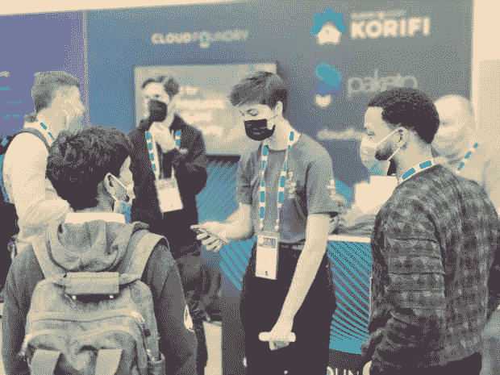
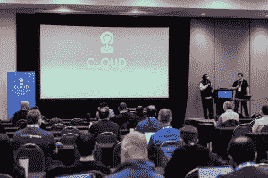

# 回顾:为什么在 KubeCon 有 Cloud Foundry？

> 原文：<https://thenewstack.io/retrospective-why-was-cloud-foundry-at-kubecon/>

[Cloud Foundry](https://www.cloudfoundry.org/) 社区正处于引人注目的创新的风口浪尖，并正在实现其将开源 Cloud Foundry 与 [Kubernetes](https://kubernetes.io/) 完全集成的目标。几年后，我们非常兴奋地重返 [KubeCon+CloudNativeCon](https://thenewstack.io/kubeconcloudnativecon-2022-rolls-into-detroit/) 展示两个新项目，我们希望这两个项目会引起云原生社区的极大兴趣: [Korifi](https://github.com/cloudfoundry/korifi) ，这是一个针对 [Kubernetes API](https://thenewstack.io/category/kubernetes/) 和 [Paketo Buildpacks](https://paketo.io/) 的新的云铸造抽象，这是一个由[云原生构建包](https://thenewstack.io/container-images-the-easy-way-with-cloud-native-buildpacks/)组成的集合。

但是，在我们深入了解这两项技术如此重要的原因之前，先回顾一下历史。

二重螺旋线

[Cloud Foundry](https://thenewstack.io/when-to-choose-cloud-foundry-over-kubernetes/) 作为一项技术，与 Kubernetes 共享了很多基础。它们都是为了在全球范围内可靠高效地运行应用程序而构建的。他们都有着谷歌的博格的 DNA，并一直不懈地致力于为从业者提供更好的开发和运营体验。他们通过使用容器化、有效隔离和自我修复来实现这一点。此外，这两种技术都是完全开源的，由他们的社区管理。

合并

他们的不同之处在于他们实现更好的开发者体验的方法。Cloud Foundry 开始通过一种开发者至上的方法来实现它的承诺，这种方法的重点是源代码到 URL 的契约。这意味着开发人员直接使用 CF 接口，其余的底层技术和过程完全抽象出来。Kubernetes 的工作重心牢牢地围绕着容器调度和编排。开发人员的秘密武器是用声明性语法编写的平面文件，这些语法描述了基础设施的理想状态，Kubernetes 引擎总是朝着这个目标前进。

尽管如此，反差确实有所收敛。

方向

尽管采取了不同的方法，但 Cloud Foundry 作为一个社区和 Kubernetes 及其庞大的相关项目生态系统都致力于实现相同的最终目标。也就是说，开发人员能够将他们的应用程序构建到容器中，并将它们部署到基础设施上——并通过这个构建和部署工作流中包含的可观察性、安全性和其他重要方面来做到这一点。我们的社区投入了大量资金来重新构建基于 Kubernetes 原语的 Cloud Foundry，这些原语在满足这一确切要求方面取得了巨大成功。

Korifi 是向云原生类型的一次巨大飞跃。

发动

PaaS 抽象提供了一种基于平台的方法，一直被认为是轻松融入新技术生态系统的绝佳方式。将 Korifi 抽象应用到 Kubernetes 集群对使用 Kubernetes 的软件工程团队来说也是如此。几乎不需要了解 Kubernetes，该工具为任何需要使用 Kubernetes 的团队提供了默认设置。Korifi 提供了熟悉的 CF push 接口，同时利用了底层的各种 CNCF 项目。它可以在公共云、私有云和混合云上工作，并且由于其占地面积小，也可以部署到边缘设备上，就像任何其他平台一样简单。在底层，Korifi 利用几个[云本地计算基础](https://cncf.io/?utm_content=inline-mention)项目来提供负载平衡、入口、服务和指标。它使用云原生构建包来创建容器。

这种 buildpack 体验近乎神奇！

魔法

由 Heroku 在 2011 年左右开创的 Buildpacks，现在以云原生化身的形式卷土重来。CNCF 孵化项目提供了将任何语言编写的应用程序容器化的最佳方式。该项目旨在统一各种 buildpack 生态系统及其规范，同时也包含旨在管理容器的标准。帕克托构建包是基本 CNB 规范的一个实现。Paketo 开源项目为最流行的语言和框架提供了生产就绪的构建包。如此多的工具产品(例如， [Waypoint](https://www.waypointproject.io/) 、 [DigitalOcean App Platform](https://www.digitalocean.com/products/app-platform) 、Korifi)在将容器部署到运行时之前的构建阶段都采用了构建包。

让更多的软件工程团队意识到这两个项目及其能力的机会是驱使我们来到 KubeCon 的重要原因。

我们对 KubeCon 的投资是基于这样一种信念，即该会议为展示我们的技术提供了完美的平台，特别是因为这些工具为开发者和平台运营商提供了流畅的体验。我们一直希望拓宽云铸造社区的视野。有什么比在 KubeCon 展厅展示机会更好的方式让感兴趣的人站出来作为贡献者和维护者积极参与呢？

我们观察到两个值得骄傲的主要趋势。首先，Paketo Buildpacks 在 DevOps 社区获得了巨大的支持。有很多人找到我们，询问该工具的当前状态和未来路线图，同时还讨论了为他们当前的项目实现构建包的细微差别。第二个趋势是，许多人认可 Cloud Foundry，并欢迎 Kubernetes 上的相同抽象。Cloud Foundry 为虚拟机预示的结构性转变也是大型开发人员希望看到的云原生投资的实现。因此，这让我们对 Korifi 在即将到来的一年充满期待。

<svg xmlns:xlink="http://www.w3.org/1999/xlink" viewBox="0 0 68 31" version="1.1"><title>Group</title> <desc>Created with Sketch.</desc></svg>