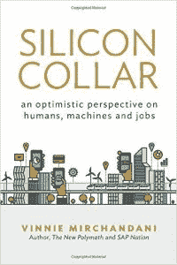

# 回顾:自动化、失业和技术伦理真空

> 原文：<https://thenewstack.io/review-automation-wake-call-fill-vacuum-tech-ethics/>

*[《人类的财富:二十一世纪的工作、权力和地位》](https://www.amazon.com/Wealth-Humans-Status-Twenty-first-Century/dp/1250075807/ref=sr_1_1?ie=UTF8&qid=1485548281&sr=8-1&keywords=wealth+of+humans)*
*瑞安·阿文特著*
*圣马丁出版社，288 页。*

*[硅领:对人类、机器和工作的乐观看法](https://www.amazon.com/Silicon-Collar-optimistic-perspective-machines/dp/0990929663/ref=sr_1_1?ie=UTF8&qid=1485548490&sr=8-1&keywords=Silicon+Collar)*
*作者姚一奇·米尔钱达尼*
*交易建筑师，280 页。*

对于我们这些身处 IT 世界的人来说，处理人类工作岗位的消失是最重要的道德问题。在大多数情况下，我们创建的软件通过将工作从人类手中夺走，使用自动化来加速组织的日常任务。当大约 70%的工人日常工作是粗活的时候，有一层厚厚的无聊、容易出错、乏味的工作可以自动化。

直观上，这减少了所需的人力劳动量，也就是减少了工作岗位。有一个正在进行的理论，有点“涓滴经济学”的味道，认为这些失去的工作在其他地方重新创造，但当前自动化的影响有可能削减更多的工作岗位，比如说，用自动取款机取代银行的柜员。

 [迈克尔·科特

Michael Coté在 Pivotal 从事技术营销工作。他曾是 451 Research 和 RedMonk 的行业分析师，在戴尔软件和云部门的企业战略和 M&A 部门工作过，在此之前曾做过十年的程序员。他在 Cote.io 上写博客和播客，在 Twitter 上是@cote。](https://cote.io) 

这里的一个例子是无人驾驶汽车对卡车驾驶的破坏性影响。有人估计，卡车驾驶是美国许多州的头号就业来源，总人数约为 350 万人，为无人驾驶汽车开发软件的相对少数程序员将很快在美国削减 350 万个工作岗位，在全球范围内会削减更多。

正如最近的 Slate Money 播客所指出的，在最好的情况下，对人类来说，自动化更多的是*转变*工作，而不是消除工作。作为“最好-最坏的情况”，这通常意味着一个人的工作转变如此之大，以至于工人的工资更少，就业更不稳定，福利更少；这就是我们目前所知的[零工经济](https://www.bloomberg.com/news/articles/2017-01-23/when-their-shifts-end-uber-drivers-set-up-camp-in-parking-lots-across-the-u-s)。

尽管它们很少提供“解决方案”，但我这个月看的两本书试图框定这种困境，甚至提供一些安慰。

[姚一奇·米尔钱德达尼](https://twitter.com/dealarchitect)的 *[硅领](https://www.amazon.com/Silicon-Collar-optimistic-perspective-machines-ebook/dp/B01INZZ7KQ/ref=as_li_ss_tl?_encoding=UTF8&qid=1485204170&sr=8-1&linkCode=sl1&tag=nudesleecote&linkId=4c2f658e590df71f7e5bb2c8a0ea398c)* 通过在一系列无休止的用例中描述自动化的积极影响，尽最大努力扭转自动化的皱眉。更令人沮丧的是，瑞安·阿文特的《人类的财富》描述了当前的自动化时代及其对人类劳动的威胁，提出了一个充满失业瘴气的未来愿景。

## 软件在吃劳动力

如果问题是在人工智能、机器人和自动化面前保留人们的工作，那么从人类擅长的事情开始就好了。为了保住我们的月薪，我们需要找到我们的商业价值，将我们人类与机器人对手区分开来。在“[《人类的财富》](https://www.amazon.com/dp/B0166SLTB8/ref=as_li_ss_tl?_encoding=UTF8&btkr=1&linkCode=sl1&tag=nudesleecote&linkId=b03da6bce79b7013640d067920222bc0)”中，Avent 试图做到这一点

他非但没有安慰我们，反而证明了与代码竞争有多么困难，同样，人类团结起来抵制工作分解也有多么困难。他描绘了一个缓慢滚动的反面乌托邦，可以作为跳动的新闻纪录片，为威廉·吉布森后来的一本书中的[做过多的解释:](https://www.amazon.com/Peripheral-William-Gibson-ebook/dp/B00INIXKV2/ref=as_li_ss_tl?s=digital-text&ie=UTF8&qid=1484930281&sr=1-1&keywords=william+gibson&linkCode=sl1&tag=nudesleecote&linkId=4b31649c4e138ca419c8ad679c43b1aa)[如你所知，鲍勃](http://tvtropes.org/pmwiki/pmwiki.php/Main/AsYouKnow)，所有这些在虚拟现实设备中的农村兽医都没有工作，因为在过去 30 年中它自动化了多少工作

Avent 做了一项出色的工作，将这种转变的原因在所有类型的劳动中进行了分类和语境化:从手工、重复的工作，到以前认为不可接触的知识工作。

米尔钱达尼的书是数字转型[的奇迹。它无情地记录了它如何改变和改进业务流程。例如，一个用例解释了审计中的人为因素是如何被自动化减少的:当自动化物流和库存系统可以信任时，审计员不需要实际进入现场“查看”来验证库存。](http://www.theregister.co.uk/2017/01/18/wtf_is_digital_transformation/)

## 它不是断头台上唯一的手

除了自动化，还有其他经济趋势正在改变工作的性质。其中最引人注目的是全球化。虽然我们都知道手工劳动为基础的制造业“离岸”，更高价值的工作，如编程，会计，以及几乎任何劳动力也可以套利出收费较低的国家。贸易规则、货船和通信速度(“互联网”)使这一业务能够跨越国界和时区流动，消除了劳动力多年来依赖于创造岸上就业机会的地理限制。

自动化和全球化的结合让工人们处于更加不稳定的境地。对高薪人员的需求减少了，因为他们的工作可以更多地由“机器人”来完成，或者被转移到海外，交给愿意以更低的报酬来做的人。

但这也意味着企业受到威胁。同样的两种力量意味着复制一家公司的核心产品和服务更容易:是什么让这些公司与最新的海外“模仿猫”区分开来？Rita McGrath 教授的短暂优势理论很好地解释了这一点，公司和员工需要找到一种可防御的竞争优势，这种竞争优势不能被其他地区和使用 IT 的破坏分子从 T2 偷走。

## 科洛统治着我周围的一切

 Avent 认为，对于这种差异化，公司和个人都需要看一些他称之为“社会资本”的东西。这是一个不成文的，几乎不可知的知识和实践的集合，公司的员工遵循并使用它来创造他们的魔力，他们的与众不同。

虽然他对经济学家的“社会资本”进行了有趣的描述，但阿文特并没有提供很多可靠的例子来解释这个概念。值得庆幸的是，有许多描述“社会资本”的深井。虽然已经 29 岁了，但我最喜欢的关于现实政治、腐蚀性企业文化的书《道德迷宫》非常适合这里。在彩虹和独角兽方面，社会资本更接近于 DevOps 信徒所说的“文化”本·汤普森经常谈到这种高度无形但极其宝贵的文化的战略价值，这种文化定义了苹果和谷歌等公司的成功之道。

Avent 的社会资本理论的关键是，价值最大化需要面对面，同处一地。根据定义，一旦社会资本可以被写下来、系统化和传播——[转化为信息](https://www.amazon.com/Information-History-Theory-Flood/dp/1400096235/ref=as_li_ss_tl?ie=UTF8&linkCode=sl1&tag=nudesleecote&linkId=5760ede537fdf7a36e30ff4853bfb0fd)——它就失去了它的差异化价值:它可以很容易地被对手知道和复制。

作为一个大部分时间都在远程工作的人，我怀疑是否有必要共处一地。当然，远程工作，我是高度偏见的。我在这两种模式下工作了 20 年，我的感觉是，所有人都在一个地方的好处似乎主要是一种选择，是标准操作程序的结果。正如众多开源项目和虚拟公司所显示的，选择“远程优先”文化是可能的。Slack 的生产力[魅力是一个很好的轶事数据点，希望 SaaS 的持续增长将提供更多证据和能力，使组织更容易适应远程工作。](http://www.theregister.co.uk/2016/03/04/slack_valuation_keeps_on_slogging/)

诚然，Avent 谈论的是超大城市，而不仅仅是一个办公室。但是，在阿文特的讨论中，向城市拥挤的需求似乎是最薄弱的一点。它还引发了一场奇怪的讨论，即城市中过多的分区和监管如何导致高房价，限制了工人在这些城市获得好工作的能力。

虽然这是事实，但在试图解决全球劳工问题时，这似乎是一个太小的问题。对我来说，Avent 讨论的核心问题是，[公司](https://www.ft.com/content/368ef430-1e24-11e6-a7bc-ee846770ec15)和[执行](http://blogs.wsj.com/economics/2015/05/13/top-ceos-now-make-373-times-the-average-rank-and-file-worker/)已经囤积了多少现金，[将资本](https://cote.io/2017/01/01/keeping-money-at-the-top/)锁在社会的一个薄片中，而其他人都透过餐馆的窗户如饥似渴地看着。

然而，不仅仅是超级富豪吸收了供应。在我看来，正如“1%的人”囤积他们的财富一样，我们这些生活在大城市的人也在通过坚持面对面的工作来囤积常规和社会资本，事实上，他们并没有为增加劳动力中各种类型的多样性做出多少努力。正如 Avent 所说:“工人们试图通过降低其他人与他们竞争的能力来使自己变得稀缺。”对于藏在西装和闪闪发光的蓝色玻璃公寓大楼里的蜥蜴脑，我们不会有别的期待。

Mirchandani 简要讨论了增加性别多样性作为减少囤积的工具，但是没有讨论这样做的实际方面。显然，很有必要将财富更平均地分配给各类被剥夺权利的人。最近美国大选的人口统计数据无疑表明，美国特权现金囤积者忽视他们的困境已经太久了。

## 生态系统的建设成本很高

虽然 Avent 主要关注白领社会资本，但你在亚洲制造业以及历史上在底特律地区看到的“生态系统资本”(使用一个尴尬的短语)也有很多可说的。[人们说](https://cote.io/2017/01/19/it-takes-more-than-one-factory/)工厂和相关企业的集群越密集，你的生产效率就越高；否则，我想，会有运输的时间和金钱成本，以及货物跨境运输的各种关税。毫无疑问，也有大量的社会资本在这些工厂中心流动。

如果你关心制造业，真正的问题是在你想要的地理位置建立这样一个生态系统[所花费的时间和成本。例如，中国几乎一无所有，在大约 10 年的时间里建立了所谓的“iPhone 城市”，政府支出和补贴大约 100 亿美元。这还不包括持续的政府支持，当然，还有](http://www.usatoday.com/story/news/nation/2017/01/20/his-own-words-president-trumps-inaugural-address/96836330/)[苹果最初和持续的支出](http://www.asymco.com/2012/11/07/recapex-the-curious-case-of-apples-2012-and-2013-capital-expenditures/)，毫无疑问还会增加数十亿。从国内来看，[一些早期“考虑”在美国建立苹果显示器工厂的人估计成本为 70 亿美元；毫无疑问，这也会带来额外的政府补贴。](https://9to5mac.com/2017/01/22/apple-foxconn-united-states-made-iphone/)

只要你愿意付出，一切皆有可能。

## 今天的工人还没有做好自救的准备

越来越多的人发现，很难找到他们知道如何做的工作，支付他们期望的工资，并且与他们的身份相符。最后两个问题尤其令人烦恼，因为如此多的服务行业工作填满了劳动力增长曲线。这个领域充满了社会困境，正如 Avent 多次指出的那样，作为一个社会，我们还没有做好准备来轻松解决这些问题。

例如，虽然医疗保健的增长是亮点之一，正如[最近纽约时报的一篇文章描述的](http://www.nytimes.com/2017/01/04/upshot/why-men-dont-want-the-jobs-done-mostly-by-women.html?_r=1)，许多失业工人有一种家长制导致的心理障碍，反对培训和接受这些工作。他们认为“护理”工作是“女人的工作”正如《纽约时报》一篇文章中的一位受访者所说:

*我不会成为一名护士；我没有对人的宽容。我不想让它听起来不好，但我总是看到一个女人在护士或某种医疗保健工作者的位置上。我认为这更像是女人的抚摸。*

似乎再培训和找新工作还不够棘手，阿文特加大了压力:如果我们最终把所有工作都自动化了，会怎么样？喜欢… *所有的*工作。除了对我们许多人来说是身份定义之外，我们经济体系的很大一部分是围绕着人们工作来推动经济，获得他们需要的现金来维持他们“生活方式”的支出。如果你把现金从这个系统中移除，突然之间(比如说几十年后)，情况看起来非常糟糕。

Avent 做了很好的工作，分析了所有这些无用的几个问题。例如，普遍工资几乎没有希望，因为，嗯，它的政治是不可能的。除了更聪明、更深思熟虑地分析和解决我们的问题之外，没有其他解决方案。换句话说，在英国退出欧盟和川普的时代，没有什么是可行的。

Mirchandani 在解决这些问题上采取了更乐观的尝试。他的许多例子表明，转变后的劳动力可以让人们在选择生活方式时拥有更多的自由——只要他们的薪酬不受影响。与 Avent 不同，Mirchandani 对政治进程有信心，建议焦虑的读者停止在 Twitter 上大喊大叫，而是:

给你的国会议员打电话，游说他们支持便携式福利。为做多份工作的人争取一个安全网。如果他们正在考虑为普遍基本收入提供资金，请他们也考虑将部分资金用于快速再培训项目，以使工人能够过渡到新技能。或者投资于能源、卫生和道路基础设施，创造新的就业机会。

我更认同 Avent 的观点:基于过去工业和劳工革命的解决方案，我们人类在成功预测如何解决这种混乱方面有着糟糕的记录。

## 我们不要都变成混蛋

正如我们期望石油、化工和苏打公司管理其利润的负面影响一样，我们需要密切关注自动化以及更广泛的 IT 创新的负面影响。

我很难举出许多人在媒体和推特上发表“技术伦理”论文的例子。Mirchandani 引用了一些机器人伦理学家的观点，但却煞费苦心地指出了一个正在进行的标准。诚然，我们沉迷于版权和专利，但这感觉更像是制药行业

[crocodile tears](http://www.cnbc.com/2017/01/10/pharma-industry-needs-to-be-more-transparent-on-drug-pricing-gilead-ceo-says.html)

关于药品定价。更有甚者，我们肯定没有行为准则，像希波克拉底誓言这样简单的事情。我们早就该有一些道德规范了

[The Forgotten](https://www.bloomberg.com/view/articles/2017-01-23/defining-forgotten-man-is-key-to-trump-s-presidency)

扑向我们的书呆子堡垒，开始屠杀

*our*

生活方式。

特征图片:[新老股](http://nos.twnsnd.co/image/155950314179)。

<svg xmlns:xlink="http://www.w3.org/1999/xlink" viewBox="0 0 68 31" version="1.1"><title>Group</title> <desc>Created with Sketch.</desc></svg>