# 回顾:用 Amazon SageMaker Canvas 构建一个 ML 模型

> 原文：<https://thenewstack.io/review-build-a-ml-model-with-amazon-sagemaker-canvas/>

上个月，在其年度 re:Invent 用户大会上，[亚马逊网络服务](https://aws.amazon.com/?utm_content=inline-mention)推出了专门为非开发者打造的新机器学习服务[。](https://thenewstack.io/aws-reinvent-how-real-is-amazons-no-code-low-code-play/)

亚马逊 SageMaker Canvas 由亚马逊 SageMaker 构建而成，亚马逊 SageMaker Canvas 是一种新的可视化、无代码功能，旨在通过用户界面和最少的代码为业务分析师构建 ML 模型和生成预测，该公司称。

在本帖中，我们将对亚马逊 SageMaker Canvas 进行实际评估。跟随训练一个逻辑回归模型。

## 步骤 1:准备数据集

对于本教程，我们将使用[银行营销](https://datahub.io/machine-learning/bank-marketing)开源数据集，该数据集可通过 Creative Commons CCO:Public Domain license 获得。为了清楚起见，我们将替换标题行。

让我们下载 [CSV 文件](https://datahub.io/machine-learning/bank-marketing/r/bank-marketing.csv)并更新头文件。

```
wget  -O  bank-marketing-raw.csv https://datahub.io/machine-learning/bank-marketing/r/bank-marketing.csv

```

```
sed  -e  's/V1,V2,V3,V4,V5,V6,V7,V8,V9,V10,V11,V12,V13,V14,V15,V16,Class.*/Age,Job,MaritalStatus,Education,Default,Balance,Housing,Loan,Contact,Day,Month,Duration,Campaign,PDays,Previous,POutcome,Deposit/'  bank-marketing-raw.csv  &gt;  bank-marketing.csv

```

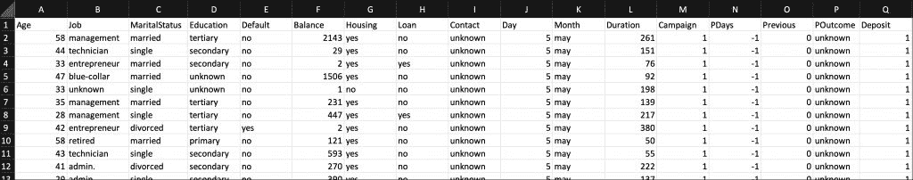

最后一列，`Deposit`是我们的标签，表示客户是否注册了定期存款。值 1 表示负面结果(不在银行存款)，值 2 表示正面结果(在银行存款)。

我们将把这个数据集上传到亚马逊 S3。用您的名称替换存储桶名称。

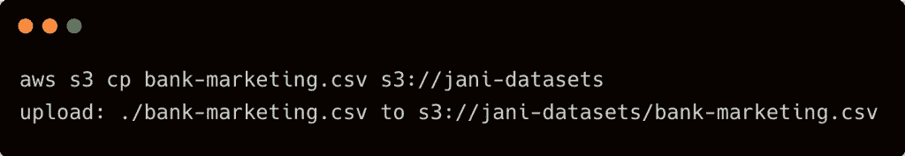

通过访问 AWS 控制台中的存储桶来验证对象。

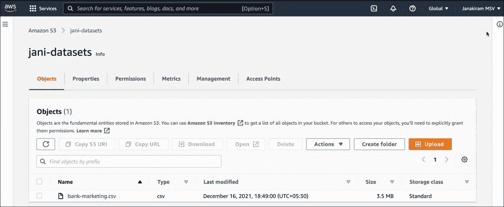

## 步骤 2:导入数据集

我们现在将这个数据集导入 Amazon SageMaker Canvas 来创建一个数据集。如果您提供了一个 SageMaker 域，那么您可以从那里启动画布。

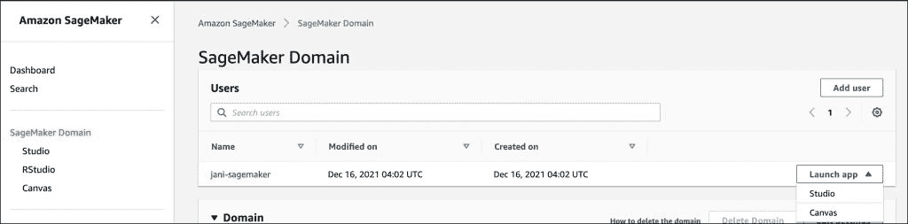

SageMaker Canvas 有四个步骤，在启动环境时出现的启动屏幕中有解释。

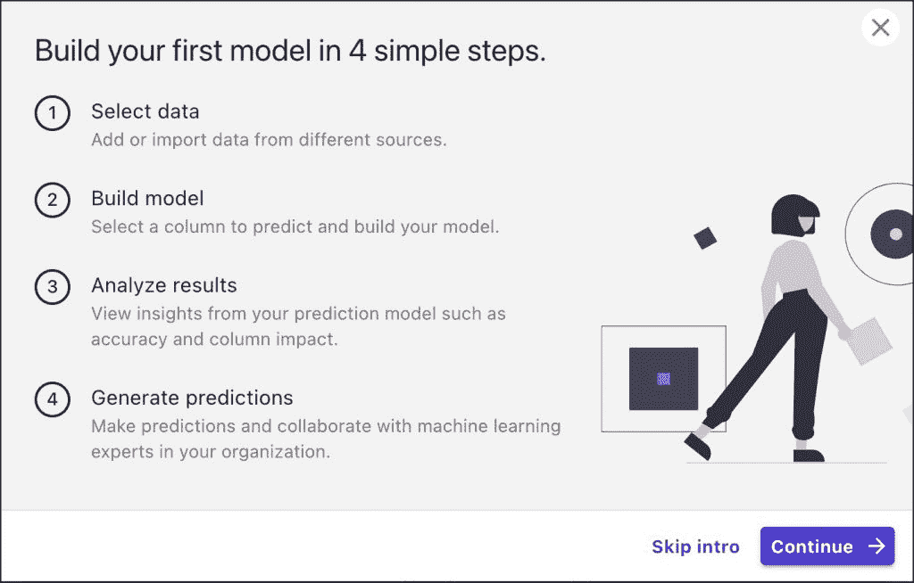

导航至左侧导航栏中的`Datasets`部分，点击`Import`。


导入我们上传到 S3 存储桶的 CSV 文件来创建数据集。

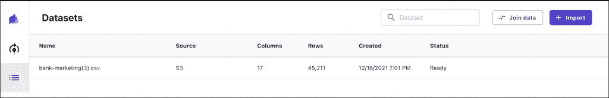

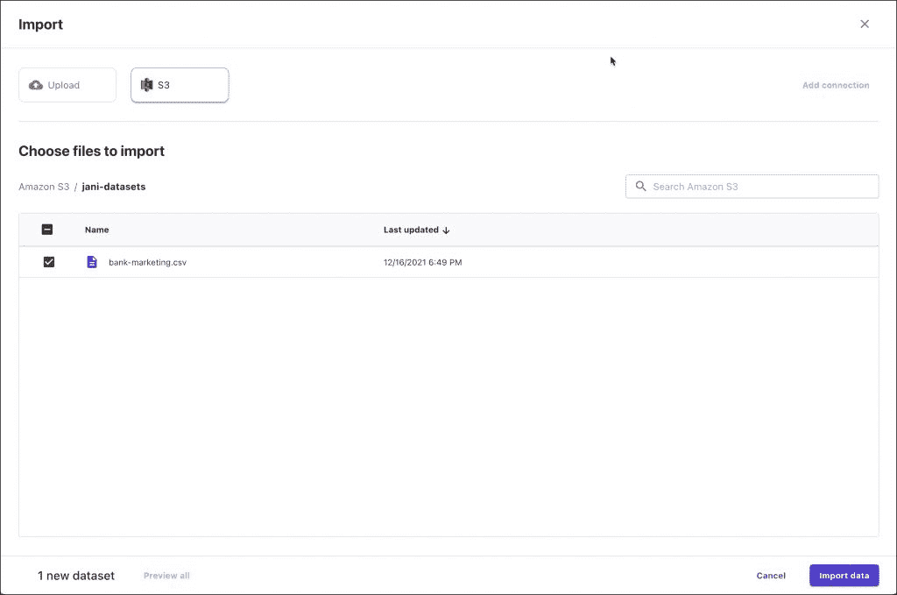

## 步骤 3:构建模型

创建一个新模型，并给它一个有意义的名字。在下一步中选择数据集。

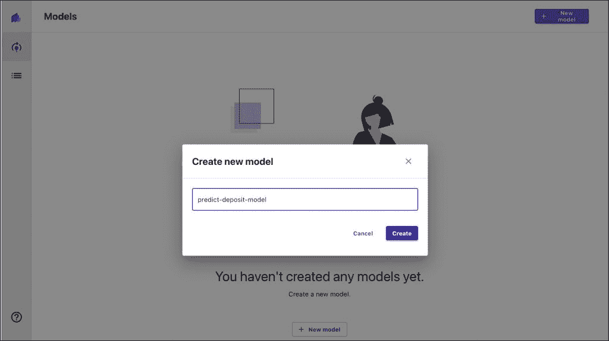

选择`Deposit`列作为目标。模型类型自动切换到 2 类预测(二元分类)。

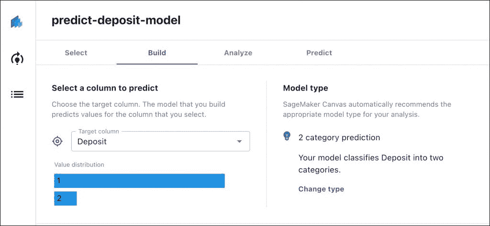

单击任何一列都会显示数据的详细信息和质量。

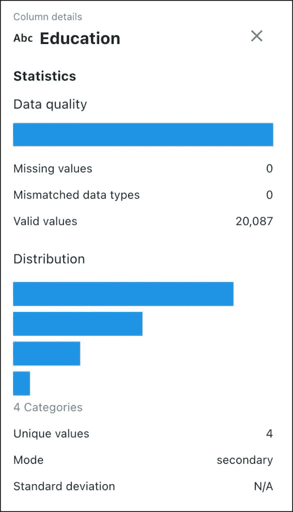

选择`Standard build`，开始培训工作。这将为我们提供一个从 SageMaker Studio 访问模型的选项。

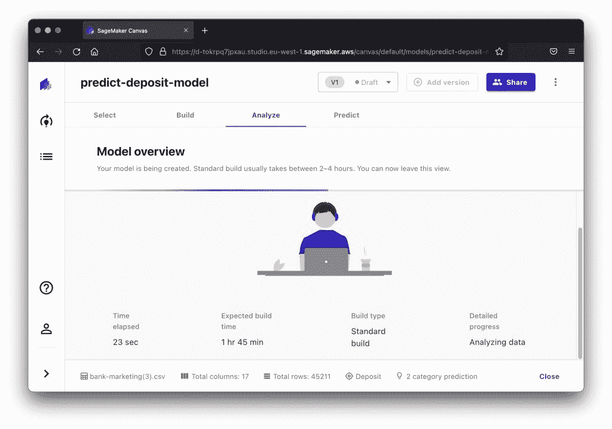

模型需要几个小时才能准备好。您可以在同一个页面上跟踪进度。

## 步骤 4:分析模型

一旦模型准备就绪，您就可以通过 F1 得分、RUC/AOC 和混淆矩阵等指标对其进行分析。

基本分析表明，模型准确率达到 90%，令人印象深刻。

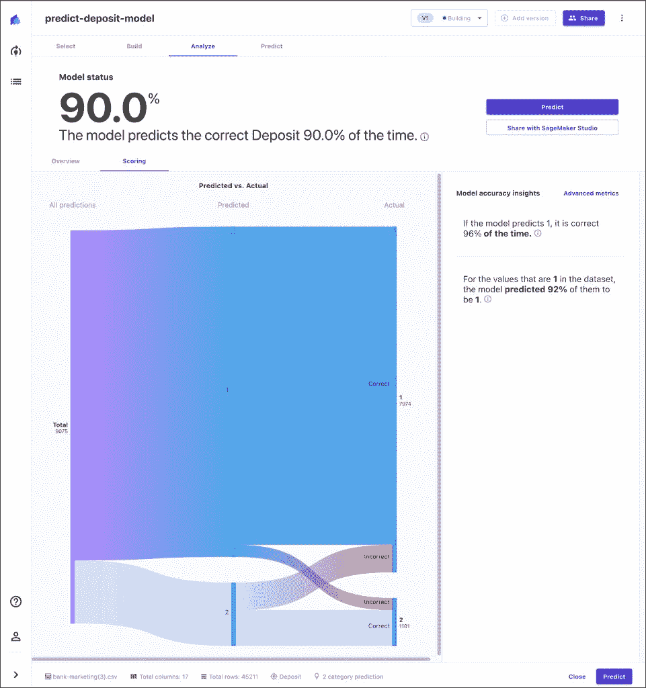

下面的截图显示了模型的混淆矩阵。它还具有 F1 和 AUC 分数。F1 是模型准确性的得分，AUC(曲线下面积)衡量模型的预测能力。

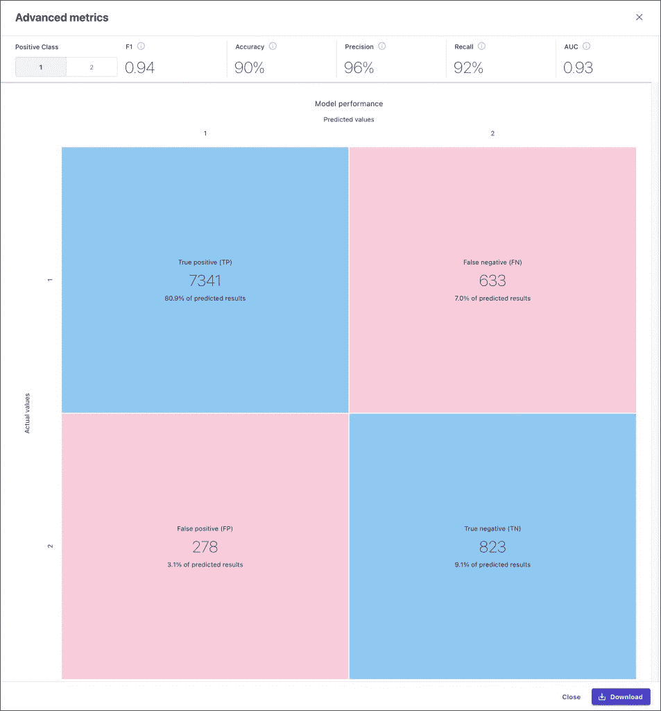

最后，我们可以通过 UI 更改值来执行预测。

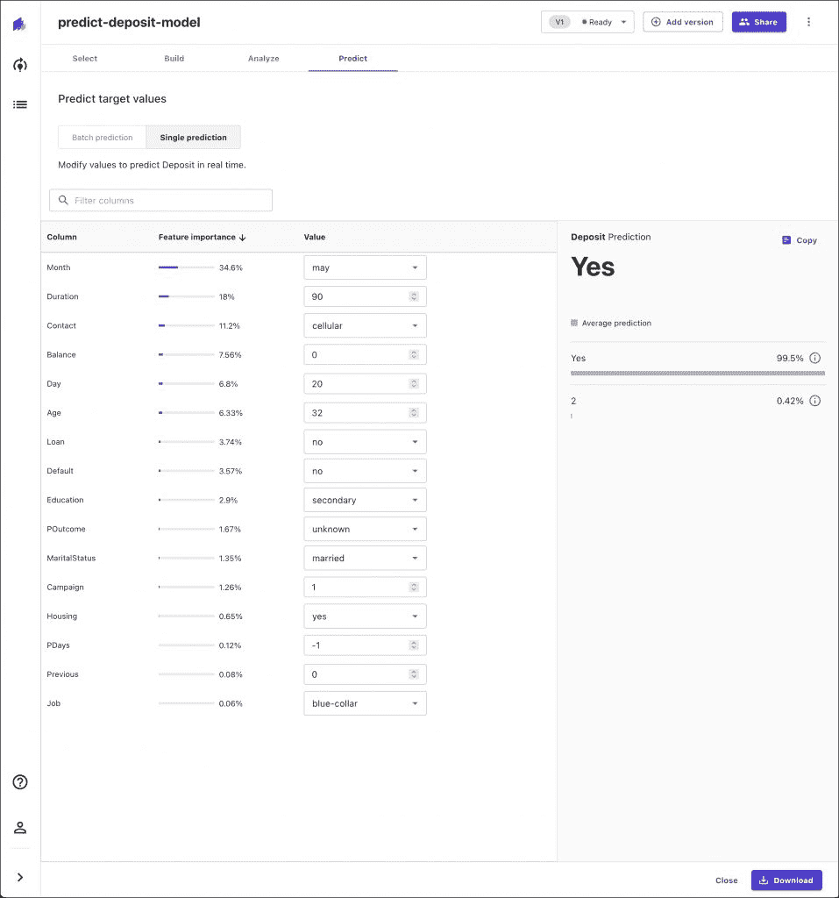

## 步骤 5:从 SageMaker Studio 访问实验

点击`Share`按钮将生成一个可通过 SageMaker Studio 访问的链接。

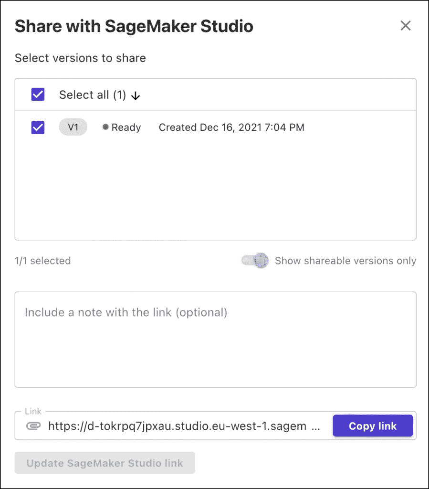

打开 SageMaker Studio 中的链接，向我们展示了 SageMaker 自动驾驶仪为选择最佳候选而进行的所有试验。

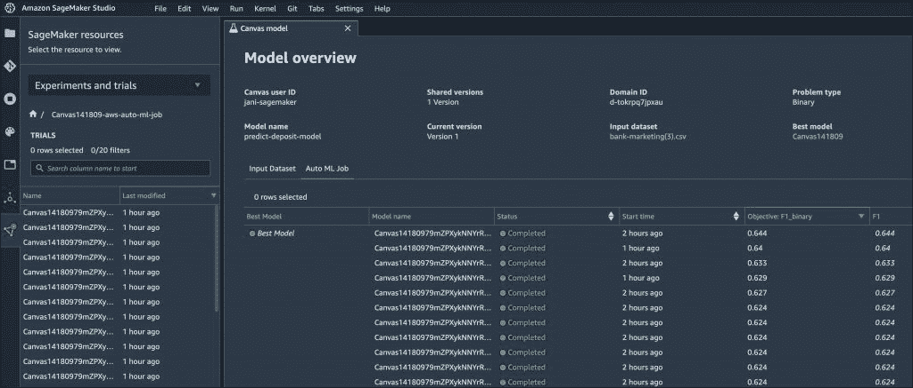

它甚至显示了试验期间生成的工件的链接。

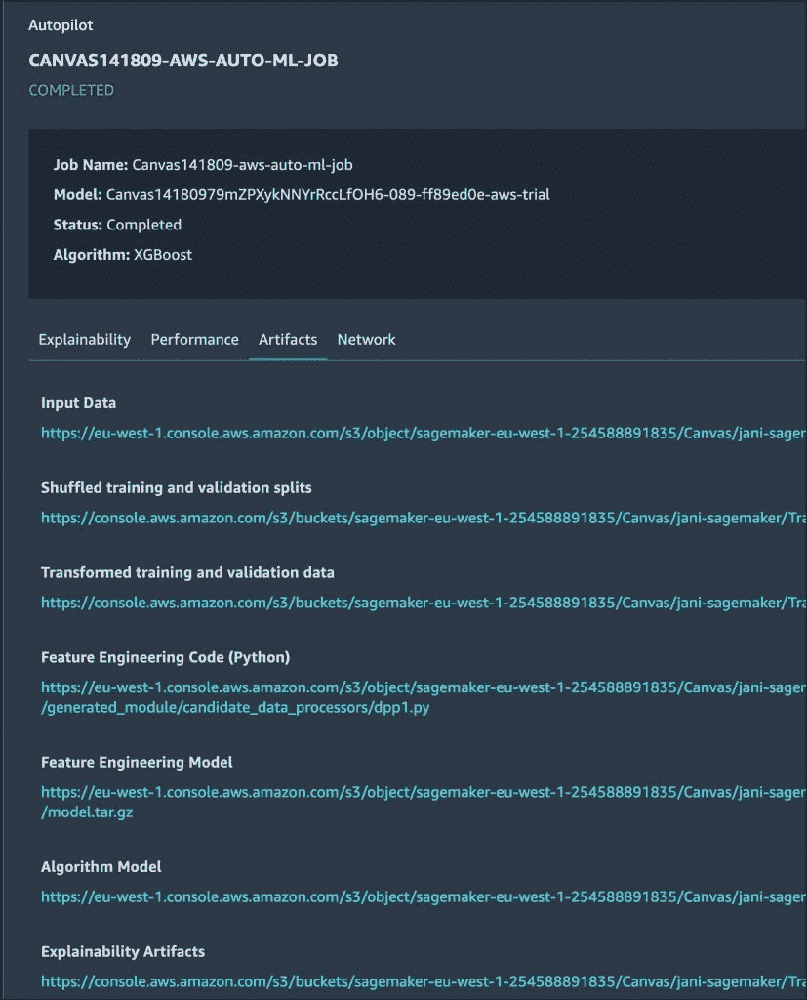

在幕后，SageMaker Canvas 在结构化数据集上运行自动驾驶实验。您可以下载 Jupyter 笔记本来研究每次试验的代码。

Amazon SageMaker Canvas 上的教程到此结束——用于训练 ML 模型的无代码工具。

<svg xmlns:xlink="http://www.w3.org/1999/xlink" viewBox="0 0 68 31" version="1.1"><title>Group</title> <desc>Created with Sketch.</desc></svg>