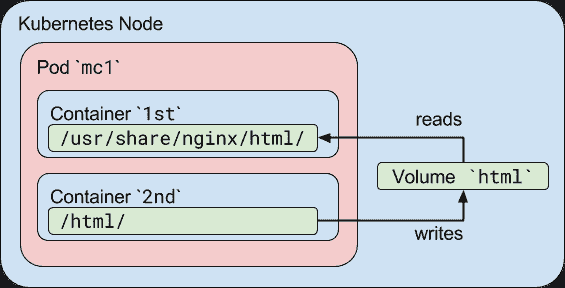
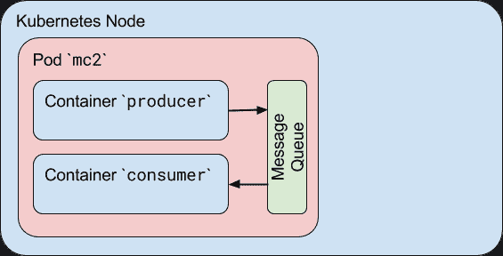

# Kubernetes 集装箱到集装箱通信综述

> 原文：<https://thenewstack.io/review-of-container-to-container-communications-in-kubernetes/>

Kubernetes 是一个容器化的解决方案。它提供了称为 Pods 的虚拟化运行时环境，Pods 包含一个或多个容器来提供虚拟运行时环境。Kubernetes 的一个重要方面是 Pod 内的容器通信。此外，管理 Kubernetes 网络的一个重要方面是在内部和外部转发容器端口，以确保 Pod 内的容器能够正确地相互通信。为了管理这种通信，Kubernetes 提供了以下四种网络模型:

*   集装箱到集装箱的通信
*   吊舱对吊舱的通信
*   吊舱到服务通信
*   外部到内部的通信

在本文中，我们将向您展示 pod 中的容器如何联网和通信，从而深入探讨容器到容器的通信。

## Pod 中容器之间的通信

在一个 Pod 中有多个容器使得它们之间的通信相对简单。他们可以用几种不同的方法做到这一点。在本文中，我们将更详细地讨论两种方法:i-共享卷和 ii-进程间通信。

### **I-Kubernetes Pod 中的共享卷**

 [马特·赞德

Matt is 是一位连续创业者，也是三家成功科技创业公司的创始人:DC 网络制造商、编码训练营和高中科技服务公司。他是 O'Reilly Media 出版的《使用 Hyperledger Fabric 开发实用智能合同》一书的主要作者。](https://www.linkedin.com/in/matt-zand-64047871/) 

在 Kubernetes 中，您可以使用一个共享的 Kubernetes 卷作为一种简单有效的方法，在 Pod 中的容器之间共享数据。在大多数情况下，在主机上使用一个与 Pod 中的所有容器共享的目录就足够了。

Kubernetes 卷使数据能够在容器重启后继续存在，但是这些卷与 Pod 具有相同的生命周期。这意味着只要 Pod 存在，卷(及其保存的数据)就会存在。如果出于任何原因删除了该 Pod，即使创建了完全相同的替换卷，共享卷也会被销毁并重新创建。

具有共享卷的多容器 Pod 的标准使用情形是，一个容器将日志或其他文件写入共享目录，而另一个容器从共享目录中读取。例如，我们可以这样创建一个 Pod:

```
apiVersion:  v1
kind:  Pod
metadata:
  name:  mc1
spec:
  volumes:
  -  name:  html
    emptyDir:  {}
  containers:
  -  name:  1st
    image:  nginx
    volumeMounts:
    -  name:  html
      mountPath:  /usr/share/nginx/html
  -  name:  2nd
    image:  debian
    volumeMounts:
    -  name:  html
      mountPath:  /html
    command:  ["/bin/sh",  "-c"]
    args:
      -  while true;  do
          date  >>  /html/index.html;
          sleep  1;
        done

```

在这个例子中，我们定义了一个名为 html 的卷。它的类型是 emptyDir，这意味着当一个 Pod 被分配给一个节点时，首先创建该卷，并且只要该 Pod 在该节点上运行，该卷就存在；顾名思义，最初是空的。第一个容器运行 Nginx 服务器，并将共享卷挂载到目录/usr/share/nginx/html。第二个容器使用 Debian 映像，并将共享卷挂载到目录/html。每秒钟，第二个容器将当前日期和时间添加到位于共享卷中的 index.html 文件中。当用户向 Pod 发出 HTTP 请求时，Nginx 服务器会读取这个文件，并作为对请求的响应将它传输回用户。[这里的](https://myhsts.org/tutorial-review-of-17-essential-topics-for-mastering-kubernetes.php)是一篇阅读更多类似 Kubernetes 主题的好文章。

[](https://cdn.thenewstack.io/media/2020/11/d5362cd2-image1.png)

您可以通过暴露 nginx 端口并使用您的浏览器访问它，或者通过直接检查容器中的共享目录来检查 pod 是否在工作:

```
$  kubectl exec mc1  -c  1st  --  /bin/cat  /usr/share/nginx/html/index.html
  ...

  $  kubectl exec mc1  -c  2nd  --  /bin/cat  /html/index.html
  ...

```

### **II-进程间通信(IPC)**

 [吉姆·沙利文

Jim 拥有电子工程学士学位和计算机科学硕士学位。吉姆还拥有工商管理硕士学位。吉姆已经做了 18 年的软件工程师了。目前，Jim 领导着一个专家团队，负责区块链开发、DevOps、云、应用程序开发和安全敏捷方法。Jim 是 IBM 的首席讲师。](https://www.linkedin.com/in/jamesjsullivan1122/) 

Pod 中的容器共享相同的 IPC 名称空间，这意味着它们也可以使用标准的进程间通信(如 SystemV 信号量或 POSIX 共享内存)相互通信。容器使用本地主机主机名的策略在 pod 内进行通信。

在下面的例子中，我们定义了一个包含两个容器的 Pod。我们对二者使用相同的 Docker 图像。第一个容器是一个生产者，它创建一个标准的 Linux 消息队列，编写一些随机消息，然后编写一个特殊的退出消息。第二个容器是一个消费者，它打开同一个消息队列进行读取，并读取消息，直到收到退出消息。我们还将重启策略设置为“Never ”,因此 Pod 会在两个容器都终止后停止。

```
apiVersion:  v1
kind:  Pod
metadata:
  name:  mc2
spec:
  containers:
  -  name:  producer
    image:  allingeek/ch6_ipc
    command:  ["./ipc",  "-producer"]
  -  name:  consumer
    image:  allingeek/ch6_ipc
    command:  ["./ipc",  "-consumer"]
  restartPolicy:  Never

```

为了验证这一点，使用 kubectl create 创建 pod 并观察 Pod 状态:

```
$  kubectl get pods  --show-all  -w
NAME      READY STATUS              RESTARTS  AGE
mc2 0/2 Pending 0 0s
mc2 0/2 ContainerCreating 0 0s
mc2 0/2 Completed 0 29

```

现在，您可以检查每个容器的日志，并验证第二个容器收到了来自第一个容器的所有消息，包括退出消息:

```
$  kubectl logs mc2  -c  producer
...
Produced:  f4
Produced:  1d
Produced:  9e
Produced:  27
$  kubectl logs mc2  -c  consumer
...
Consumed:  f4
Consumed:  1d
Consumed:  9e
Consumed:  27
Consumed:  done

```

[](https://cdn.thenewstack.io/media/2020/11/6517d90b-image2.png)

然而，这个 Pod 有一个主要问题，它与容器如何启动有关。

## **结论**

pod 可以有多个容器的主要原因是为了支持辅助主应用程序的助手应用程序。助手应用程序的典型例子是数据拉取器、数据推送器和代理。这种模式的一个例子是带有助手程序的 web 服务器，该程序轮询 git 存储库以获取新的更新。

本练习中的体积提供了容器在 Pod 生命周期内进行通信的方式。如果删除并重新创建 Pod，存储在共享卷中的所有数据都会丢失。在本文中，我们还讨论了 Pod 中容器之间的进程间通信的概念，这是共享卷概念的一个替代方案。现在您已经了解了 Pod 中的容器如何通信和交换数据，您可以继续学习其他 Kubernetes 网络模型，例如 Pod 到 Pod 或 Pod 到服务的通信。[这里的](https://blockchain.dcwebmakers.com/blog/advance-topics-for-deploying-and-managing-kubernetes-containers.html)是一篇学习 Kubernetes 开发的更高级主题的好文章。

<svg xmlns:xlink="http://www.w3.org/1999/xlink" viewBox="0 0 68 31" version="1.1"><title>Group</title> <desc>Created with Sketch.</desc></svg>