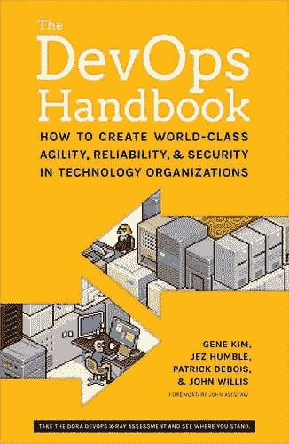
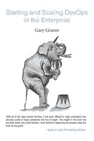

# 评论:理解 DevOps 的新书

> 原文：<https://thenewstack.io/review-understanding-devops-putting-place-even-scale/>

*"**[《devo PS 手册:如何在技术组织中创造世界级的敏捷性、可靠性和安全性](https://www.amazon.com/DevOps-Handbook-World-Class-Reliability-Organizations/dp/1942788002/ref=as_li_ss_tl?ie=UTF8&qid=1479482923&sr=8-1&keywords=The+DevOps+Handbook&linkCode=sl1&tag=nudesleecote&linkId=ad10c0a507eb390ea1b669be48b21930)** "*
*作者:吉恩·金、帕特里克·德博伊斯、约翰·威利斯、杰兹·亨布尔和约翰·奥斯鲍*
*IT 革命出版社，480 页*

***[企业中的启动与缩放](https://www.amazon.com/Start-Scaling-Devops-Enterprise-Gruver-ebook/dp/B01M332BN2/ref=as_li_ss_tl?ie=UTF8&qid=1479483952&sr=8-1&keywords=Start+and+Scaling+DevOps+in+the+Enterprise&linkCode=sl1&tag=nudesleecote&linkId=4f8c30c8f54792ac1406b5d46ddff3f1)***
*作者加里·格鲁弗*
*图书宝贝，94 页*

大型组织总是发现很难将敏捷扩展到团队之外，更不用说不同部门之间了。与在像好事达、花旗或联邦政府机构这样的大型组织中应用敏捷的难度相比，在团队层面上进行敏捷和开发几乎毫不费力。

所有这些组织都迫切希望获得敏捷和 DevOps 的好处:[加速发布周期，这样他们就可以获得消除瓶颈的精益式吞吐量好处](https://www.youtube.com/watch?v=l-8V3wNAHvA&feature=youtu.be&t=7m40s)和[专注于创建让用户高效的软件](http://www.theregister.co.uk/2016/02/04/think_small_not_big/)。我喜欢称之为，他们想实施小批量流程来推动业务创新。

但是这很难，太难了。正如[devo PS 报告发现的](http://www.slideshare.net/realgenekim/2014-state-of-devops-findings-velocity-conference/29)，拥有 10，000 名或更多员工的组织比 500 人或更少的“小型”组织成为高绩效者的可能性低 40%。

 [迈克尔·科特

Michael Coté在 Pivotal 从事技术营销工作。他曾是 451 Research 和 RedMonk 的行业分析师，在戴尔软件和云部门的企业战略和 M&A 部门工作过，在此之前曾做过十年的程序员。他在 Cote.io 上写博客和播客，在 Twitter 上是@cote。](https://cote.io) 

我与许多在这种变化中挣扎的大型组织交谈过。他们必须经历戏剧性的组织和流程转换，通常在几年内完全重建。他们中的许多人，像好事达公司一样，甚至建立了独立的组织，以免用过去的方式阻碍和影响新的组织。

无论你认为什么是“敏捷和 DevOps 知识界”，最近都有很多运动来帮助这些组织。 [DOES 会议在描述大型组织如何改进方面做得很好](https://www.youtube.com/channel/UCkyYEVVmT9vQ4yPBR4ciFUA/videos),[devo pddays 会议](https://www.devopsdays.org/)同样展示了一些大型用户案例，供应商——如我的公司 Pivotal——正在利用他们的会议让大型组织分享他们的战争案例和建议。我们在帮助大型组织方面做得越来越好，但这需要很长时间，还有很多工作要做。

最近出版的两本书很突出，如果你正在努力扩展敏捷和 DevOps，它们很有帮助，值得你花时间去读。

## 完成 DevOps 盒装套装

 首先是[《德沃普斯手册》](https://www.amazon.com/DevOps-Handbook-World-Class-Reliability-Organizations/dp/1942788002/ref=as_li_ss_tl?ie=UTF8&qid=1479482923&sr=8-1&keywords=The+DevOps+Handbook&linkCode=sl1&tag=nudesleecote&linkId=ad10c0a507eb390ea1b669be48b21930)，由德沃普斯思想领袖的全明星阵容撰写，[吉恩·金](https://twitter.com/RealGeneKim)，[帕特里克·德博伊斯](http://www.jedi.be/blog/)，[约翰·威利斯](https://www.linkedin.com/in/johnwillisatlanta)，以及[杰兹·谦卑](https://twitter.com/jezhumble)。这本书名副其实:这是一本手册，介绍了什么是 DevOps，要实施的实践，它们为什么有效，以及来自[蠢驴组织](https://devops.com/the-devops-donkey-represents-the-rest-of-us/)的足够多的案例研究，让你相信[你不必成为网飞或谷歌](https://www.youtube.com/watch?v=P_sWGl7MzhU)就能通过这些实践获得成功。

当我阅读《DevOps 手册》时，我一直把它与《精益企业》进行比较(这本书也是杰斯·亨布尔与 T21、乔安妮·莫莱斯基和巴里·奥雷利合著的)。尽管尝试了两次，我还是无法以常规的方式完成精益企业。它包含了所有正确的东西，从连续交付，到博伊德上校和普鲁士军事手段，到威斯特伦思想。

“精益企业”是 DevOps 讲坛上的精彩布道(更像是其中的一种纲要)，而“DevOps 手册”更像是将优秀工作付诸实践的手册。“精益企业”将向你推销为什么你应该修复你的组织，帮助你理解一种思考组织的新方式，并软化你的头脑以接受“DevOps 手册”中的指示

由[詹妮弗·戴维斯](https://twitter.com/sigje)和[凯瑟琳·丹尼尔斯](https://www.linkedin.com/in/katherinefdaniels)合著的另一本书《有效的开发任务》是这两本书的好伴侣。我喜欢“有效的开发运维”*，因为除了涵盖开发运维的基础，它还谈到了我最喜欢的开发运维的人性化部分:我们应该努力做好工作，并通过创建健康、智能的工作场所和流程来做到这一点。它也获得了大量的实践建议，无论是在肉制品还是软件方面。这是我对所有软件方法论过于愤世嫉俗的总结:不要做傻事。*

 *## 绿色运行管道，否则格鲁弗会用他的激光眼融化你

 虽然《DevOps 手册》绝对值得你花时间，但你应该先拿一本[加里·格鲁弗](http://www.garygruver.com/)的 94 页新书《[在企业中开始和扩展 devo PS](https://www.amazon.com/Start-Scaling-Devops-Enterprise-Gruver-ebook/dp/B01M332BN2/ref=as_li_ss_tl?ie=UTF8&qid=1479483952&sr=8-1&keywords=Start+and+Scaling+DevOps+in+the+Enterprise&linkCode=sl1&tag=nudesleecote&linkId=4f8c30c8f54792ac1406b5d46ddff3f1)》，然后再做其他事情。这本书里的文字清晰而强烈，就像他总是设法在自己的大头照里看到的那样。这就像用解体射线的商业终结来清理你楼上垃圾壁橱的混乱一样。

格鲁弗的书从上面的前提开始:将 DevOps 应用于小团队是没有问题的。如果不是数千人，而是数百人，那就完全是另一回事了。而且，正如我在旅行中经常发现的那样，世界上大多数的软件问题都在破解大规模应用敏捷和 DevOps 项目的难题。

解决这个扩展问题将在我们的生活中产生最大的净积极影响:如果你能提高政府机构软件的效率，例如，在医疗保健、零售或工业机械管理方面，每年只提高几个百分点，你将比给猫戴上更多的帽子改善更多人的生活。

诚然，问题有时可以[归结为仅仅一个团队](http://ronjeffries.com/xprog/articles/issues-with-safe/)，但是大组织中的大多数系统——许多产生核心收入的系统——都是庞大、复杂和可怕的。作为一个不可避免的复杂系统的例子，Gruver 描述了如何实施全渠道战略:

*例如，在零售行业，公司试图在每个客户界面创造共同的体验，创造网上购物和店内提货的能力需要协调大型紧密耦合系统的工作。它会影响网站和移动团队的订购。它通过信贷和库存系统，这是典型的遗留系统。然后是商店的销售系统和工具。这些系统是如此紧密地耦合在一起，以至于从网上购买到店内提货需要跨所有这些系统协调开发、测试和部署。*

他的处方并不是轻而易举就能应用的，而且与你从大多数 DevOps 建议中得到的彩虹和凉鞋的感觉相比，是非常严格的。在其方法的核心，Gruver 坚持使用自动化部署管道和不断增长的自动化构建验收测试来管理单个项目，以及多个项目的集成。他设法用短语“[有界语境](http://martinfowler.com/bliki/BoundedContext.html)”解释了如何应用有界语境思维来分解复杂系统(就像上面的全渠道系统)

我发现 Gruver 的书非常有帮助，甚至令人激动的是，它的说明非常精确，并通过几个假设场景来解决大规模应用敏捷和 DevOps 时出现的常见问题。另外，对于这种类型的书来说，这是一个完美的尺寸:大约 90 页，需要你花大约 90 分钟来阅读。

专题图片:比尼谢尔，库尔环盖高中，途经[新老股](http://nos.twnsnd.co/)。

<svg xmlns:xlink="http://www.w3.org/1999/xlink" viewBox="0 0 68 31" version="1.1"><title>Group</title> <desc>Created with Sketch.</desc></svg>*