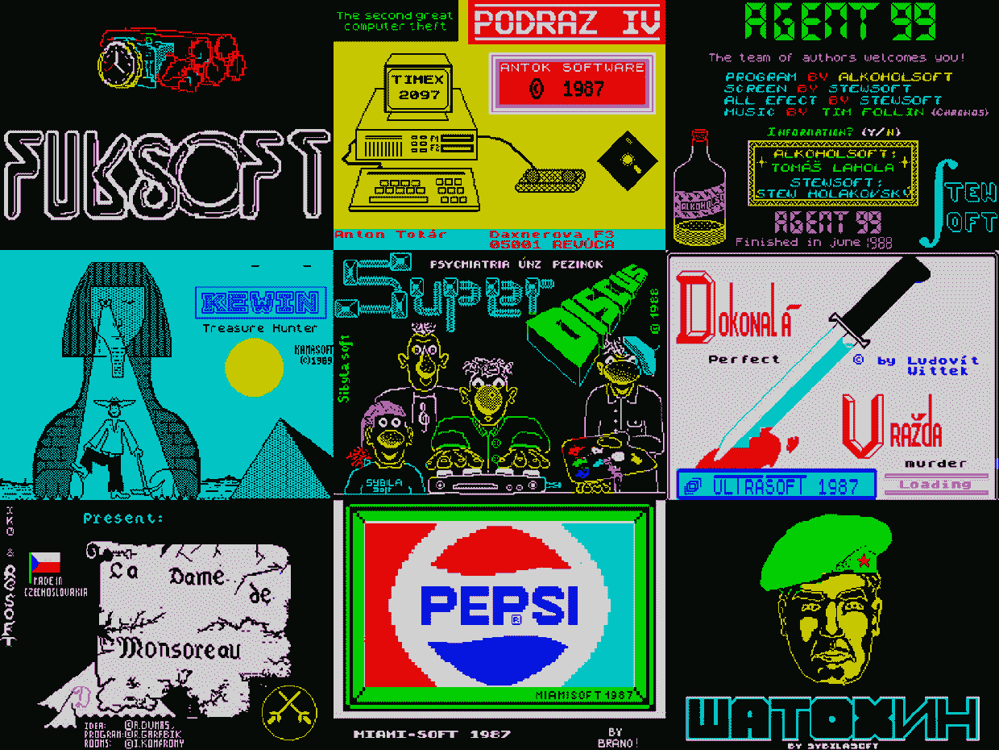

# 复兴铁幕后青少年制作的电子游戏

> 原文：<https://thenewstack.io/reviving-video-games-made-by-teens-behind-the-iron-curtain/>

“通过玩由生活在苏联式共产主义下的愤怒的青少年设计的电子游戏来体验苏联式共产主义的崩溃，”video 最近的一篇文章打趣道。

它给读者指出了一个令人惊讶的鼓舞人心的新网页，承诺“[可以玩 80 年代后期的斯洛伐克数字游戏的英语本地化版本](https://scd.sk/clanky/playable-english-localizations-of-slovak-digital-games-from-the-late-80s-period/)利用斯洛伐克艺术委员会的公共资金，斯洛伐克设计博物馆与斯洛伐克游戏开发者协会合作开展了一个多年项目，将斯洛伐克语游戏翻译成英语，以帮助它们在世界范围内更加可见。

组织者希望这个项目能让游戏历史研究者和游戏行业专业人士“直接接触我们的游戏历史”

《华盛顿邮报》称，即使是社会学家和媒体历史学家也可以研究这些材料，因为该项目的最终目标是翻译斯洛伐克从个人电脑早期生产的几乎所有 8 位电脑游戏，并且“在作者许可的情况下，可以出于研究和非商业目的自由分发”

除了与专业翻译合作，博物馆和协会还得到了具有“历史著作知识”的编程专家的帮助。这些专业人士包括游戏的原创者——比如[斯坦尼斯拉夫·赫尔达](https://www.linkedin.com/in/stanislav-hrda-14133263)，现在是思科网络设备当地经销商的销售顾问，他在 34 年前写了一个叫做“T7”的模仿《兰博》的游戏[。](https://scd.sk/hra/satochin/)

但在他们的在线展览背后，是一个丰富的、鼓舞人心的、却常常被忽视的关于个人电脑早期历史的故事。正如马修·高尔特在 Vice.com 写的那样，“冷战无法阻止游戏在东方集团的蓬勃发展。”

## 对共产主义不满

Ars Technica2020 年的一篇文章回顾了捷克和斯洛伐克的青少年是如何“成为世界上第一批发现电子游戏可以承载政治声明的人之一”。他们对共产党很恼火，因为共产党使他们很难得到电脑和软件。他们认为压迫性的政权正在夺走他们的未来，所以他们觉得有资格嘲笑它，扭曲规则。”

或者，正如 Hrda 告诉 Ars Technica 的，“我们想在学校里学习计算机科学，而不是马克思列宁主义。”

设计博物馆的博客帖子揭示了一个游戏被复制和交换的令人惊讶的地方:Svazarm 的兴趣小组，这是一个有着自己东方集团历史的组织。Svazarm 在 2018 年出版的一本名为“游戏铁幕:共产主义捷克斯洛伐克的青少年和业余爱好者如何声称电脑游戏的媒介”的书中回忆道，该书将该组织描述为“与军队合作的联盟”，是该国最大的准军事组织之一，拥有数千个地方组织。

Ars Technica 的文章描述说，虽然该组织“负责培训年轻人在军队中的潜在角色……但它更像是一个童子军俱乐部，聚集了对赛车运动、业余无线电、模型飞机、电子产品和计算机感兴趣的孩子”。

这本书认为，捷克斯洛伐克军队“确实通过 Svazarm 在支持业余爱好计算方面发挥了间接作用”，尽管“业余爱好计算活动人士倾向于将加入 Svazarm 解释为对政权的务实渗透。”(该书指出，当年轻的开发者发布游戏时，游戏的积分“很少”表明他们与 Svazarm 和其他社会主义俱乐部的联系。)

“在国家支持的电脑俱乐部的庇护下，当地程序员将游戏塑造成一种表达的媒介，不像电视或报纸，既不受监管也不受审查，”该书在亚马逊上的描述叙述道

在共产党统治的最后几年，捷克斯洛伐克的程序员是世界上第一批制作关于当前政治事件的激进游戏的人，他们预见了几十年后在独立或实验性游戏中观察到的趋势

## 从西方走私进来的电脑

那不是青少年学习编程的唯一地方。这本书还估计有 100 多个电脑俱乐部，“每个城市和大多数较大的城镇至少有一个。”根据这本书的描述，“尽管家用电脑稀缺，软硬件市场缺失”，最终还是生产出了 200 多款游戏。

该描述称，这些游戏“轮流具有创造性、发明性和政治颠覆性”，游戏开发者利用“他们的聪明才智变得活跃、富有创造性并被倾听。”

还有其他挑战需要克服。在捷克斯洛伐克和其他苏联卫星国，Hrda 在设计博物馆的博客帖子中回忆道，“人们很难获得微型计算机，所以他们从西方走私进来。”(他说，当时在东欧国家，计算机生产“要么不存在，要么涉及相对不发达、规格低劣的计算机。”)

例如，在 2020 年，Ars Technica 找到了弗兰蒂谢克·弗卡，他在 20 世纪 80 年代 16 岁的时候，看过《夺宝奇兵》后，也写了自己关于印第安纳·琼斯的文字冒险文章称，弗卡在一台 ZX Spectrum 电脑上编写了这款游戏，这台电脑是由一个朋友的父母“放在一个外交行李箱中以逃避边境管制”走私入境的。

弗卡激发了许多其他青少年写他们自己的本土文本冒险。

在设计博物馆的博客文章中，Hrda 还回忆说，主要是青少年和儿童，生活在“没有版权保护的国家……从西方复制游戏，在家里甚至在现有的电脑俱乐部里玩。更有技巧的人从玩游戏到尝试创造游戏。”

铁幕背后的年轻游戏创作者技能有限，也没有赚钱的机会，因为这些游戏从未在商店出售。因此，文本冒险变得流行起来，通常是用简单的编程语言 BASIC 编写的，每台家用电脑都附带这种语言。

Hrda 深情地回忆说，编写文本冒险给了这些年轻的程序员一种方式，将他们的幻想印在他们自己的角色和世界上，将他们的朋友融入故事中，有时甚至是他们在电影(以 VHS 磁带发行)、漫画、书籍和电视节目中看到的西方流行文化角色。

“一些人在文字游戏中写下了自己的科幻或幻想故事，另一些人将现实与流行文化相结合，参考了作者感兴趣和着迷的事物和现实，或者是作者朋友之间讨论的主题，”Hrda 在博物馆项目的博客上写道。

但是这篇博文的有趣之处就在这里。Hrda 还回忆了那些对共产主义政权具有明显颠覆性的游戏——比如说，描述了一场未经授权的反政权抗议。在 1988 年的一个游戏中，Hrda 在博物馆项目的博客上写道，“你用炸药炸毁了苏联共产主义创始人 V. I .列宁的雕像，在雕像下你发现了一块金砖，它允许你移民到自由的西方。”

Hrda 在 Arts Technica 的文章中说，一个灵感来自一部苏联电影，在这部电影中，一个名叫 Shatokhin 的英雄士兵渗透到一个美国军事基地，邪恶的中情局特工在那里策划破坏裁军谈判的方法。

它基本上是兰博的仿制品，Hrda 说。因此，不可避免地，他写了一个游戏，在这个游戏中，苏联英雄必须与兰博本人对抗——尽管兰博会受到任何政府控制的官方媒体的审查。

“对于共产主义盗贼统治下日益老化的老年政治，视频游戏领域和自制文本冒险游戏的子类别都在雷达之下，”Hrda 在博物馆的博客帖子中写道，“游戏自由流通，主要是在朋友之间，没有限制或审查，就像不便作者的不便书籍一样。”

## 结束学分

14 岁的他画出了游戏中的锤子和镰刀， [Michal Hlavac，](https://www.linkedin.com/in/michalhlavac)现在是 Meta 公司人工现实实验室 Oculus 的产品设计师。对于 Ars Technic，他回忆了游戏是如何直接嘲笑苏联人的。(游戏中甚至还有一个隐藏的游戏，玩家变成兰博，试图杀死他的苏联对手。)

Ars Technica 的文章描述了一个游戏，其中逃离捷克斯洛伐克的人是印第安纳·琼斯。(“他在与暴力的共产主义者战斗，躲避高压水枪，在火山口边缘保持平衡，并逃离爆炸的炸弹”)但文章也指出，这款游戏是在现实世界的抗议者在布拉格的温塞拉斯广场被警察殴打和逮捕后发布的。

“这些人在现实生活中无法反击，所以他们后来用他们的电脑来进行虚构的报复，”文章总结道。“一位西部英雄印第安纳·琼斯前来解救他们，给他们的压迫者上了一堂基于文字的课。”

游戏的标题？"《印第安纳·琼斯历险记》1989 年 1 月 16 日，布拉格温塞拉斯广场."现在可以在线玩的[。](https://primitivedesigns.github.io/remakes89/indy/en/)

虽然游戏的影响在更大的历史长河中可能可以忽略不计，但 Ars Technica 指出，像 Hrda 这样的游戏设计师也参与了一场现实世界的“天鹅绒革命”，这场革命导致了捷克斯洛伐克的非暴力权力过渡。

“在那些动荡的日子里，游戏开发商从他们数字化的西方英雄背后走了出来。他们第一次远离电脑屏幕，公开表达自己的政治观点…

"就像印第安纳·琼斯一样，捷克斯洛伐克少年最终赢得了自由."

* * *

# WebReduce

<svg xmlns:xlink="http://www.w3.org/1999/xlink" viewBox="0 0 68 31" version="1.1"><title>Group</title> <desc>Created with Sketch.</desc></svg>