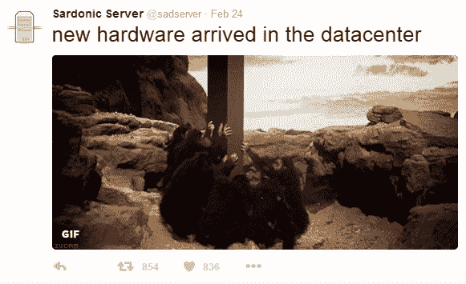
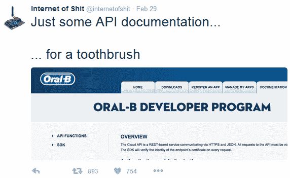
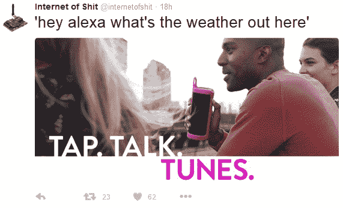
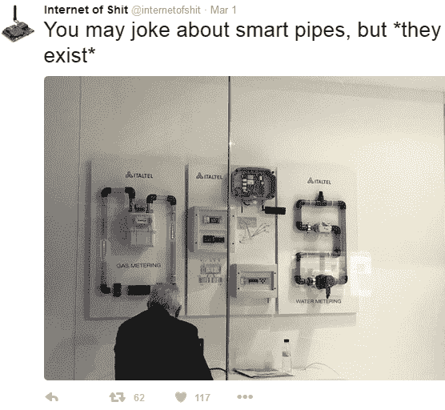
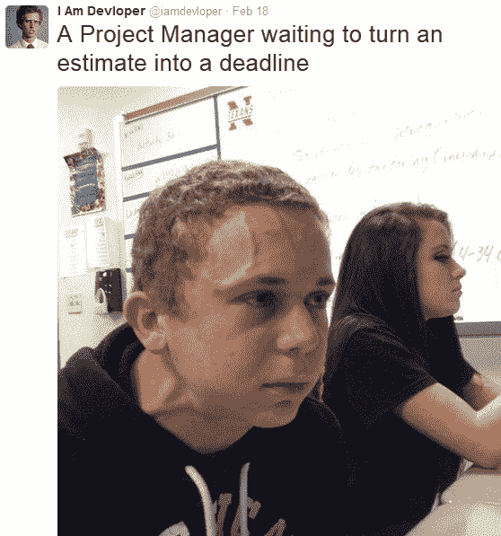

# 用 JavaScript 重写 Git:五个极客模仿 Twitter Feeds

> 原文：<https://thenewstack.io/rewriting-git-javascript-five-geeky-parody-twitter-feeds/>

有时，在信息技术的大肆宣传的世界里，正是这种会心的笑声揭示了皇帝没有穿衣服。因此，这里有五个 Twitter 账户，用不超过 140 个字符的篇幅提供了傻瓜的智慧。

## @SadServer

曾几何时，推特上的观众发现[讽刺漫游者](https://twitter.com/SarcasticRover)，一个假装由美国宇航局的机器人探索者撰写的提要，搁浅在火星上。它仍然在那里，现在抱怨今年的奥斯卡典礼比美国宇航局的机遇号火星车(2014 年开始遭受硬件故障)持续的时间更长。

但是现在有了[“讽刺服务器”](https://twitter.com/sadserver)

“你为什么这么关心加密？你的数据实际上是不可读的。

像任何优秀的 Twitter 幽默家一样，这个服务器知道如何用图片来表达自己的观点。例如,《讽刺服务器》用《T4 2001:太空漫游》的动画片段展示了新硬件进入数据中心的独特兴奋感。

偶尔，它会将目标转向困扰专业极客的无情官僚主义:“由于预算削减，每三个警报中只有一个会被发送。”但它最喜欢的目标似乎是极客们的傲慢:

有时，它甚至似乎在嘲笑整个极客群体的思维:

## @ TheInternetOfShit

当然，你听说过物联网，但是一个 Twitter 账户提供了它自己的模仿范例，[狗屎互联网](https://twitter.com/internetofshit)。这是一个近 1000 条推文的尖锐愤世嫉俗的集合，抨击了所有围绕互联网消费产品的炒作，有时还指出了最糟糕的违法者中最糟糕的一个。例如:“现在你的吸尘器可以给你发送需要的短信了！”

近 70，000 人正在关注这场持续的畸形秀，feed 的简介提供了一个电子邮件地址，因此读者可以建议更多需要好好打击的“智能”家居物品。最近，这些推文一直在嘲笑亚马逊的“ [Alexa](http://www.theverge.com/2016/3/3/11157394/amazon-alexa-fire-phone-failure-echo-success-smart-home) ”个人助理，以及它告诉你天气如何的能力——当你已经在户外的时候。

但潜在的信息似乎总是一个诚实和真正的惊讶，技术正以某种方式潜入甚至最简单的人类发明。

“水族馆一开始真的没有那么难，”这让一个 KickStarter 活动想起，该活动承诺[世界上最简单的水族馆监视器](https://www.kickstarter.com/projects/1758456789/fishbit-your-aquarium-made-simple?ref=ksrfb)。总的来说，这些推文确实提出了一个非常令人信服的观点——不管是好是坏，物联网已经开始了。

## @IAmDevloper

这个账户的名字，“[我是开发者](https://twitter.com/iamdevloper)，”[原文]是这个账户所歪曲的 IT 世界中的傲慢、愚蠢和普遍的不和谐的预览。

例如，周三，Devloper[原文如此]发布了一张图片，展示了当一个 JavaScript 开发者坚持认为自己太优秀而不能使用框架时会发生什么。

IamDevloper[原文如此]借用了电影《大人物拿破仑》中的一张个人资料照片，已经吸引了 144000 名粉丝，嘲讽了从项目经理到平面设计师的所有人…

甚至是对他们的文本编辑软件有点过于自豪的计算机程序员…

像任何优秀的幽默作家一样，Devloper 分享了他自己的古怪癖好的例子，这些癖好很可能是你自己的。

当然，提要有几个重复出现的主题:

## @HackerNewsOnion

[@HackerNewsOnion](https://twitter.com/HackerNewsOnion) 的个人资料页面看起来就像为 [YCombinator 的黑客新闻](https://twitter.com/newsycombinator)创建的页面，除了它的标志是一个大的“O”而不是“Y”，因为“黑客新闻洋葱”只发布假新闻标题，就像 [The Onion](https://www.theonion.com/) 一样。和洋葱一样，@HackerNewsOnion 最好的讽刺暗示了令人不安的事实。

在 2013 年发布后，超过 4 万人开始关注他们的推文。虽然只有 47 篇，但是新闻标题的风格让每一篇讽刺性的杰作都让人感觉更加辛辣。

# 

时隔一年多之后，2 月份,@ HackerNewsOnion 以一个新的标题震惊了世界。

# @HipsterHacker

作为最古老的 IT 模仿 Twitter feeds 之一， [@HipsterHacker](https://twitter.com/hipsterhacker?lang=en) 仍然用他在 2011 年发布在反馈顶部的一条推文来问候访客:

作为一名模拟潮人，他不仅模仿科技行业本身，还模仿那些对每个闪亮的新框架着迷的个人极客。

一年多后，这条推文得到了更新，随后宣布潮人黑客[现在正在使用 React](https://twitter.com/hipsterhacker/status/628986199814881280) ，并且“回头看看，我可以看到我成长了多少……”这条推文在去年夏天逐渐消失——可能是因为所有那些雄心勃勃的项目。

通过 Pixabay 的特征图像。

<svg xmlns:xlink="http://www.w3.org/1999/xlink" viewBox="0 0 68 31" version="1.1"><title>Group</title> <desc>Created with Sketch.</desc></svg>