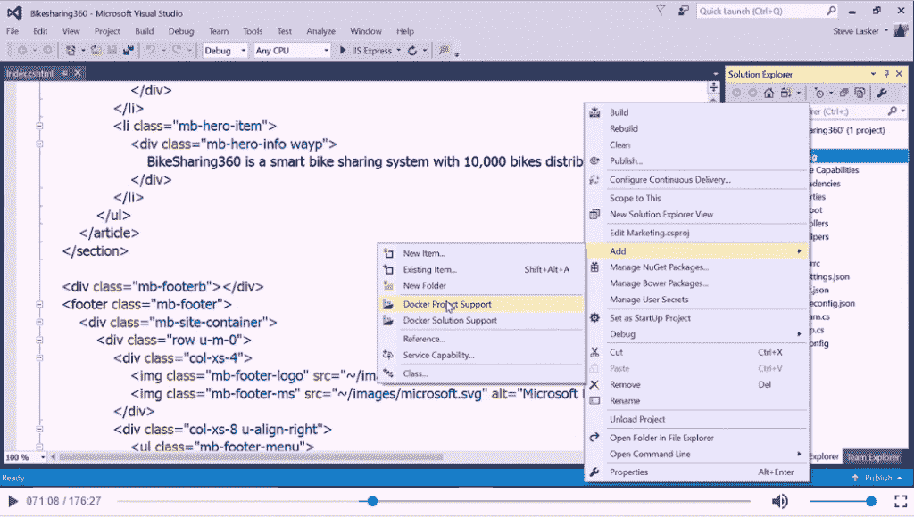
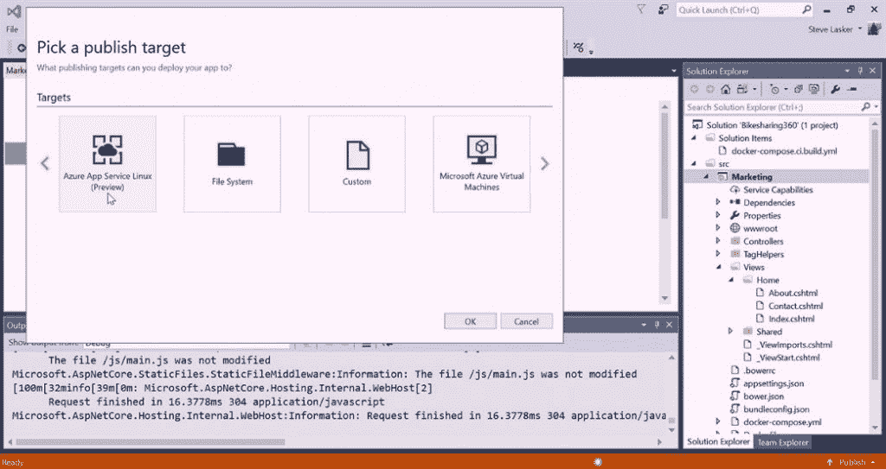
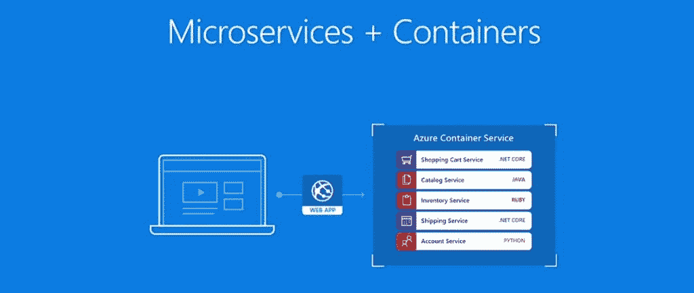
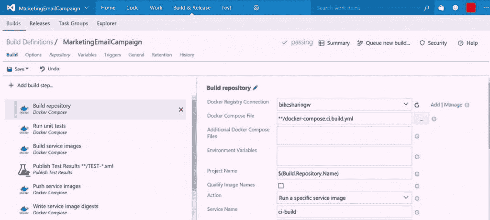
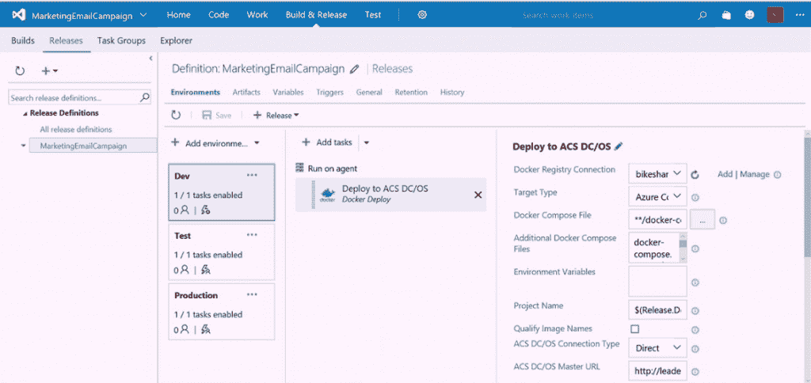
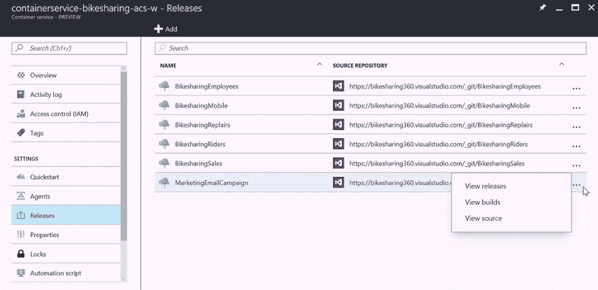

# 右键单击 Docker:微软雄心勃勃的容器企业愿景

> 原文：<https://thenewstack.io/right-click-docker-microsofts-ambitious-enterprise-vision-containers/>

微软想用自己的秘密武器帮助企业容器化的采用:鼠标右键。

“采用基于容器的开发方法，使用 Docker 之类的东西，至少是大多数开发团队现在正在思考和讨论的事情，”微软云计算和企业部门负责人斯科特·格思里在本月纽约举行的公司 Connect()会议上说。"能够使用 Docker 部署应用程序使得部署方法更加一致."

因此，微软终于掀起了容器热，它把公司最擅长的事情带到了派对上:打包新技术，以便企业可以轻松使用它们。换句话说，只需使用众所周知的 Microsoft Windows 鼠标右键，就能实现完整的容器生命周期管理服务——从开发到生产，然后再返回。

迄今为止，有兴趣将应用容器化并在生产环境中运行它们的组织必须集成来自多个供应商的软件和服务的大杂烩。微软希望组织想要一个更精简的方法，一个覆盖容器管理所有方面的方法。

“从头到尾，从源代码控制和 IDE 到[持续集成]和[持续部署]，一直到 Azure，使用微软的一个好处是有一个线程将所有这些连接起来，”微软高级 DevOps 项目经理[多诺万·布朗](https://twitter.com/DonovanBrown)解释道，他也在 Connect()上。“我们在这里让你毫不费力。”

> “微软为您提供了开发、调试和部署所有 Docker 工作负载的能力”——Donovan Brown。

[Windows Server 2016](https://www.microsoft.com/en-us/cloud-platform/windows-server) 具有原生 Docker 集成，使用标准 Docker API 作为接口。 [Visual Studio 2017](https://www.visualstudio.com/vs/visual-studio-2017-rc/) 提供 docker 集成，允许开发者直接在自己的机器上构建和测试 Docker 化的应用。它可以将容器移交给 [Visual Studio Team Services](https://www.visualstudio.com/team-services/) 构建管理器，以部署在 [Azure 容器服务](https://azure.microsoft.com/en-us/services/container-service/)(或您选择的容器运行时)或 [Azure 应用服务](https://azure.microsoft.com/en-us/services/app-service/)，将容器存储在 [Azure 容器注册表](https://azure.microsoft.com/en-us/services/container-registry/)(或您选择的注册表)上，并使用 [Azure 应用洞察](https://azure.microsoft.com/en-us/services/application-insights/)进行监控。

*  *  *

假设您是一名开发人员，正在 IIS 的 Video Studio 中管理一个 ASP.net 核心应用程序。一切都很顺利，但现在你的老板想把应用程序容器化。

在 Connect()主题演示中， [Brown](https://twitter.com/DonovanBrown) 解释说，当开发者“右击一切”的时候，恐慌的时刻就来了。许多开发人员仍然不知道图像和容器之间的区别。什么时候用 Docker Compose，什么时候用 Dockerfile？

布朗解释说，碰巧的是，在微软的世界里，右击将是正确的方法。在新发布的 Visual Studio 2017 中，用户只需进入**Add–>Docker 项目支持**，VS 将添加所有必要的文件，以将正在创建的应用程序转换为 Docker 应用程序。

在 Docker 容器中构建应用程序。

具体来说，该选项自动创建一个 [Dockerfile](https://docs.docker.com/engine/reference/builder/) ，它定义了进入图像的所有元素。开发人员可以编辑 docker 文件，甚至不用担心它。调试和编译应用程序的过程对于容器化的应用程序和独立的应用程序是完全一样的。如果容器内的代码发生了变化，这些变化会立即反映在测试过程中。

“我可以像往常一样使用 Visual Studio，但现在我得到了 Docker 的支持，”Brown 说，

完成后，在 Visual Studio 中创建的 Docker 映像可以在任何支持 Docker 的环境中运行，无论是在本地还是在云中。多诺万承诺，产品中出现的错误不能在开发人员的机器上重现的日子将一去不复返。

Donovan 承诺，在 Visual Studio 中发布容器化的应用程序也应该是一个熟悉的点击过程。开发人员将遵循与他或她将应用程序发布到云服务或虚拟机中相同的流程:

选择您希望容器运行的位置。

例如，Visual Studio 将知道在将容器部署到 Azure 之前，将容器放在 Azure 容器注册表中(仍处于预览模式)。Visual Studio 为容器化的应用程序创建了一个发布配置文件，它提供了在本地构建图像并将其传输到注册表中的指令。如果进行了配置，Azure 将会识别出一个新的映像已经被添加到存储库中，并自动下载和运行它。

为了自动化 Visual Studio 和 Azure 之间的路径，微软[最近推出了](https://azure.microsoft.com/en-us/blog/app-service-on-linux-now-supports-containers-and-asp-net-core/)其 [Azure 应用服务](https://azure.microsoft.com/en-us/services/app-service/)，该公司的应用托管平台，能够轻松部署 Windows 和 Linux 版本的[Docker 容器](https://thenewstack.io/microsoft-secures-the-windows-docker-container/)。容器支持也将提供微软本地版本的应用服务，Azure Stack。

Guthrie 建议 Azure App 服务可以通过容器支持一个基于微服务的应用。例如，一个 web 应用程序可以与许多容器化的后端服务进行对话，这些服务都是彼此独立开发的，并且都是用不同的语言编写的:

使用 [Docker Compose](https://docs.docker.com/compose/) ，Visual Studio 甚至可以构建一组容器，并将它们作为单个应用程序一起运行，以进行测试。Visual Studio 现在可以用于跨不同容器调试应用程序。

“我可以跨容器边界调试，就像我调试任何其他应用程序一样，”布朗告诉观众。

使用微软的应用生命周期管理服务 [Visual Studio Team Services](https://www.visualstudio.com/team-services/) ，可以通过完全持续的集成和部署“DevOps”风格的管道来管理这些容器化的组件。在这里，开发人员可以定义注册表和部署平台的位置，因此 Visual Studio Team Services 可以设置适当的工作流。Visual Studio Team Services 可以使用任何公共或私有的容器注册表。

Team Services 现在可以识别多容器部署，并且已经更新为与 [**docker build**](https://docs.docker.com/engine/reference/commandline/build/) 测试一起工作。构建步骤可以从任务目录中选择，任务目录可以包括第三方服务，例如来自 [Twistlock](https://www.twistlock.com/) 或 [Aqua Security](https://www.aquasec.com/) 的容器安全扫描服务。

“我可以将这项任务添加到我的构建中，并分析我们创建的图像。如果我们的容器中有任何漏洞或安全违规，它将停止我们的构建，确保我们不会用坏图像污染我们的注册表，”布朗说。

定义您的 CI/CD 管道。

Visual Team Services 提供了发布管理，提供了一种将成品容器部署到开发、测试或生产环境中的自动化方法。

托管的 [Azure 容器服务](https://azure.microsoft.com/en-us/services/container-service/)提供了与 Docker 的 API 兼容性，以及对 Mesos、 [Kubernetes](/category/kubernetes/) 和 Docker 编排引擎的支持。“事实上，Azure Container Service 是任何主要云提供商提供的唯一一个支持所有三个最流行的容器编排框架的云服务，”Guthrie 吹嘘道。

使用 Microsoft stack 的主要优势之一是，该公司为您提供了跨不同服务和软件进行连接的简单方法:

部署您的 Docker 容器。

Azure 门户不仅会显示正在运行的容器的运行状态，还会显示它们正在运行的应用程序的运行状态。此外，通过 Visual Studio，它还提供了用于返回构建、发布甚至源代码的右键单击选项:

Azure studio 可以带您回到 Visual Studio 和 Visual Studio Team Services 中的源材料。

监控是微服务架构中一个未被强调但至关重要的领域。甚至在今年早些时候，微软[仅通过其](https://thenewstack.io/microsofts-jeremy-winter-qa-automation-new-visualization/)[微软运营管理套件](https://www.microsoft.com/en-us/cloud-platform/operations-management-suite)提供了最少的 Docker 监控功能。但该公司在这方面也取得了长足的进步。它已经更新了 [Azure Application Insights](https://azure.microsoft.com/en-us/services/application-insights/) ，这是 Visual Studio Team Services 的一组功能，用于监控运行在容器内部的应用程序的性能。

* * *

为了支持 Linux 和 Windows 品种的容器，微软集成了许多基础设施和开发支持产品，包括 Visual Studio、Visual Studio Team Services、Azure Container Service 和 Windows Server 2016，以共同努力，至少以演示形式为企业提供无缝的容器工作流。成为全微软的容器使用商店有什么好处？

微软云应用开发和数据营销副总裁 Mitra Azizirad 在接受 TNS 采访时表示:“这是一种不受平台限制的全球扩展能力。她说，Azure 有能力托管这些容器，以便它们可以在全球任何地方部署。

微软云应用开发和数据营销公司副总裁 Mitra Azizirad。

Azizirad 说，微软已经看到其企业用户群对容器的强烈兴趣。迄今为止，该公司“网络用户群”之外的反应更为强烈；Connect()的目标之一是引入容器如何与？Net 核心运行时来提供跨平台的应用程序部署。

微软认为容器是一个很好的选择。网芯。全新的跨平台[。Net 运行时核心](https://www.microsoft.com/net/core#windowsvs2015)提供了一个一致的运行时接口来部署在一个容器中。都是。Net 核心应用程序 and.Net 框架应用程序可以部署在一个容器内，并将享受 Visual Studio 的全部调试功能。

IDC 应用开发软件研究项目主任 Al Hilwa 警告说，现在微软已经推出了这些容器管理工具链，要使它们为企业做好准备，还需要做大量的工作，包括微软和非微软的产品

希尔瓦在电子邮件中写道:“关于微软对 Docker 所做的事情，这是相当广泛的，但我会在生产部署方面应用同样的警告，如果在这一点上没有在 Windows 上更是如此的话。”。“这种情况有望在未来一两年内改变。”

当然，容器已经被广泛地部署在开发和测试应用程序中，对于新的应用程序，存在一定的风险。但是在生产环境中，容器通常与虚拟机封装在一起，主要是为了安全问题。

希尔瓦写道:“这项技术发展迅速，在大多数 IT 企业中，它还没有大规模应用于生产环境。”

以下是 Connect()第一天的全部主题演讲。容器演示大约在第 68 分钟开始:

Docker 是新堆栈的赞助商。

<svg xmlns:xlink="http://www.w3.org/1999/xlink" viewBox="0 0 68 31" version="1.1"><title>Group</title> <desc>Created with Sketch.</desc></svg>