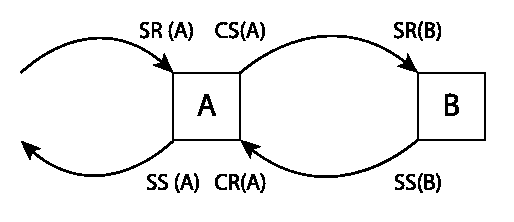
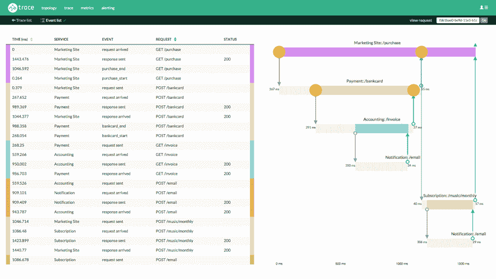
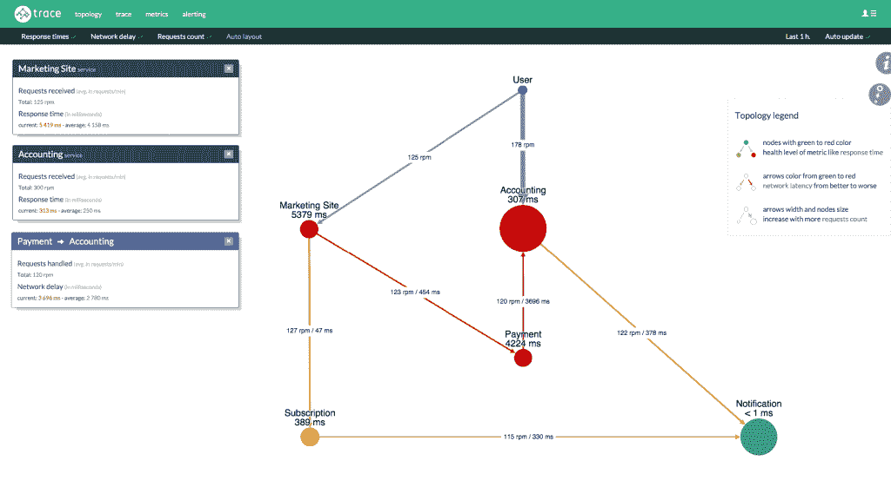

# RisingStack 的 Trace 可以监控你的微服务

> 原文：<https://thenewstack.io/risingstack-trace-microservice-monitoring-heats-closed-beta/>

似乎有一个新的监控平台供开发人员每天到达现场进行测试。最新提供的服务之一是来自 [RisingStack](https://risingstack.com/) 的完全开源的微服务监控服务 [Trace](https://trace.risingstack.com) 。

随着公司开始从单片应用程序转向微容器以配合其微服务，大规模运行数千个实例的企业的需求也随之不断增长。尽管仍处于封闭测试阶段，Trace 解决了开发人员在扩展其微服务时面临的常见问题——事务跟踪、监控、警报和基础设施可视化。

## 在人群中脱颖而出

具有分析和警报功能的微服务监控 PaaS 解决方案并不新鲜。RisingStack 从[谷歌 Dapper](https://research.google.com/pubs/pub36356.html) 获得了 Trace 的灵感——一个大规模分布式系统追踪基础设施。Trace 实现了跨越请求生存期的服务器和客户端发送/接收事件。当服务器请求传入时，它被记录在 Trace 中，并在传出请求上分配一个请求 ID，该 ID 在整个事务中持续存在。

RisingStack 在 A/B 服务器之间跟踪 ServerRecieve、ServerSend、ClientRecieve 和 ClientSend

这种堆栈跟踪可视化特性允许开发人员识别和隔离他们的体系结构中可能出现的任何正在发生的问题。通常，宝贵的时间花在识别运行故障服务的服务器或集群上，而更多的时间花在调试上。通过实现跟踪可视化，开发人员能够在工作流中的任何点更好地监控他们的堆栈。

“Trace 还提供了连接服务的详细拓扑视图，以便更好地理解和跟踪服务如何相互通信。RisingStack 的联合创始人兼首席执行官 Gergely Németh 说:“这样，平均响应时间、网络延迟和请求数的数据就可以在地图上看到，同时还可以显示节点及其之间的关系。

RisingStack 跟踪:分布式堆栈

## 定制、扩展等

目前，Trace 通过将 HTTP 头添加到传出请求中在后端工作，这对服务器开销的影响很小。“增加前端支持也在我们的路线图中，包括 Java、Go 和。NET，”Németh 说。

如果开发人员想在注册封闭测试版后试用 Trace，他们只需将一行代码粘贴到根目录中即可运行。Trace 支持内部解决方案和基于云的基础设施，这对于有兴趣使用它来监控其应用程序的开发人员来说至关重要，这些应用程序可能会受到严格的数据隐私或用户隐私限制。

RisingStack 跟踪微服务拓扑视图

用户可以将自己的控制器添加到 Trace，或者在获得 API 密钥后，在 Trace 自己的服务器上运行收集器。将跟踪作为一个依赖项添加到应用程序中就像用 NPM(节点包管理器)将它设置为一个需求一样简单。

如果你想亲自尝试 RisingStack 的 Trace，你可以在这里注册封闭测试版[。](https://trace.risingstack.com/?utm_source=trace-microservice-monitoring-and-debugging&utm_medium=lastbutton)

<svg xmlns:xlink="http://www.w3.org/1999/xlink" viewBox="0 0 68 31" version="1.1"><title>Group</title> <desc>Created with Sketch.</desc></svg>