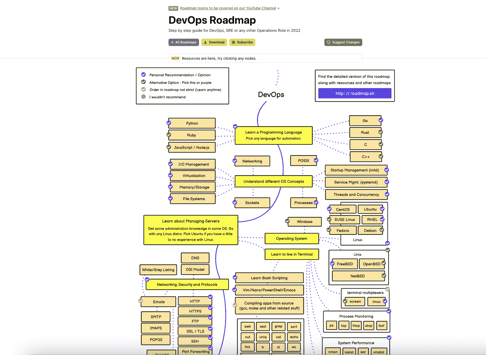

# Roadmap.sh 和新堆栈

> 原文：<https://thenewstack.io/roadmap-sh-and-the-new-stack/>

[Roadmap.sh](https://roadmap.sh/) 和新的堆栈已经联合起来，在为开发人员和 DevOps 社区服务方面相互补充。

由 500，000 名开发人员组成的社区推动，Roadmap 为开发人员提供路线图、学习计划、路径和资源。

该网站提供基于角色和基于技能的指南。该网站为开发者提供技能树和其他视觉资源，帮助他们在职业生涯中提高技能和成长。该网站始于 2016 年的开源 GitHub 页面，显示静态图像，涵盖[前端](https://roadmap.sh/frontend)、[后端](https://roadmap.sh/backend)和 [DevOps](https://roadmap.sh/devops) 景观。

有很多社区请求添加更多路线图，并提供内容来了解路线图中列出的主题。然而，由于一些技术挑战，直到 2021 年底，路线图才变得具有交互性。

该网站有超过 19 个新的路线图来跟踪用户的进展和学习主题的资源。大多数路线图都是交互式的。

100，000 多名订户阅读了这份月刊。该项目的 [YouTube 频道](https://www.youtube.com/theroadmap)提供围绕软件开发主题的可视化内容，在过去的两年中，订阅用户已经超过 13 万。

该项目目前是 GitHub 上第六大明星开源项目，GitHub 明星超过 20 万。社区推动项目；任何人都可以对路线图提出修改建议，通过添加新的路线图做出贡献，帮助改进现有的路线图，向路线图添加内容，或者帮助改进网站的代码库。

社区参与通过项目的 [GitHub 库](https://github.com/kamranahmedse/developer-roadmap)上的 Roadmap GitHub 问题，通过电子邮件分享反馈，或者通过 Twitter 联系。欢迎新栈读者提出建议和改进。

每个路线图都是一个交互式图表，可以打开一个资源页面。打开 DevOps 路线图中的“Python”，一个侧边栏显示了学习更多 Python 知识的资源。用户可以在网站上下载任何路线图。社区通过路线图的路线图 GitHub 页面提出建议。

## 新堆栈如何帮助 Roadmap.sh？

新堆栈是用于横向扩展开发、部署和管理的首要全球资源。新的堆栈赞助商包括 Red Hat、云计算原生计算基金会、Amazon Web Services 和其他几十家专注于 DevOps 的公司。

新堆栈的面向资源的工作将补充路线图在其网站上的现有主题。路线图和新堆栈将探索符合机构群体利益的新路线图。

路线图符合新堆栈对解释和分析大规模开发、部署和管理的关注。我们在新堆栈很高兴开发更多的方法，通过与路线图的合作，为处于学习各个阶段的开发人员带来资源。

Insight Partners 是路线图和新堆栈的投资者。

<svg xmlns:xlink="http://www.w3.org/1999/xlink" viewBox="0 0 68 31" version="1.1"><title>Group</title> <desc>Created with Sketch.</desc></svg>