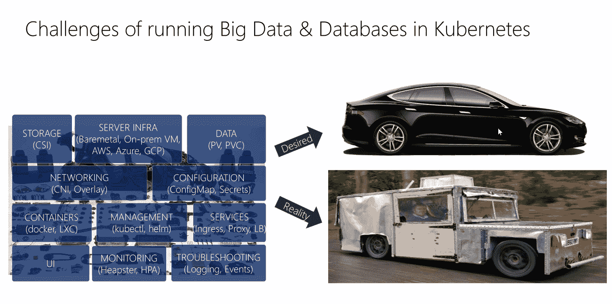
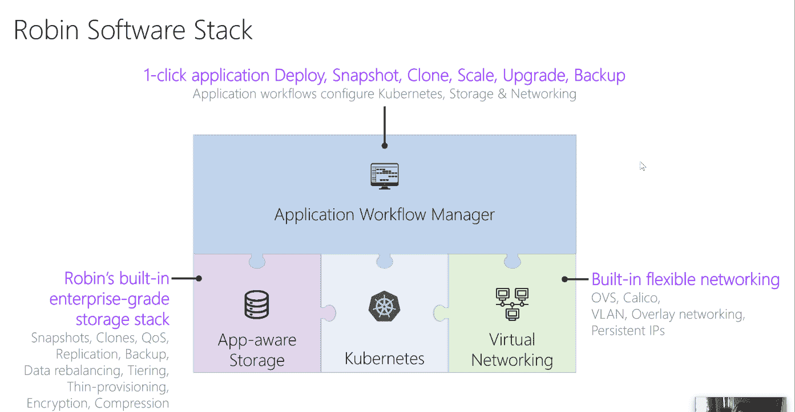

# Robin Systems 推出 Kubernetes“超融合”产品

> 原文：<https://thenewstack.io/robin-systems-unveils-kubernetes-hyper-converged-offering/>

[Robin Systems](https://robinsystems.com/) 建立其业务的理念是，即使有状态的应用程序(数据库和其他以数据为中心的工作负载)也可以通过以应用程序为中心的方法获得容器化的好处。

据罗宾系统首席技术官[帕萨·西塔拉](https://www.linkedin.com/in/parthaseetala/)称，其[堆栈最初](https://thenewstack.io/robin-systems-everythings-container/)包括其内部构建的编排器，但将 Kubernetes 视为容器编排的事实上的行业标准，该公司已决定接受它并基于围绕它开发的强大生态系统。

它吹捧其所谓的[hyper-](https://robinsystems.com/product/architecture/)[c](https://robinsystems.com/product/architecture/)[onverged Kubernetes 技术](https://robinsystems.com/product/architecture/) 以克服组织仍然面临的 Kubernetes 挑战，并简化应用程序部署。

“如今，许多公司都在努力将以数据为中心的应用程序加载到 Kubernetes 上。这是为什么？”塞塔拉说。他说，这并不是因为在网络存储方面缺乏选择，他指出有 28 家公司与云本地计算基金会结盟，为 Kubernetes 提供存储，24 家公司提供网络。

他说，仍然存在三个主要挑战:

*   **数据库**:数据库不是作为微服务构建的，而 Kubernetes 是一个微服务平台:你不只是创建一堆部件，在上面放一个负载均衡器，然后向上扩展。他们有自己的拓扑结构、集群管理等等。
*   **存储和数据管理** : Kubernetes 允许您在同一个物理硬件上运行多个工作负载，但是您可能会遇到吵闹的邻居。Kubernetes 本身不具备存储管理能力；没有简单的方法来保证 SLA。此外，以数据为中心的应用程序对位置也有需求。这在 Kubernetes 集群中很难实施。
*   **联网** : Kubernetes 很复杂，需要小心设置，并且运行在 Kubernetes 集群之外的服务要能够与运行在其上的服务进行通信。

一言以蔽之，零件太多，要管理的东西太多。

“虽然你想专注于一个应用程序，但你最终会遇到许多与基础设施相关的管理，”他说。

Robin 决定重新审视这一点，从应用程序级别开始，定义数据库、其底层基础设施和 Kubernetes 的需求。

超融合意味着接受应用程序工作负载(部署、快照、克隆、映射、备份),并将它们与数据管理和网络管理功能以及 Kubernetes 之类的编排部件配对。它提供本机存储、计算和网络，以及控制它们的应用程序管理层，以便简化开发运维及 It 运营。

Robin 能够自助部署大数据、数据库和 AI/ML 工作负载，在团队成员之间共享整个实验，快速进行假设分析试验，扩展包括 GPU 和 IOPs 在内的资源，以及跨数据中心和云迁移和重建整个应用环境。

该技术从 Kubernetes 开始，然后添加了一个从头开始构建的应用感知存储结构。它是基于对应用程序拓扑的理解而构建的。

“如果 it 了解这一点，您就可以开始在存储堆栈中构建以应用程序为中心的原语。…设置为任何部分都不会消耗超过一定数量的 iops，做这些事情，”他说。然后，它会添加一个软件定义的网络层。

“你不只是想展示 Kubernetes、网络和存储……应该有人能够定义一个 YAML 文件，说明‘我的应用由这些服务组成。这些服务具有这种拓扑。拓扑需要这些资源，并且应该扩展到我定义的级别，”他说。

“如果你有这样的接口，开发者不需要理解任何底层技术。不需要存储知识，不需要网络知识，不需要 Kubernetes 知识…他们了解应用程序，编写 YAML 文件对他们来说非常容易。一旦他们做到这一点，他们就可以开始在应用程序级别展示扩展、升级或备份等功能。这个应用程序管理器可以驱动底层存储、Kubernetes 或虚拟网络来完成这些任务。这就是整个罗宾栈。”

超融合 Kubernetes 平台的功能包括:

*   一键式调配、扩展、克隆和迁移大数据和数据库
*   返回到应用程序状态之间的某个点
*   克隆整个应用程序，包括数据
*   对整个应用程序执行一键式备份和恢复
*   以安全的方式升级任何应用程序
*   通过一键控制每个应用的服务质量来满足性能 SLA
*   支持跨云的数据和应用移动性

Robin Systems 首席执行官 [Premal Buch](https://www.linkedin.com/in/premal-buch/) 表示:“传统上，企业必须为每个应用开发定制工作流，以部署和管理大数据/人工智能/人工智能管道中的数据库和应用。“该流程要求 IT 和 DevOps 进行冗长的第三方集成，并为每个内部和云安装执行繁琐的手动重复流程。这只会导致高成本、复杂性和延迟的价值实现时间。借助超融合 Kubernetes，Robin 消除了 IT 和开发人员的时间和成本消耗，使他们能够更快地实施关键计划。”

[451 Research 首席分析师杰伊·莱曼](https://www.linkedin.com/in/jaylyman/) 指出，将大数据、人工智能、机器学习和物联网等工作负载与基于容器和 Kubernetes 的基础设施和应用生命周期管理结合在一起的软件，可以帮助这些数据丰富和数据密集型应用实现敏捷性和效率。

Robin 在内部运行，但也在三大云提供商上运行: [AWS](https://globenewswire.com/news-release/2018/03/14/1422411/0/en/Robin-Systems-Announces-Free-Trial-Edition-of-Robin-Cloud-Platform-on-AWS.html) ，Google Cloud 和 [Azure](https://globenewswire.com/news-release/2018/07/17/1538368/0/en/Robin-Systems-Paves-the-Way-for-Migration-of-Data-Heavy-Enterprise-Applications-to-Azure-Cloud-using-Azure-Data-Box.html) 。3 月， [IBM](https://globenewswire.com/news-release/2018/03/20/1442878/0/en/IBM-and-Robin-Systems-Announce-a-Joint-Solution-for-the-Containerized-IBM-Db2-Warehouse-on-Robin-Cloud-Platform.html) 宣布在 Robin 云平台上全面发布 IBM Db2 Warehouse。

云计算原生计算基金会是新堆栈的赞助商。

通过 Pixabay 的特征图像。

<svg xmlns:xlink="http://www.w3.org/1999/xlink" viewBox="0 0 68 31" version="1.1"><title>Group</title> <desc>Created with Sketch.</desc></svg>