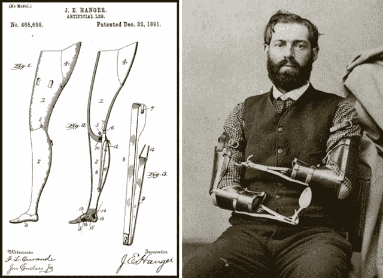
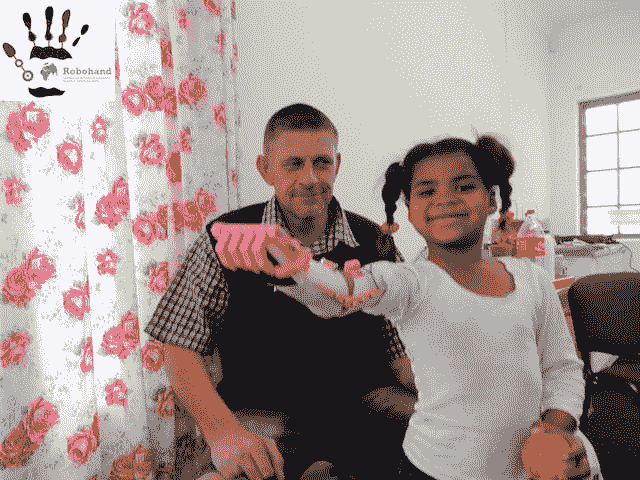

# 面向大众的机器人假肢是一个即将发生的未来

> 原文：<https://thenewstack.io/robo-prosthetics-for-the-masses-is-a-future-ready-to-happen/>

俏皮的老套短语[“抖腿”](https://myfavoritecliche.blogspot.com/2009_01_01_archive.html)通常是针对那些已经需要动起来的懒人。从字面上看，这个短语暗示人们可以举起一条腿在空中摇晃——如果那条腿是假肢的话。假肢的最早证据属于一具埃及木乃伊，它的四肢由纤维制成，可能还没有完全发挥功能。在西方历史上，假肢制造从耶稣诞生之前一直持续到黑暗时代、文艺复兴时期以及 20 世纪初。

美国的假肢行业直到内战时期才真正开始，那时人们从战场上回来时都失去了四肢。有报道称，我们还需要 10 年时间才能制造出价格仅为 5 美元的全功能假肢[。](http://www.npr.org/2014/03/13/289836980/with-3-d-printing-affordable-prosthetics-are-in-reach)

在非洲接受义肢治疗的儿童在失去一只胳膊或一条腿时没有任何选择。他们只是可怕战争的受害者。至少在美国，退伍军人需要新的肢体。但是这些假肢价格昂贵，使用传统的劳动密集型技术。这就是为什么 3D 打印越来越被接受:它正在迫使截肢者的手臂、腿和其他打印身体部位的可负担性和大规模生产发生转变。

[Open Hand Project](http://www.openhandproject.org/about.php) 是致力于 3D 打印机器人假手的最引人注目的组织之一，其目标是让截肢者更容易使用它们。创始人乔尔·吉巴德注意到 3D 打印假肢的增长，他将其归因于其成本效益。

“制作定制假肢最昂贵的部分是劳动力，”吉布德说。“有了 3D 打印，这就大大减少了，因为你不需要有人手工制作每个假肢。你可以点击打印，让打印机通宵打印。”

[Anderson Ta](https://plus.google.com/+AndersonTa/posts) 是 3D 打印假肢的另一个已知名字。作为莱斯大学的研究技术员 II，他目前正在 3D 打印和生物工程的交叉领域工作。Ta 和 [RepRap](http://reprap.org/) 开发者乔丹·米勒(Jordan Miller)在休斯顿的莱斯大学(Rice University)开设了先进制造研究所夏季奖学金(Advanced Manufacturing Research Institute summer fellowship)，将 Ta 和米勒的 3D 打印知识整合到组织工程和再生医学中，也就是所谓的“生物打印”

与此同时，一个名为 [Robohands](http://www.thingiverse.com/robohand/designs) 的组织开源发布了他们的 3D 打印和铝制数控加工机器人假手原型。一位名叫理查德·范·阿斯的南非男子在 2011 年遭遇木工事故后创建了这个组织，那次事故使他右手失去了手指。他很快意识到大多数人买不起假肢，于是发明了机器人手。截至 2013 年 11 月，全球已有超过 200 人安装了机器人手。其他 3D 打印的假手，如 [cyborg beast](http://www.thingiverse.com/thing:261462) ，提供额外的灵活性，专注于更好的手指抓握，是 MakerBot 的 snap-together[robo 和](http://www.thingiverse.com/thing:92937)以及原始 robo 和的组合。

假手的制造商也通过 [Google+ e-NABLE 社区](https://plus.google.com/communities/102497715636887179986)联系在一起，该社区将自己描述为“一个公共可发现、私人可加入/可读的社区，旨在开发一个分布式支付-转发网络，用于 3D 打印假肢的设计、定制和制造。”任何人都可以加入，依靠一个充满协作、想法分享和社区的开源模型。这是 3D 打印假肢的未来吗？

“在六个月内，我相信 3D 打印假肢将开始获得一些更‘专业’的兴趣，”Ta 说。“也就是说，像医院这样的机构将开始研究如何将它融入他们的产品中。”

鉴于 [施里纳儿童医院](http://www.shrinershospitalsforchildren.org/)最近与莱斯·奥什曼工程设计厨房(OEDK)联系，希望利用他们的资源制造假肢，这很有可能。OEDK 推荐心理医生去 Ta 的实验室。

虽然假肢的未来变得越来越容易 3D 打印，但这根本不是一个新领域——没有必要大惊小怪——3D 打印并没有接管整个领域，使医疗假肢过时。

目前，为战争受害者大规模生产肢体是可能的，但棘手的部分是定制插座。这就是 3D 打印在更大范围内最有意义的地方。3D 打印提供了一个可行的解决方案，而不是等待个性化定制插座的生产，比如说，为乌干达农村地区的儿童。尽管如此，这些定制插座不能现场按需印刷。根据一篇关于 3DPrintingIndustry.com 的文章，这个过程更加复杂:

> “截肢需要在乌干达的一家医院进行扫描。然后，该扫描需要被发送到世界的另一个地方，技术人员可以将其转换为插座的 3D 模型。3D 模型将被送回医院进行打印。”

从这个意义上说，3D 打印假肢并不能取代传统的修复和矫正设备，正如美国矫形和假肢协会编码和报销、教育和编程主任 Joe McTernan 所指出的那样。

“我相信它将成为未来制造假肢组件的有用工具，”麦克特尔南说。“技术一直是假肢的驱动力，3D 打印技术代表了一种新的、不同的、令人兴奋的制造精密部件的方法，这种方法将为假肢用户提供舒适佩戴和使用他们的设备所需的亲密贴合。”

美国在假肢方面的进步首先始于内战时期，当时发生了 60，000 到 70，000 例截肢。内战时期的技术进步，比如后膛装步枪和火炮，导致了 T2 更多的流血和屠杀。一位名叫詹姆斯·亨格的早期截肢者和邦联士兵创造了“[亨格肢、](http://www.hanger150.com/hanger-history/the-j-e-hanger-story/)”并申请了专利，它是由削过的桶形杖制成的。1891 年，汉格获得了他早期假肢发明的专利。随着时间的推移，他的假肢变成了现在的[衣架诊所](http://www.hangerclinic.com/locations/Pages/default.aspx)，一个主要的矫形和假肢解决方案提供商。

l:詹姆斯·亨格大约在 1891 年的早期假肢；塞缪尔·德克尔的机械臂。图片 via [收藏家周刊](http://www.collectorsweekly.com/articles/war-and-prosthetics/)。

其他战争版本的手和手臂假肢包括退伍军人塞缪尔·德克尔自己开发的机械臂。它们提醒人们这些早期物体的粗糙本质。但是他们成功了。德克尔后来成为美国众议院的正式看门人，这份工作依赖于为他人握住门把手和把手。假臂和手能比人类的更好地完成这项任务吗？

随着第一次世界大战，随着更先进的武器，如机枪，在 1914 年变得流行，对假肢的需求也随之增加。假肢广告也变得越来越普遍。第二次世界大战后，义肢生产再次兴起，退伍军人抱怨现有的义肢技术。他们推动从 1912 年到 1947 年的军队医务总监诺曼·t·柯克获得国家科学院的援助。到 1949 年，退伍军人事务部在全国建立了 30 个多学科截肢者诊所。然而，如果不是因为战争，假肢是否会在美国流行还不得而知。战争受害者是这些肢体的接受者，但是[截肢的头号原因仍然是糖尿病](http://www.diabetes.co.uk/diabetes-and-amputation.html)。3D 打印性价比高，可定制，但它是假肢的未来吗？

Ta 注意到对功能的关注超过了形式，尽管大多数手看起来像是他们要取代的手。但未来的情况可能并非如此。3D 打印的手假肢最终可能比人手做得更多。

带着新机器人手和假肢的安吉尔。图片经由[robohand.net](http://www.robohand.net/press-package/)。

“可能有一只手是为特定的活动或功能而设计的，”Ta 说。"同时，目前大多数手型设计是为那些没有手指的人设计的."

Open Hand Project 的吉布德认为 3D 打印假肢的未来潜力更大。“在未来，我认为有可能对某人的残肢和现有肢体进行 3D 扫描，然后利用这些测量结果来创造一只定制的手，以适应他们的残肢，”吉布德说。"并定制成他们现有肢体的镜像."

<svg xmlns:xlink="http://www.w3.org/1999/xlink" viewBox="0 0 68 31" version="1.1"><title>Group</title> <desc>Created with Sketch.</desc></svg>