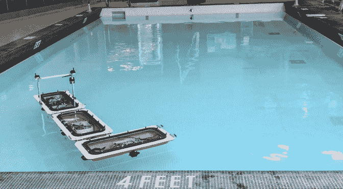
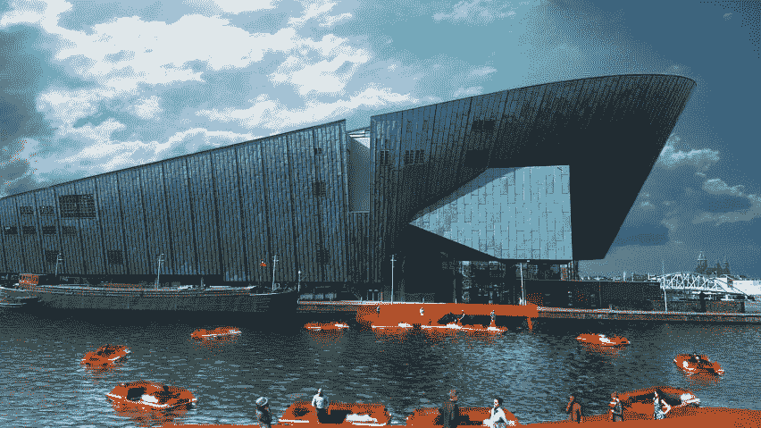

# “机器人船”是模块化自主船，可以转变成动态浮动基础设施

> 原文：<https://thenewstack.io/roboats-are-modular-autonomous-boats-that-transform-into-dynamic-floating-infrastructure/>

在像阿姆斯特丹这样地势低洼的地方，四分之一的城市道路实际上是充满水的运河，开发传统的公路汽车以外的交通工具是有意义的。这种替代品很可能被恰当地命名为[机器人船](http://roboat.org/)，这是一种自主船的原型，它不仅可以独自在城市的水道中航行，还可以与其他机器人船通信，以便将自己组装成不同的配置。

## 按需和动态

这些自我改造的机器人平台由[麻省理工学院](http://www.mit.edu/) (MIT)与[阿姆斯特丹高级都市解决方案研究所](https://www.ams-institute.org/)合作创建，被誉为世界上第一支自主机器人船舰队。机器人船不仅被设计成“按需运输”，还可以发挥其他功能——组装成有用的临时结构，如人行桥、舞台、漂浮的公交车和出租车，甚至可以在水上滑行的弹出式市场。由于控制机器人船的各种算法，它们可以在预定时间后自行拆卸，或用作移动的“敏捷传感器”，收集阿姆斯特丹的环境和基础设施数据。

最新一代的机器人船现在配备了各种传感器、推进器、微控制器、GPS 模块、相机和[激光雷达](https://en.wikipedia.org/wiki/Lidar)(一种使用激光的远程探测系统)，以及其他设备。特别是，最新的机器人船在三面具有激光制导的球窝锁紧机构，这允许它将自己连接到其他机器人船或物体上。计算机视觉技术以及先进的控制和轨迹跟踪算法有助于锁定所需的精确机械运动——在水的流动动态表面上进行锁定是一个具有挑战性的过程。这些算法可以帮助机器人从一个地方导航到另一个地方，并计算它们之间的相对距离，此外还可以让它们识别并连接到坞站。

麻省理工学院教授、计算机科学和人工智能实验室(CSAIL)主任丹妮拉·鲁斯(Daniela Rus)参与了这个项目，她说:“我们的目标是利用机器人为水上生活带来新的能力。”。“新的闩锁机制对于创建弹出结构非常重要。Roboat 在水上自主运输时不需要闩锁，但你需要闩锁来创建任何结构，无论是移动的还是固定的。”

坞站通常以固定机器人船的形式出现，展示一种叫做 [AprilTag](https://github.com/AprilRobotics/apriltag) 的东西，这是一种经常用于机器人技术的增强现实标签。这些允许进入的船形机器人确定它们相对于坞站标签的精确三维位置和方向。然而，机器人船锁定过程的算法丢弃了一些可用的位置数据，以简化对接和连接所需的计算。

在新锁定机制的水中测试中——无论是在室内游泳池还是在河上——该团队注意到，大多数机器人能够在大约 10 秒内完成连接过程，尽管有时需要尝试几次才能成功完成任务。

该团队现在正致力于创造这些水上装置的更大版本，这将在水上更加稳定，此外还开发了锁闭系统的改进。在未来，这种机器人船可能会用于夜间垃圾收集，垃圾可以从码头转移到水上的垃圾收集设施，从而缓解交通拥堵和污染。

此外，一些设计师设想机器人船可以为阿姆斯特丹形成一种电力驱动的、[动态基础设施](https://www.dezeen.com/2019/08/14/roundaround-carlo-ratti-mit-senseable-city-lab-amsterdam-netherlands/)，在原本不可能有永久性结构的水道上建立临时连接。无论如何，这种设计的多功能性是显而易见的:它将最大限度地利用城市的运河水系，不仅将它们转变为交通场所，还将它们转变为每个人都可以享受的公共空间——不仅是在阿姆斯特丹，还可能在其他偏远地区。

图片:麻省理工学院

<svg xmlns:xlink="http://www.w3.org/1999/xlink" viewBox="0 0 68 31" version="1.1"><title>Group</title> <desc>Created with Sketch.</desc></svg>