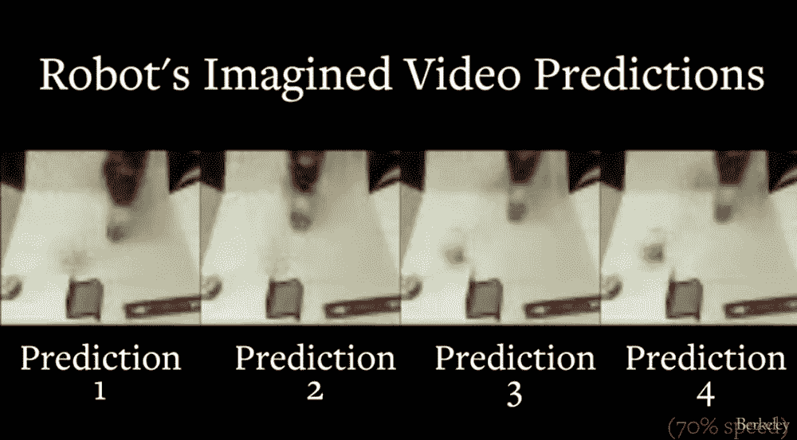

# 这个机器人可以通过深度学习来想象它的未来

> 原文：<https://thenewstack.io/robot-can-visualize-immediate-future-deep-learning/>

看着一个婴儿推、拉和抓东西，他们似乎做不了什么。但事实上，当婴儿参与这种无人监督的实验时，他们会学到很多东西，自学他们周围的物理环境以及如何操纵他们遇到的物体。然后，人类儿童能够吸取这些教训，并通过想象和预测如何解决这些问题，利用他们以前学到的知识，将它们应用到新的未知情况中。

虽然这种通用的、无监督的学习和对因果关系的预测对人类来说很容易掌握和理解，但机器会发现很难做到这一点。为了帮助解决这个问题，加州大学伯克利分校人工智能研究实验室(BAIR)的研究人员正在开发一种被他们称为视觉预见的深度学习技术(T2)。该技术将向机器人灌输一种短期想象力，使它们能够根据它们在以前无人监督的学习情况下可能收集到的信息来预测某些行动的潜在结果——在这种情况下，它们可以自己移动各种物体。

[https://www.youtube.com/embed/Li_vZVpiFSA?feature=oembed](https://www.youtube.com/embed/Li_vZVpiFSA?feature=oembed)

视频

## 机器人可视化

虽然这种新的机器人预见并没有走得很远——只有几秒钟的未来——但这是一个相对较大的飞跃，因为它允许机器人在没有人类干预或任何关于物体或环境本身的知识的情况下操纵物体。通常，要让机器四处移动对象，传统方法需要人类程序员用某种标签信息来识别对象，以便它可以与其环境中的对象进行交互。虽然这种方法在像工厂这样的封闭环境中可能足够了，但对于扩大到可能需要提前快速思考的更大的真实世界的情况来说是不切实际的，例如自动驾驶车辆在路上可能遇到的情况。

“就像我们可以想象我们的行为将如何移动我们环境中的物体一样，这种方法可以让机器人想象不同的行为将如何影响周围的世界，”负责监督这项研究的工程和计算机科学助理教授谢尔盖·莱文说。“这可以在复杂的现实世界情况下智能规划高度灵活的技能。”

该团队的发现[报告了](https://arxiv.org/pdf/1605.07157.pdf)这个名为 Vestri 的机器人是如何通过一个独立的“游戏”阶段的，在这个阶段，它被给予一组随机的物体在桌子上推来推去。所有的动作都被维斯特里的摄像机捕捉到了。

在这个持续约一周的播放阶段，包括与各种对象的超过 59，000 次交互，机器人使用了一种称为卷积递归视频预测或动态神经平流(DNA)的深度学习技术来建立其世界的预测模型。该模型使用图像像素来帮助它预测未来的运动场景，“想象”不同动作的不同未来结果。这些模型建立在机器人以前在自我游戏中学习的经验基础上，然后可以将这种知识推广到不熟悉的物体，从而允许机器人执行指定的任务，物理地处理新的、以前从未见过的物品，而不需要繁琐的标签或专门的编码。

开发一种能够自主学习的人工智能，并“概括”这些经验教训，以便它们可以在更大范围内应用的可能性——是当前人工智能研究的圣杯。我们已经看到了人工智能中这种一般化的、类似人类的学习的曙光，它可以学习并[自学如何从头掌握复杂的棋盘游戏](https://thenewstack.io/innovative-gaming-moves-googles-ai-becomes-go-grandmaster-three-days/)，或者机器系统可以可靠地[独自破解视觉难题](https://thenewstack.io/ai-human-like-vision-cracks-captcha-code/)，而无需受益于大量训练数据。在这种情况下，我们看到这种*白板*方法如何应用于现实世界中物理运动的预测模型。

“孩子们可以通过玩玩具、移动玩具、抓握玩具等方式来了解他们的世界。我们这项研究的目的是让机器人也能做同样的事情:通过自主互动来了解世界是如何运转的，”莱文解释道。“这个机器人的能力仍然有限，但它的技能是完全自动学习的，并允许它通过建立以前观察到的交互模式来预测它从未见过的对象的复杂物理交互。”

该团队现在正致力于进一步开发这种视频预测系统，作为机器人的一种“视觉想象”，目的是使机器人不仅能够推动物体，还能够组装、抓取和重新定位它们，以及处理可以捆绑或折叠的有延展性的物体。

<svg xmlns:xlink="http://www.w3.org/1999/xlink" viewBox="0 0 68 31" version="1.1"><title>Group</title> <desc>Created with Sketch.</desc></svg>