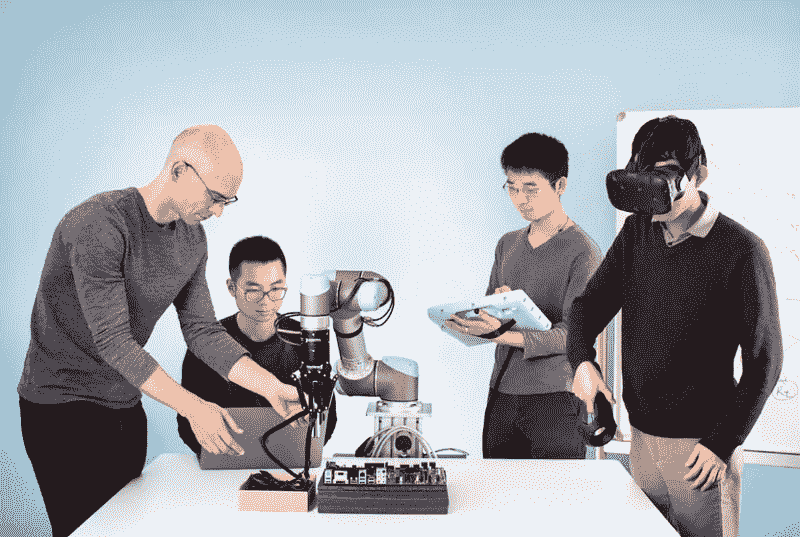
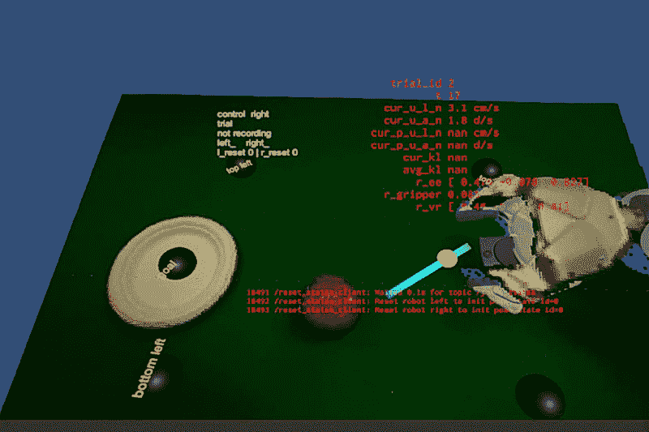
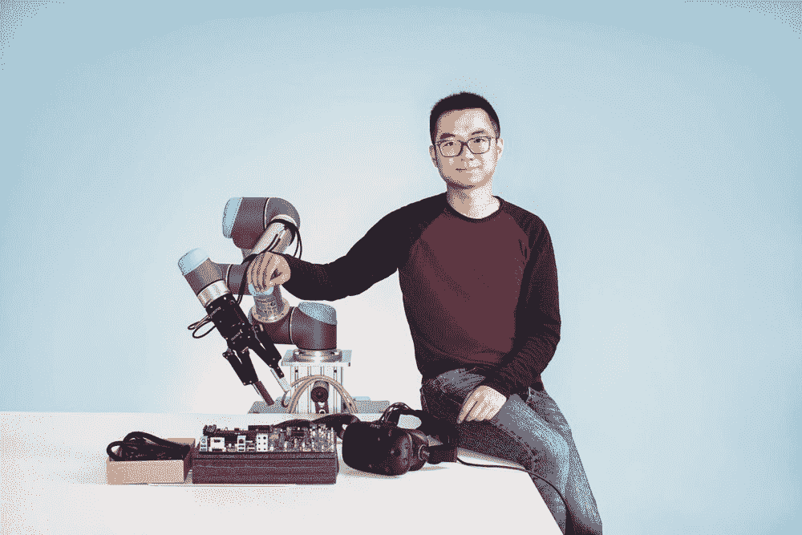

# 这个机器人正在通过虚拟现实向人类学习

> 原文：<https://thenewstack.io/robot-learning-humans-virtual-reality/>

机器人似乎正在渗透到各种领域:像工厂机器人一样渗透到工业环境中；在我们的办公室里作为协作机器人，甚至在街上作为滚动的送货机器或货物搬运机器人。但是，尽管有这些明显的进步，仍然有许多精细动作的事情机器人不能做得像人类一样好——到目前为止。

快速学习如何操纵和抓取各种不同形状和大小的东西是机器人面临的挑战之一。目前，只要没有太大的差异或任何复杂的障碍，例如折叠柔韧的绳子或电线，就有可能让机器人重复操纵物体的特定任务。但这种障碍可能很快就会成为过去，一家初创公司正在探索如何利用现成的虚拟现实(VR)设备，由人类快速训练人工智能机器人执行一系列操纵任务。

总部位于加利福尼亚州埃默里维尔的初创公司 [Embodied Intelligence](http://embody.ai/) 由一个团队创建，该团队的资质包括与 [OpenAI](https://openai.com/) 和加州大学伯克利分校合作，该公司正在使用一种称为模仿学习的深度学习来帮助机器人通过模仿进行学习。

## 通过虚拟模仿学习

虽然这听起来对人类来说是一件容易的事情，但对机器来说并不那么简单。对于机器人操作来说，通过观察演示来学习是可能的，但是这些演示需要高质量。例如，人类可能通过推动机器人的肢体来引导机器人，但如果这些人类手臂被机器人的视觉传感器捕捉到并与目标物体混淆，这将不起作用。强化学习，或者通过试错的过程来学习，是另一种选择，但是需要仔细的设计和大量的训练时间。远程操作方法——通过界面远程操作机器——似乎效果最好，可以收集高质量的演示用于培训。

然而，扩大这种方法规模的主要因素是成本:机器人遥操作系统可能相当昂贵。因此，在 arXiv 上发表的一篇论文中，该团队描述了他们如何开始使用商业上可用的 Vive 耳机和手动控制器以及 PR2 机器人创建自己的远程操作系统。该软件是使用 [Unity](https://unity3d.com/) 编写的，这是一款与许多虚拟现实品牌兼容的 3D 游戏引擎。

在一次培训演示中，Embodied Intelligence 的 VR 遥控操作界面内部的第一人称视图。

使用这种方法，该团队发现他们可以训练机器人伸手去拿箱子或桌子上随机放置的物体，对齐，推动或插入各种物体。令人惊讶的是，这些实验达到了相对令人印象深刻的 80%至 90%的准确率，使用了持续不到一个小时的虚拟现实人类主导的训练演示——比其他训练方法有了很大的改进。

正如 Embodied Intelligence 的首席执行官[陈品山](http://peterchen.io/)告诉 [*The Verge*](https://www.theverge.com/2017/11/10/16627570/robot-ai-grasping-grabbing-embodied-intelligence-startup) 的那样，“我们可以通过不到 30 分钟的演示教授广泛的技能”。“这不仅仅是教机器人一个固定的轨迹。这是在教它识别球在哪里，捡起球，并把它放在一个位置——在不同的场景中。”

这可能意味着机器人可以在更广泛的工业、商业和消费应用中使用——机器人可以组装各种各样的物体，在零售店服务，或者帮助你在家里做各种各样的精细家务，只需要一点培训，任何外行人都可以使用广泛可用的虚拟现实设备和平台。

但最重要的是，该公司正计划开发和发布一种通用版本的软件，可用于各种情况，而不是必须为每项任务专门编写机器人程序。

在 IEEE Spectrum 的*中，[Embodied Intelligence 的](https://spectrum.ieee.org/automaton/robotics/artificial-intelligence/ai-startup-embodied-intelligence) [彼得·阿比尔](https://people.eecs.berkeley.edu/~pabbeel/)说:“我们带来了只需提前为所有应用程序编写一次的软件。”。“这是一个范式的转变，从需要为每一个特定的任务编程到编程一次，然后只是通过演示或强化学习来收集数据。”*

当然，为了取得这些进展，该系统将需要进一步提高其精度，特别是在工业应用中，即使很小的误差也可能意味着生产力的损失，或者在最坏的情况下可能导致灾难性的故障。但是，一旦这些障碍被清除，这很可能是朝着我们要么害怕要么期待的全自动未来迈出的一大步。

图像:具身智能

<svg xmlns:xlink="http://www.w3.org/1999/xlink" viewBox="0 0 68 31" version="1.1"><title>Group</title> <desc>Created with Sketch.</desc></svg>