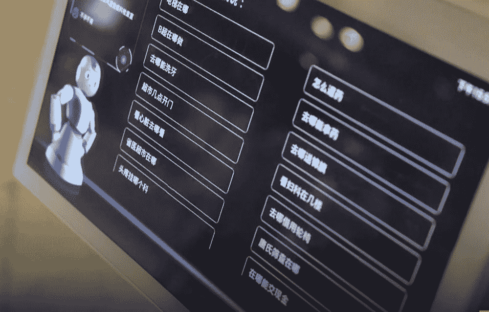
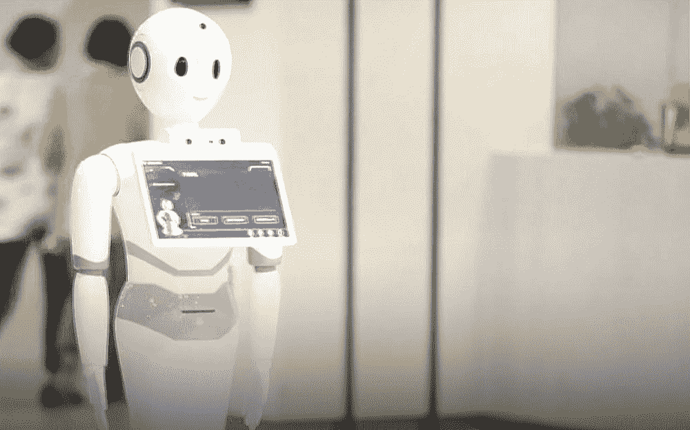
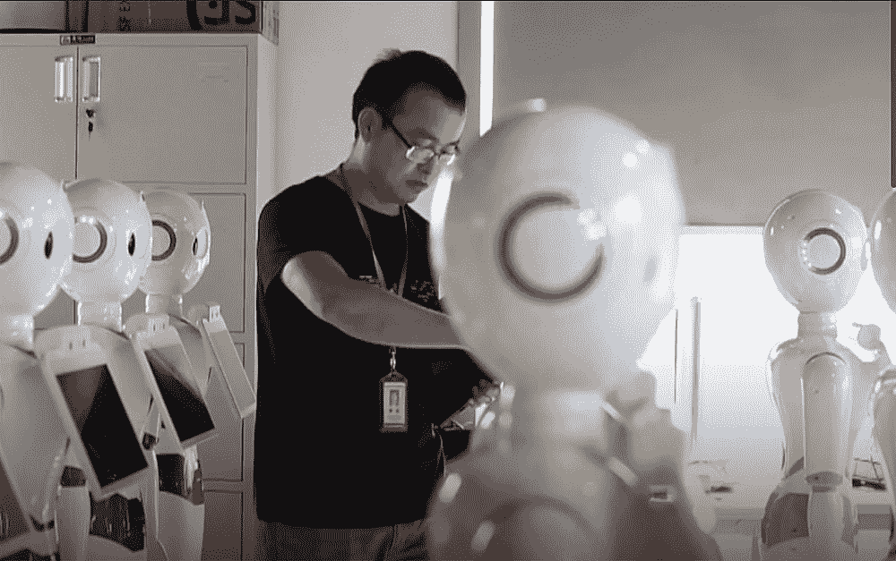

# 机器人有史以来第一次通过医疗执照考试

> 原文：<https://thenewstack.io/robot-passes-medical-licensing-exam-first-time-ever/>

制造业等某些行业的自动化是我们刚刚开始习惯的事情。乍一看，像医学和科学研究这样的高技能职业似乎最不容易受到这一趋势的影响，因为这些领域所需的技能组合不可能如此容易地自动化。但这可能很快被证明是一个看似令人欣慰的想法，因为越来越多的人工智能平台正在打破曾经被认为太复杂以至于机器无法处理的障碍。

中国初创公司科大讯飞是正在开发机器人的公司之一，这些机器人有朝一日可能会智能到足以取代人类医生。它的机器人小艺(字面意思是“小医生”)最近在中国以优异的成绩通过了医生执照考试，显然是世界上第一个这样做的人。

[https://www.youtube.com/embed/dm0QO_xesnc?feature=oembed](https://www.youtube.com/embed/dm0QO_xesnc?feature=oembed)

视频

据《南华早报》*报道，与清华大学合作开发的机器人“智能医生助手”小艺以 456 分的成绩通过了临床执业医师考试。远高于要求的 360 的及格分数，而这也是医学生成为该国执业医生必须参加的考试。*

这是小艺的第二次考试；在第一次尝试中，它只能得到 100 分。这一次，为了帮助它做准备，机器人从 53 本医学教科书、200 万份病历和超过 40 万篇医学文献和报告中吸收了信息。

但是仅仅靠记忆是无法帮助小伊通过考试的；它需要学习如何推理，并根据它所知道的信息和考试本身所呈现的内容做出明智的决定。

“自 2013 年以来，考试中超过一半的问题都是关于(病人)案例的，”清华大学电气工程系副主任吴季向央视解释道。"所以单纯依靠记忆和搜索是不可能的."

根据孝义背后的团队，机器人背后的人工智能必须学习如何在它吸收的信息之间建立联系，以发展其推理能力。此外，在医疗领域专业人士的帮助下，人工智能得到了完善，这些专业人士将他们在诊所和疾病诊断和治疗方面的真实经验用于帮助改进小艺的算法。

小艺的成功是中国人工智能技术领域正在进行的许多努力之一，旨在竞争并超越人工智能行业的其他大公司，包括美国。随着政府最近发布的[国家人工智能发展计划](https://futurism.com/china-aims-to-be-a-global-frontrunner-in-ai-by-2030/)，中国现在的目标是到 2030 年成为人工智能发展的世界领导者，重点是通过开发智能机器人和自动驾驶汽车、人工智能软件和硬件以及增强和虚拟现实技术来推动经济发展。

“我们已经超越 IBM 的沃森，成为第一个有资格成为人类医生的人工智能(机器人)。科大讯飞董事长[刘庆峰](https://www.bloomberg.com/profiles/people/4695616-qingfeng-liu)说，他指的是 IBM 的人工智能平台，该平台目前协助医疗专业人员进行[疾病诊断](https://thenewstack.io/whats-store-machine-learning-2016/)，以及一系列其他需要[智能协助的应用](https://thenewstack.io/world-of-watson/)。

然而，孝义的目标不是取代人类医生——至少现在不是。

“人工智能不是取代医生，而是能够帮助医生更好地为病人服务，”刘补充说。“通过研究中国特大城市顶级医院顶级医生的医疗案例和诊断技巧，我们的 AI 医生可以作为助手，帮助全国偏远地区的医生。”

目前，无论是独立诊断还是治疗病人，小伊都还没有做好自主充当机器人医生的准备。

“它目前最能做的就是向医生提出建议，帮助他们更快地发现问题，避免一些风险，”吴说。

该公司现在正在与安徽省立医院开展一个试点项目，以测试小艺是否能在现实生活中有效地帮助人类医生。最终，他们的目标是开发一个可以训练医生的人工智能辅助程序。

“在中国的农村地区，全科医生严重短缺，”刘说。“我们希望人工智能可以帮助更多的人获得优质的医疗资源。”

图片:科大讯飞

<svg xmlns:xlink="http://www.w3.org/1999/xlink" viewBox="0 0 68 31" version="1.1"><title>Group</title> <desc>Created with Sketch.</desc></svg>