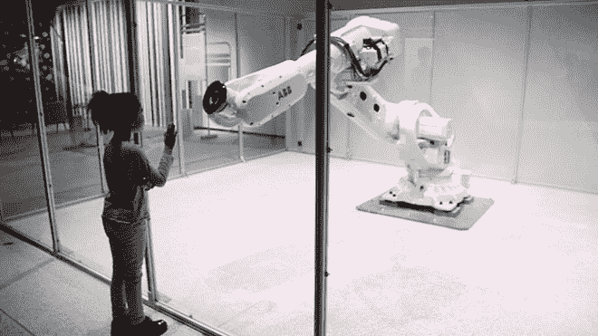
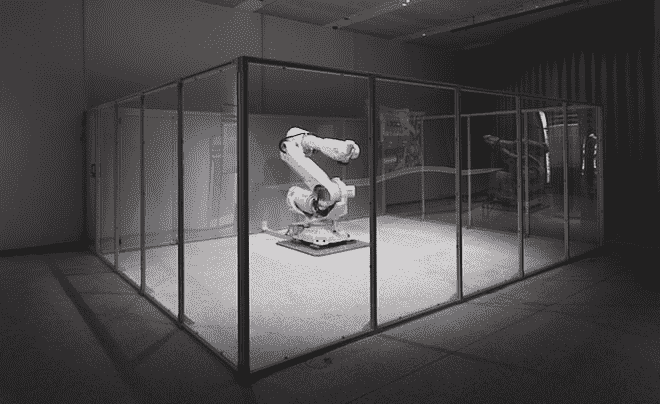

# “机器人驯兽师”将工业机器人重新编程，使其对生物感到好奇

> 原文：<https://thenewstack.io/robot-tamer-reprograms-industrial-robot-curious-living-creatures/>

技术创新的步伐正在我们生活的许多方面带来自动化和机器人化，从无人驾驶汽车到杂货店送货机器人，到 T2，甚至可以种植作物的无人机。这个问题的可怕幽灵，“[当机器人抢走所有的工作](https://thenewstack.io/will-happen-robots-take-jobs/)时，我们该怎么办？”悬在空中，助长了对那些有朝一日可能取代我们的机器的可以理解的恐惧。

但是根据美国多学科设计者和研究者 Madeline Gannon 的观点，机器人不应该被害怕。“人类和机器人是这个星球上的伴侣物种。我们需要彼此，”Gannon 说，他认为机器人可以被设计成专注于人类互动，并被制造成增强人类的能力，而不是彻底取代它们。

甘农不是典型的工程师或机器人专家。Gannon 目前正在卡内基梅隆大学完成她的博士学位，她有着计算设计和建筑的背景，是 MADLAB 的创始人和 ATONATON 的联合创始人，这两个研究工作室都在发明人类和制造东西的机器之间的新的交流方法。

## 驯服危险的机器人

尽管她曾与 3D 打印机和 CNC 机器等各种制造机器合作过，但最近，Gannon 对工业机器人产生了兴趣，这些笨重的装置通常出现在汽车装配线上。当然，这些机器人也是卷入多起严重工作场所事故的同类机器人，这引发了这些机器人是[“危险”机器人](http://blog.robotiq.com/is-my-robotic-co-worker-dangerous-why-robots-kill-people)的想法。因此，难怪最近这一方向为甘农赢得了“机器人耳语者”或“机器人驯兽师”等绰号。

为了对抗这种对机器人有些不合理的恐惧，Gannon 最近的合作(与[Julian Sandoval](https://www.linkedin.com/in/sandovaljulian/)、 [Kevyn McPhail](http://www.kevynmc.com/) 和 [Ben Snell](http://www.ben-snell.com/) 的开发团队)是创造了 *Mimus* ，这是一个一吨重的 [ABB IRB 6700](http://new.abb.com/products/robotics/industrial-robots/irb-6700) 工业机器人，它被重新编程以响应人类与动物般好奇心的互动，目前正在伦敦[设计博物馆](http://designmuseum.org/)展出。

Gannon 在 Vice 上的创作者项目帖子中解释说:“ *Mimus* 由一个非常简单的[基于代理的](https://en.wikipedia.org/wiki/Agent-based_model)行为编程，生成她的运动和轨迹。”。“作为程序员，我设定了她能去和不能去的界限。例如，她不能跑进地板或她的围栏，但她决定如何去拜访一个人。这种基于主体的行为也是米慕斯动物般运动的原因。她寻找并漫步到一个人身边，而不是直接模仿他们的动作。”

虽然她被关在一个透明的围栏里，但米慕斯使用嵌入天花板的传感器来感知周围的人群。她的跟踪程序根据每个被检测到的人的身高、距离、在展会上的时间，或者他们是一群人的一部分还是独自一人，为他们分配属性。为了确保机器人不会过度依恋任何特定的人， *Mimus* 被编程设定了各种各样的注意力范围，她会被她的底层算法认为“最有趣”的人所吸引。那个人会随着时间的推移，随着属性的改变而改变。例如，只要“最有趣”的人站得太久， *Mimus'* “无聊计时器[开始滴答]”就会提示她转向下一个人。

这似乎有点夸张，但正是这些程序化的动物般的品质促使甘农将*米莫斯*描述为一种“生物”从工业环境中解放出来，放在一个让人想起动物园环境的围栏里，这个巨大的机器人似乎比害怕机器人的专家可能让你相信的要友好和友好得多。因为我们有与生物互动的经验——机器人，没有那么多。

甘农指出:“当我们第一次接近一只动物时，我们本能地从它的肢体语言中寻找传达其内心状态的线索。”“例如，狗的尾巴向你显示它是兴奋还是受到威胁；猫的蹲伏可以让你知道它是在伸展身体还是准备扑过去。”

Gannon 的最终目标是创造她所谓的“移情界面”，在这里人类和他们的机器之间可以建立和保持情感和谐。鉴于我们至少可以期待一个与我们一起工作的[协作机器人](https://thenewstack.io/collaborative-robots-will-help-human-workers-not-replace/)的未来， *Mimus* 代表了一种有趣的变通方法，有助于提高我们对自主机器的同理心，我们可能还没有完全理解或知道如何控制这些机器。当机器人的行为更像我们能够理解的东西时，恐惧就会减少，至少足以让我们对此产生好奇。

在 Autodesk 的波士顿建筑空间和 [Pier 9](http://autodesk.com/pier9) 、 [ABB Ltd](http://new.abb.com/products/robotics) 和[Frank-rat chy 工作室的支持下创建的创意调查](http://studioforcreativeinquiry.org/)、 *Mimus* 将作为 *[恐惧与爱:对复杂世界的反应](https://designmuseum.org/exhibitions/fear-and-love)* 的一部分在设计博物馆展出，直到 2017 年 4 月 27 日。

图片:阿托纳顿，卢克·海斯

<svg xmlns:xlink="http://www.w3.org/1999/xlink" viewBox="0 0 68 31" version="1.1"><title>Group</title> <desc>Created with Sketch.</desc></svg>