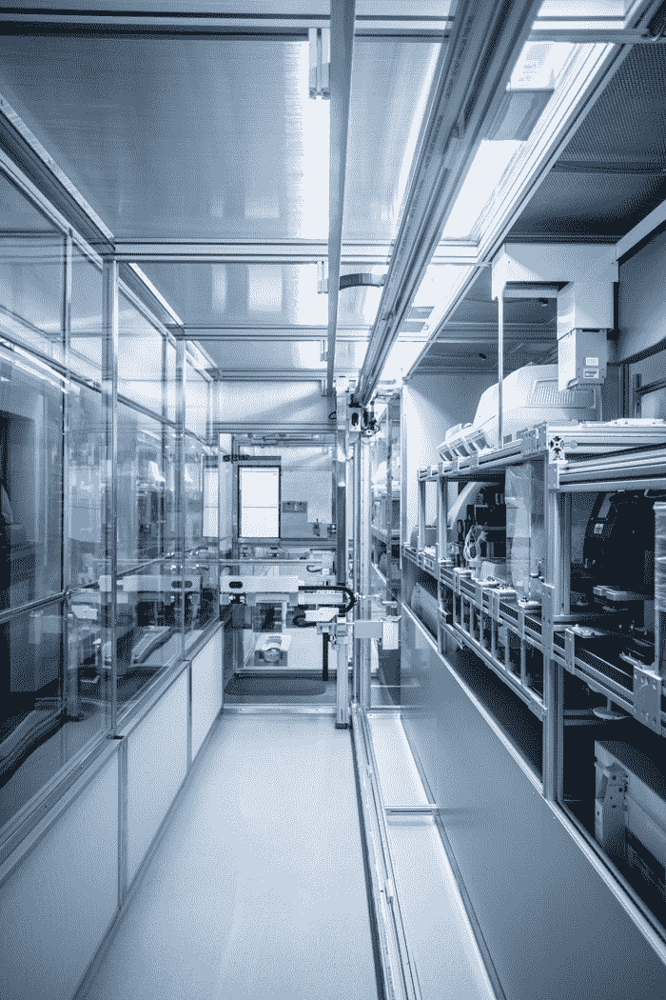
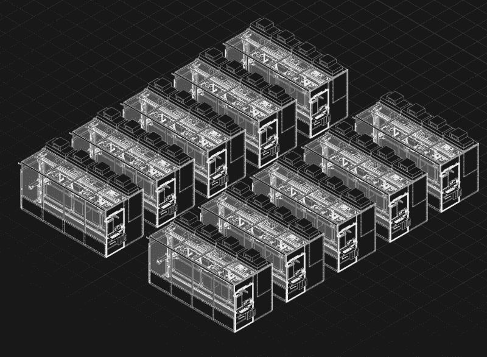

# 机器人云实验室允许科学家在家工作

> 原文：<https://thenewstack.io/robotic-cloud-laboratories-allow-scientists-to-work-from-home/>

随着新冠肺炎疫情的到来，世界各地的家庭订单已经影响了许多社会。随着学校关闭，孩子们被困在家里；当各种类型和规模的公司暂时关闭时，办公室工作人员发现他们正在远程工作。随着全球各地的大学将学生和教师送回家过年，学者们发现自己处于同一条船上。

但这并不一定意味着科学研究已经停止。相反，习惯于传统实验室环境(使用显微镜和细菌培养)的研究人员可能会有一个有前途的在家工作的替代方案:基于云的实验室，全部由机器人操作。

总部位于三藩市的 Strateos 公司就是这样一家初创公司，它正在迎接远程研究工作的挑战。在过去的几年里，它一直在提供它所谓的“机器人云实验室”——本质上是一种可以远程访问的自动化服务，因此允许从事生物研究的科学家在家工作。在不久的将来，有计划将该服务扩展到包括合成新的化合物所需的设备。

据该公司称，Strateos 的服务将自动化与先进的成像和分析软件相结合，最近由生命科学机器人云实验室[trans raptic](https://www.transcriptic.com/)和根据组织样本扫描创建 3D 数字模型的公司 3Scan 合并而成。Strateos 最近还与制药公司[礼来公司](https://www.lilly.com/)合作，旨在利用其机器人实验室模块创建一个自动化药物发现平台。

## “全自动和可编程”

要使用 Strateos 的服务，用户首先要发送该公司提供的摄入套件，这样研究人员的样本就可以放在标有该公司基于网络的标签系统的标准化容器中。使用 Strateos 的在线界面，科学家可以选择他们想要对他们发送的样本进行哪些测试。它也相对实惠，因为用户只需为他们订购的测试付费。

“我们的方法是完全自动化和可编程的，”Strateos 首席执行官马克·菲舍尔-科尔布里(Mark Fischer-Colbrie)告诉 [IEEE Spectrum](https://spectrum.ieee.org/view-from-the-valley/robotics/robotics-software/scientists-work-from-home-lab-cloud) 。“这意味着科学家可以选择一个标准的工作流程，或者决定一个工作流程是如何运行的。所有的设备，包括声学液体处理器、分光光度计、实时定量聚合酶链式反应仪器和流式细胞仪都可以使用。科学家可以用各种参数来定义实验的每一步，例如，机器人孵化样本的时间以及它的速度是快还是慢。”

Strateos 的实验室由“集装箱化的机器人工作单元”组成，这些工作单元都通过控制软件连接在一起，创建了一个既灵活又可扩展的架构。例如，如果研究人员需要在更短的时间内处理他或她的样本，控制软件会动态地将更多的机器人资源和试剂分配给这项工作。通过每小时测量超过 3，000 个数据点的传感器，每个工作单元都得到定期维护和全天候监控。

该公司表示，通过实施这种自动化方法，污染和人为实验误差大大减少。将机器人技术整合到实验室程序中的其他优势包括更高的效率和更容易的标准化，以及产生更多的元数据，这将允许科学家更轻松地重复实验，并允许研究人员远程合作——很可能在不久的将来得到人工智能的[协助。](/deep-physics-ai-helps-predict-quantum-molecular-wave-functions/)

可以想象，这种方法还将使最先进实验室的使用民主化，使较小的组织和个人研究人员能够进行实验，而不需要预先支付昂贵的设备。随着自动化趋势在各行各业的不断发展，[自动化也将有助于进一步增强研究过程，使其更加有效，并可能更容易获得。](https://thenewstack.io/5-workflow-automation-use-cases-you-might-not-have-considered/)

点击[战略](https://www.strateos.com/)阅读更多信息。

图像:战略

<svg xmlns:xlink="http://www.w3.org/1999/xlink" viewBox="0 0 68 31" version="1.1"><title>Group</title> <desc>Created with Sketch.</desc></svg>