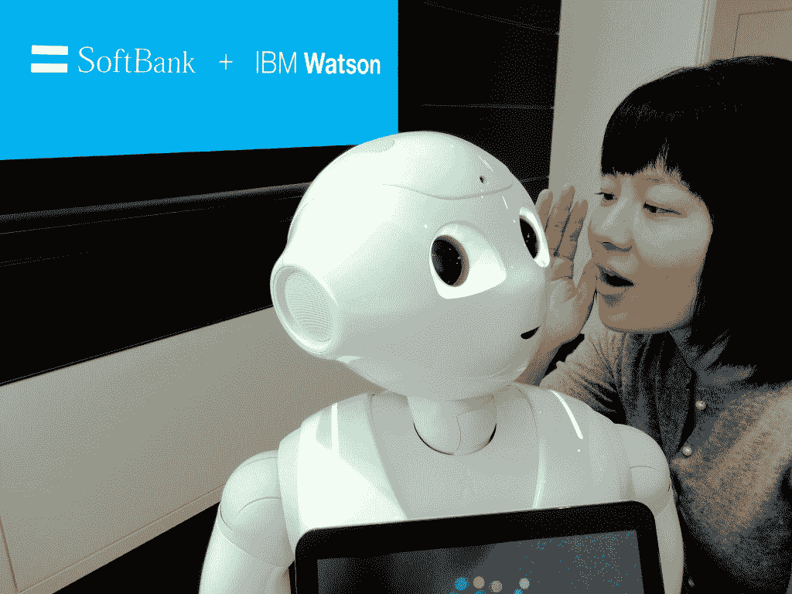

# 机器人回来了，或者，“哦，不，不是另一个”

> 原文：<https://thenewstack.io/robots-are-back-or-oh-no-not-another-one/>

如果你对标题感到疑惑，那么你可能还不是道格拉斯·亚当斯的《银河系漫游指南》的粉丝有一次，偏执的机器人马文被迫去做另一项任务，他认为自己太聪明、无所不知，不应该浪费宝贵的时间。一个家伙许诺一个全新的、令人兴奋的生活在等着他，对此他回应道:“哦，不，不要再来一次。”

人类有一个问题，也许你已经注意到了。当任何事情超出他们的理解范围时，比如宇宙的本质或者斯迪利·丹的歌词，他们假装它在他们的理解范围之内，然后离开。动物的本性，宇宙的秩序，来世，单身汉/单身女郎约会节目的制作——人类将这些不人道的活动拟人化，以便他们可以面对他们有问题理解的东西。

机器人是人类以自我为中心的需求的产物，这种需求要求机器使用人类的参照系来解决它们并与之互动。当人类想象一个完全由人类控制的机器的未来时，他们把机器人设计成类人机器人。当人类认为机器已经完全失去控制时，人类会把它们设计成类人机器人。

## 不同的模仿游戏

起初，机器人似乎不属于存在的哲学状态或寻求统一场论的同一类别，因为根据定义，机器人是人类的创造。但就像任何哲学一样，机器人的理想不仅仅是人类思维的产物，而是人类思维的永久居民。当人类用理想主义的术语谈论机器人时，或者当伪装成机器人的木偶在电子展上向观众展示时，它们不是将零件焊接到汽车上的电枢，也不是让受伤的退伍军人直立行走的假腿。不可避免地，有人会在它们身上贴上快乐的脸，甚至悲伤的脸，眨着眼睛，戴着假睫毛，希望未来的机器至少能像人一样假装表情。

从历史上看，机器人最成功的部分是最不像大脑的部分。人工智能是努力创造技术，产生结果，否则将需要人类的智慧。当然，人类对智力的标准是变化的。在 20 世纪 70 年代，预测天气的计算机似乎无所不知；今天，当一场风暴经过一个城镇，人们受到伤害时，计算机会因为预测失误而受到指责。

人工智能和机器人学的研究实际上是分开的，后者专注于自动化需要运动技能的任务的能力，无论产品最终是否类似于人类甚至任何有机的东西。现代工业中最成功的机器人可能受到了自然的启发，但它们并不受制于自然。对于人工智能来说，可能也有类似的道理:最好的机器学习概念可能受到了人类理性的启发，但最终根本没有模仿它。

这并不能阻止人类认为这两种努力的产物——它们以进步的名义偏离巢穴如此之远——应该再次结合在一起，并被迫搬回家住在地下室。

IBM 的研究人员在沃森项目上取得了辉煌的成就。但是，在通过赢得《危险边缘》成功“产品化”之后，该公司只能向其沃森业务部门投资 10 亿美元尽管该系统在诊断癌症方面[还有一定的前途](http://www.computerworld.com/article/2840226/cleveland-clinic-uses-ibms-watson-in-the-cloud-to-fight-cancer.html)，但沃森在大多数人心目中合法化的方式是通过击败肯·詹宁斯。

去年二月，IBM 与日本软银电信达成协议，在日本市场为沃森开发消费者应用程序。合作伙伴通过展示软银的机器人 Pepper(见上图)与沃森的云服务的配对，展示了他们的共同承诺。从理论上讲，这是机器人的“大脑”在云平台上的重新定位，在某种程度上这是完全合理的。没有实际的理由为什么机器人必须完全包含自己的中央操作系统。

然而，如果你将这一事实归结为最终结论，既然沃森系统的功能可以从任何地方访问，那么通过机器人访问沃森有什么实际用途呢？

## 神经系统

人类内心深处仍然有一种根深蒂固的需求，那就是成为宇宙的中心，或者成为除了另一个颁奖典礼之外的重要事物的中心。这种需求体现在人们希望人类最伟大的技术成就会与其创造者有所相似。

然而事实并非如此，其原因最终要归功于人类。在 20 世纪 60 年代，太空计划产生了自动化系统，使人类能够在行星体之间旅行——在当时，这是他们最大的技术成就。在 21 世纪初，太空计划需要一种方法在更小的空间内压缩信息技术，同时在整个地球上更广泛地传播它。这一努力的成果就是云计算——至少在那个十年里，可以说是最伟大的技术成就。

为云平台开发功能性程序需要彻底反思信息的本质。虚拟化产生了一个想法，即应用程序可以在一个比单台计算机更大的平台上呈现。一旦应用程序从处理器的束缚中挣脱出来，一个更新的概念——微服务——第一次使人类能够将单个功能本身视为虚拟计算机。

上周在这个新的堆栈中，[我的朋友兼同事 Alex Williams 提出](https://thenewstack.io/microservices-are-real-the-cloud-not-so-much/)管理微服务的复杂性将会超出人类的理解和分析能力。他推测，也许机器人将被委托执行微服务监控的任务。

我希望亚历克斯不会因为我公然反对他的建议而把我踢出网站，他的建议是，更现代系统的复杂性最终将被机器人的效率所掩盖。作为一种分散风险的大胆方式，我将提出这个问题:在我的另一个工作岗位上，[有人问了一个问题](http://www.cmswire.com/social-business/are-you-as-relevant-as-a-robot/)，人类的工作是否最终变得足够卑微，以至于机器人可以接管大部分工作。有人提出，人类避免被机器人淘汰的最佳方式是成为他们所做领域的专家——如此独特以至于不可替代。

(独特是一种趋势，在我的职业生涯中，这种趋势被归因于我几次，尽管它还没有阻止我的可替代性。只是不是机器人。)

在等式的一边，亚历克斯认为基于微服务的系统的抽象深度可能太大，人类无法跟上，最终机器人将承担这一负担。另一方面，Erika Morphy 认为，非熟练劳动力可能变得如此琐碎，机器人也将接管这一工作。如果这两个建议最终都是正确的，最终人类唯一能做的事情就是写博客。

认为抽象最终会使系统变得过于复杂而不为人类所理解是忽视了数学本身的伟大成就:将最复杂的系统结构彻底简化成在某种程度上可以理解的系统。抽象是聪明人处理大问题的方式:首先将它们分解成功能单元，其次将这些单元隔离成离散的角色，第三是将这些角色可用的资源集中起来。

如果它与自然界中的任何东西有任何相似之处，那么它与其说是人类，不如说是白蚁，它们能够形成非常先进的社会，显然没有政治的混乱，也没有颁奖典礼上不必要的铺张浪费。

## 这是生活，吉姆，但不是我们所知道的

需要人工智能或机器学习以自动化方式解决的问题，不会通过合同与机器人绑定，以产生一些可以说话、发牢骚、眨眼或哭泣的物质实体。科幻小说需要机器人，因为很难给像“脱离实体的声音#3”这样的角色颁发奥斯卡奖但沃森最擅长的功能类型确实需要一个胸腔和一双手臂，以及一个悲伤时向一侧倾斜并撅起嘴的头，原因只有一个:确保博客写手写下它。

人类总是被好的演技分散注意力。

人类正在创造的微服务系统只在那些希望它们看起来像人类的人看来复杂。就人类预测未来的能力而言，科幻小说制片人可能会认为人类已经脱离了剧本。然而，迄今为止，从人类中出现的智能看起来更像云，而不像人。

人类繁忙日程上的下一个任务将是让自己接受这是一件好事的事实。

通过 Flickr 知识共享的特色图片[。](https://www.flickr.com/photos/taymazvalley/6405801675/in/photolist-8A7GwW-6H6D3p-8A7FLo-7tynvD-5Fy6jq-5FtPrv-c5v7wQ-5FtNN8-5FtP1Z-5FtPdX-puWtVX-84VdaK-8PJhTD-acPgyV-8HTtsx-puW93G-ndn3gT-4tuo9g-8skQWD-nWUPib-ndncoL-4LWQQk-e9JKv-dUpH-6HEm3k-puYPn1-pcGLMC-eWmx1-6HDJoz-67HLAc-jv4Q6u-9HjeZz-9M1RYY-4BqPm-6KfdGW-qfzBag-aL4pEt-25izJF-9tR1L1-7fyv8M-5D4zwo-4umVuu-8rg7Jt-8jELXj-21R3w-31asY7-7QpK4w-4waJRe-4sKsHC-cynTny)

<svg xmlns:xlink="http://www.w3.org/1999/xlink" viewBox="0 0 68 31" version="1.1"><title>Group</title> <desc>Created with Sketch.</desc></svg>