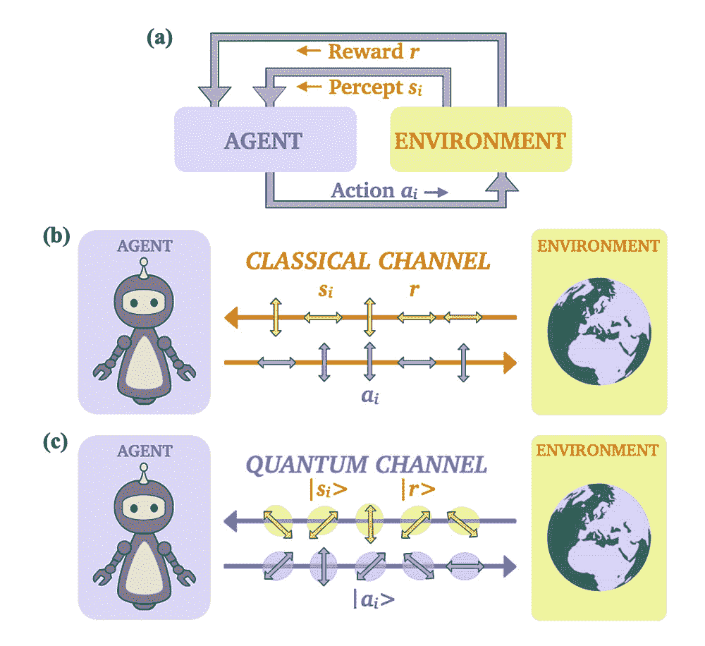

# 借助量子技术，机器人学习速度更快

> 原文：<https://thenewstack.io/robots-learn-faster-with-quantum-technology/>

一个国际研究小组通过实验证明，量子计算可以显著加快机器人的学习时间。

“我们第一次展示了一种学习任务——或者更准确地说是一种强化学习技术——它利用量子技术的优势，让机器或机器人学习任务，并与环境进行交流，为机器人的行动提供反馈，”这项研究的首席研究员、维也纳[大学](https://www.univie.ac.at/en/)的物理学教授 Philip Walther 解释道， 领导着一支由来自[因斯布鲁克大学](https://www.uibk.ac.at/index.html.en)、[奥地利科学院](https://www.oeaw.ac.at/en/austrian-academy-of-sciences/)、[莱顿大学](https://www.universiteitleiden.nl/en)和[德国航空航天中心](https://www.dlr.de/EN/Home/home_node.html)的研究人员组成的团队。 “因此，我们展示了一台机器，在那里量子技术得到了‘最大限度的利用’我们的实验表明，与经典的机器学习相比，速度有所提高。"

随着机器学习技术的发展，机器人领域在过去的几年里取得了巨大的进步。这使得能够像人类一样“学习”的机器人得以发展，无论是通过[触觉推理](https://thenewstack.io/mit-robot-uses-tactile-reasoning-ai-to-play-jenga-like-a-human/)学习，还是通过虚拟现实模仿学习[，或者使用](https://thenewstack.io/robot-learning-humans-virtual-reality/)[深度学习](https://thenewstack.io/deep-learning-demystified/)帮助机器人开发一种方法[“可视化”未来](https://thenewstack.io/robot-can-visualize-immediate-future-deep-learning/)，或者[从错误中学习](https://thenewstack.io/openai-algorithm-allows-ai-to-learn-from-its-mistakes/)，就像人类一样。

当然，随着这些学习任务变得更加复杂，将需要更好的硬件和数据处理策略来处理这些更密集的计算。这就是[量子计算](https://thenewstack.io/quantum-computings-challenging-liftoff-to-commercialization/)的强大潜力可以给机器学习带来巨大推动的地方。这是因为与传统的“经典”计算机不同，传统的“经典”计算机以 1 和 0 的二进制形式处理信息，量子计算机利用了一种称为[叠加](https://medium.com/@ScottAmyx/quantum-computing-series-part-4-superposition-in-quantum-mechanics-381b98180f62)的量子力学属性，这使它可以同时处理 1 和 0 的非此即彼或*信息。这种令人难以置信的多状态信息处理的可能性使得量子计算在诸如[密码学](https://thenewstack.io/singapore-researchers-shrink-quantum-chips-to-the-size-of-an-integrated-circuit/)，医学，金融，当然还有加速机器学习等领域具有潜在的革命性。*

## 量子算法和量子光

在发表于 [*Nature*](https://www.nature.com/articles/s41586-021-03242-7) 的发现中，该团队描述了他们的实验如何使用称为光子的基本光粒子，结合麻省理工学院开发的[集成可编程纳米光子量子处理器](https://thenewstack.io/mit-devises-photonic-processor-building-optical-neural-networks/)。这个处理器被用作机器人代理的替身，能够执行学习任务。

“我们使用量子光——单个光子——通过纳米光子处理器进行处理，”沃尔特说。“简而言之，光从‘左侧’进入，然后经过量子力学处理，这意味着这个光子被叠加，因此可以同时通过不同的路径传播，然后从‘右侧’逃离芯片。”"

在实践中，实验是用纳米光子芯片设计成不同的部分，以便更准确地监测实验结果，因为芯片处理量子算法和量子光。“第一部分是机器人，它可以调整它的处理器部分来引导光子。下一部分是影响光子路径的环境，最后一步是评估环境对光子路径的影响，这是我们新运行的一部分。”

这最后一步是使用经典计算完成的，这将导致“策略更新”，或者为机器人获取新“知识”的过程。根据该团队的说法，人们可以将这个实验想象成一个智能机器人代理站在十字路口，负责学习总是向左转。当这个左转正确实现时，它会收到一个奖励，这进一步强化了机器人的学习过程。当在经典计算系统下执行时，只有当机器人左转时才能获得奖励。然而，当在量子力学范式下完成时，量子机器人可以同时准备合理的路径，使它能够更快地学习。在该团队的实验中，量子计算技术的使用将机器人代理的学习时间减少了 63%，从 270 次尝试减少到仅 100 次。

机器人学习代理的示意图。a)主体通过接收输入(Si)与环境交互，并输出相应的动作(ai)。在正确的行动被选择的情况下，环境给出一个奖励(r)，这个奖励增强了代理人在下一轮的表现。b)代理-环境通过“经典”信道交互，其中两种状态中的任何一种通信都是可能的。c)主体-环境通过量子信道相互作用，其中可以传递各种叠加态。

“我们惊讶地发现，在没有利用量子特性的情况下，量子强化学习也可以通过经典运行来优化，”Walther 说。“其原因是，允许机器人快速学习的底层算法是所谓的 [Grover 的搜索算法](https://www.quantiki.org/wiki/grovers-search-algorithm)，这是一种成熟的算法，允许在搜索东西时以二次加速。”

然而，Walther 指出，Grover 的搜索算法存在一些内在的挑战，即使用这种算法不仅增加了快速找到搜索目标的概率，而且当算法运行太长时间时，也会增加超调的概率，从而降低搜索成功率。

“在我们的实验中，我们通过量子力学开始机器学习任务来解决这个问题，然后在结束时，我们切换到经典算法，这样我们就可以平稳地收敛到正确的发现，”他补充道。

最终，该团队的演示表明，量子技术无疑将有助于加速支撑自主机器人的机器学习过程，以及实现光子架构的好处，以及其他选择。

“在未来，人们可以通过使用更多的光子和更复杂的干涉网络来增加这种量子机器学习的复杂性和规模，”沃尔特说。“然而，我们的演示并不局限于光子系统，因为其他类型的量子系统目前也在实现量子机器学习协议。”

更多阅读尽在 *[自然](https://www.nature.com/articles/s41586-021-03242-7)。*

<svg xmlns:xlink="http://www.w3.org/1999/xlink" viewBox="0 0 68 31" version="1.1"><title>Group</title> <desc>Created with Sketch.</desc></svg>