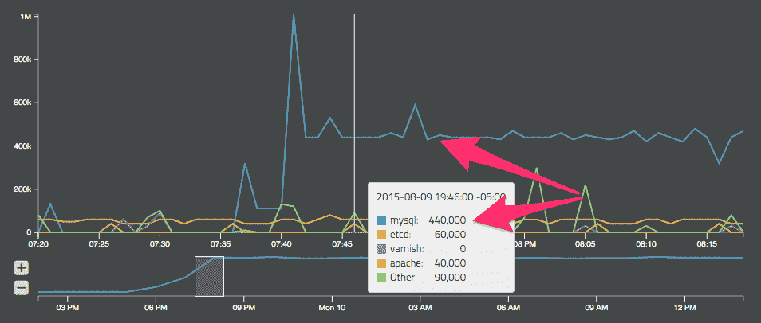
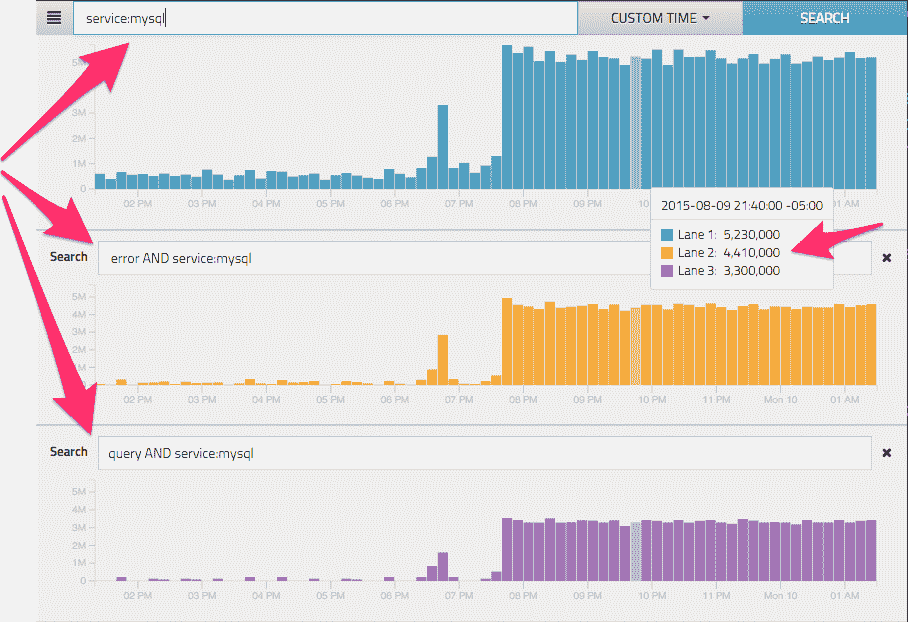

# Rocana 可以消除微服务故障排除中的指责游戏

> 原文：<https://thenewstack.io/rocana-aims-eliminate-blame-game-microservices-troubleshooting/>

“不是我这边坏了”，这似乎是一个永无止境的游戏，通常是团队花费太多时间来确定问题的根本原因。当一个人向组合中添加微服务时，指责游戏会变得更加复杂，因为团队将根据他们正在使用的应用程序或服务被分成子集。部署单独的工具来监控容器、系统和微服务可以提供对这些基础架构组件的深入了解，尽管这让运营团队处于不利地位。

当 Rocana 与 [Spiceworks](http://www.spiceworks.com/) 合作以更好地了解 DevOps 团队如何深入解决其基础架构挑战时，他们发现 94%的 IT 团队不同意问题的根本原因。通常情况下，每个团队都有其独特的数据子集，这使得基本的比较成为一项艰巨的任务。如果无法将整个基础架构中的数据关联起来，那么在找到解决方案之前还有更多的东西需要筛选。

## 免费展示您的数据

扩展可能会给运营团队带来挑战，因为许多当前的工作流工具集不是为处理新系统生成的大量运营数据而设计的。

“几年前，带有基于查询的界面的流行日志聚合产品是很好的工具。但现在，数据太多，查询响应速度慢得令人痛苦，”Rocana 首席执行官 Omer Trajman 说。

当大量数据添加到已经复杂的微服务基础设施或系统中时，一些基于搜索的解决方案很难有效地隔离问题  。因此，企业通常不得不优先收集哪些数据，而忽略其他数据。Trajman 指出，可以用来防止停机的数据。为了解决这一问题，Rocana 最近发布了 Rocana One，这是该公司 Rocana Ops 工具的免费版本，允许用户每天免费分析高达 1TB 的数据，并无限保留。

Rocana:按服务细分的基于行的数据可视化

容器和部署在其中的微服务在监控性能和健康方面提出了独特的挑战，因为它们是大规模动态部署的，同时也具有较短的生命周期。无论一个人的 DevOps 团队有多强大，遗留工具都无法理解这些数据。过滤掉白噪声，有助于用户更好地发现他们应该关注什么，以及什么时候关注。

Rocana 可以从许多来源收集和分析数据，包括系统日志、应用程序日志、主机指标，甚至基于 API 的数据源。当在一个人的堆栈中设置 Rocana 时，开发人员通常会发现自己在几分钟内就准备好了，因为必要的数据已经可以从系统指标或其他来源获得。Trajmaned 解释说，如果想要获得分析的代码级视图，Rocana 还可以与 [StatsD](https://www.datadoghq.com/blog/statsd/) 等分析工具一起使用，以便为以后的分析提供系统工具。

## 将它们连接在一起

Rocana 致力于改善 IT 团队、开发人员和系统管理员的生活。特别是，Rocana 作为一个监控筒仓合并工具大放异彩。它使用户能够将他们的监控信息整合到一个运营数据仓库中，而不是继续在这些工具上进行维护。这不仅包括传统的监控分析，还包括强大的搜索和查询功能以及异常检测。

规模经营时，效率是最重要的。组件的数量很容易达到数十万个，并且有一系列独特的变量需要监控。Trajman 指出，Rocana Ops 利用一种独特的 WARN(加权分析风险通知)分数来识别表现异常行为的单个组件、主机、服务甚至位置。

在这个领域，有各种各样的解决方案可供开发人员和 IT 运营专业人员使用，包括诸如 [WaveFront](https://www.wavefront.com/) 、 [SpiceWorks](http://www.spiceworks.com/) 和 [Zabbix](http://www.zabbix.com/) 等工具。

“这是大海捞针的对射。在低端，用户不需要这个——这是多余的。他们不是在大海捞针。拥有 5 或 10，000 台机器，你就是，”Dev Nag 说，他是 [Wavefront](https://www.wavefront.com/) 的首席技术官，讨论了这个问题。

在解决应用程序性能监控问题时，Rocana 使企业能够深入其基础架构，以确定性能问题。即使像延迟这样简单的事情也会影响整体性能，因为服务调用在完成任务时会与服务器、数据库、web 应用程序和路由器等许多组件进行交互。借助 Rocana Ops 和 Rocana One，开发人员可以更好地从端到端跟踪问题，并在级联系统故障发生之前解决问题。

SpiceWorks 为那些在 IT 服务台环境中工作的人提供了大量的工具选择，包括库存评估、网络监控、ping 检查和服务监控。Zabbix 还提供各种分析工具，包括 KPI 指标、容量监控和网络容量概览。虽然端到端监控可能是一项挑战，但这些工具为几乎所有基础架构提供了强大的解决方案选择。

## 更好的监控，更好的解决方案

当从遗留解决方案迁移到基于云的技术时，开发利用最佳监控工具的新基础架构通常是一个可靠的决策。然而，当数据必须与当前的运营布局集成时，大多数企业都遇到了障碍。

Rocana:彼此策划搜索查询

虽然微服务监控平台可能能够识别出不正常或无响应的服务，但这并不能帮助开发人员和 IT 团队确定问题的真正原因。如果调用外部数据库的微服务是由过载的数据库、拥塞的 WAN 段或基于主机的内存利用率问题导致的性能问题，该怎么办 Trajman 说。

无论是构建传统应用、构建微服务框架，还是尝试充分利用数据，了解如何实施最佳监控解决方案都至关重要。Rocana 提供的解决方案不仅基于系统监控，还基于整个基础设施的调试、操作和问题解决。如果你有兴趣报名 Rocana One，可以在这里报名。

图片来自 Rocana。

<svg xmlns:xlink="http://www.w3.org/1999/xlink" viewBox="0 0 68 31" version="1.1"><title>Group</title> <desc>Created with Sketch.</desc></svg>