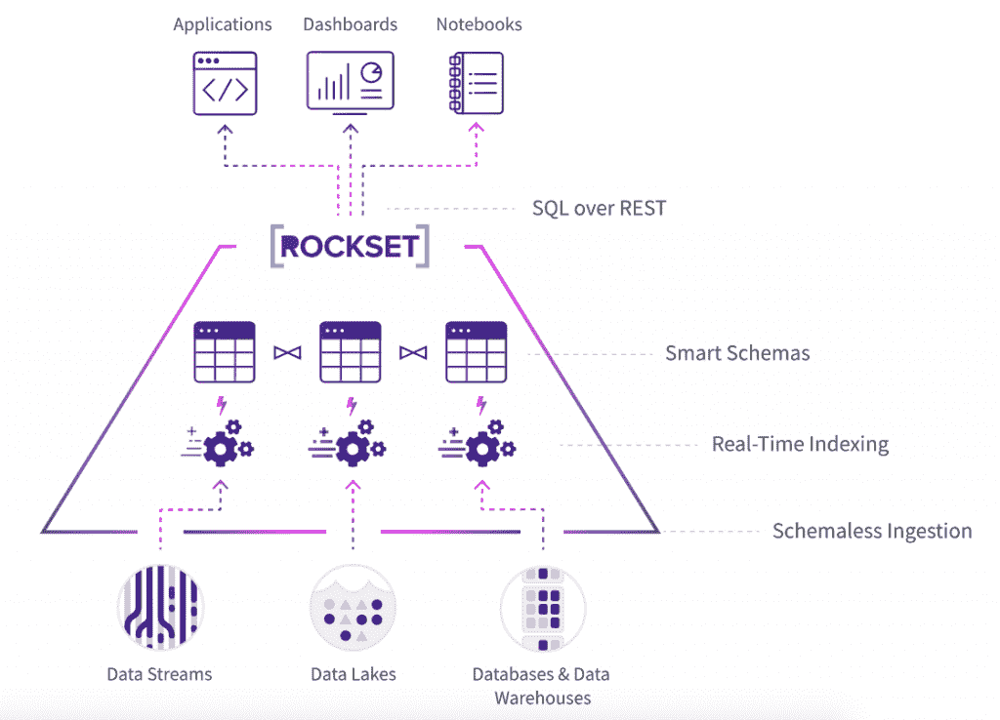

# Rockset:对原始数据的快速 SQL 查询

> 原文：<https://thenewstack.io/rockset-fast-sql-querying-on-raw-data/>

为什么构建数据应用如此困难和复杂？这是文卡特·文卡塔拉马尼(Venkat Venkataramani)和他在 [Rockset](https://rockset.com/) 的合作伙伴着手解决的问题。

Venkataramani 说:“我们认为现代数据基础设施给开发者带来的复杂性是疯狂的。”“从有用的数据到有用的应用需要跨越太多的障碍。不仅建造复杂基础设施的成本很高，而且个人维护成本也非常非常高。我们只是在想，如何让开发者和数据科学家真正轻松地构建应用，尤其是在云中。”

新公司的首席执行官文卡塔拉马尼(Venkataramani)曾在脸书管理在线数据基础设施。另一位联合创始人兼首席技术官 [Dhruba Borthakur](https://github.com/dhruba) 是 Hadoop 分布式文件系统的创始工程师之一。首席架构师 Tudor Bosman 共同创建了脸书图形搜索后端。他还在谷歌工作过，负责 Gmail 的存储和索引后端，在甲骨文工作过，负责数据库服务器。

他们认为在数据准备和 ETL(提取、转换和加载)上花费了太多时间。

Venkataramani 解释说:“构建数据应用程序的大部分基础设施都针对运行本地或专用 Linux 服务器进行了优化。“当工作负载转移到云时，我们在考虑如何消除许多步骤。我们在想，我们能制造的最简单、最强大的产品是什么？

我们想，“如果我们只是索引所有这些数据，让人们可以轻松地直接对原始数据执行快速 SQL，这样我们就可以在云中以无服务器的方式消除数据准备、管道、模式建模、性能工程和所有这些事情中的许多步骤，会怎么样呢？[那样的话，]我们可以消除当前技术强加给他们的许多东西。"

## 轻松实现 SQL 功能

SQL 是大多数大数据应用程序的首选数据库，但在 SQL 上查询非结构化数据仍然很痛苦，斯坦福大学计算机科学助理教授 Peter Bailis 在一篇博客文章中写道。

“使用 SQL 查询用于分析、数据科学和应用程序开发的非结构化数据源需要一系列繁琐的步骤:弄清楚数据当前是如何格式化的，确定所需的模式，将该模式输入 SQL 引擎，最后加载数据并发出查询，”他写道。“这种设置是一项主要的开销，而且这不是一次性的费用:随着数据源和格式的发展，用户必须重复这些步骤。”

Rockset 对此的回答是开发自己的存储和索引技术，构建在 [RocksDB](https://rocksdb.org/) 之上。这家总部位于加州圣马特奥的公司成立于 2016 年，最近从秘密行动中走出来，宣布了由红杉和格雷洛克牵头的 1850 万美元的 A 轮融资，此前筹集了 300 万美元的种子资金。

【T2

作为 SaaS 的产品，Rockset 是一个无服务器的搜索和分析引擎，结合了搜索引擎和列数据库的强大功能，为不同的数据提供快速的 SQL。它依靠[强大的动态类型](https://rockset.com/blog/dynamic-typing-in-sql/)和索引来实现。它利用云自动扩展来提供成本效益。

Rockset 不需要预先的模式定义或数据[非规范化](https://searchdatamanagement.techtarget.com/definition/denormalization)，因为根据概述其架构的[白皮书](https://rockset.com/whitepaper.pdf)，它通过索引和存储半结构化数据格式(如 JSON、Parquet、XML、CVS、TSV)来支持使用 SQL 的关系查询。

## 来自任何地方的数据

它可以从实时流、数据湖、数据库和数据仓库中获取数据，而无需构建管道。Rockset 不断同步新数据，无需固定的模式。

它针对键值、时间序列、文档、搜索、聚合和图形类型查询进行了优化。Rockset 查询优化器混合使用基于规则和基于成本的优化，采用机器学习来学习客户的查询模式并使其更高效。

“我们以自己专有的格式存储数据，这是我们自己对数据进行分类的方式，”Venkataramani 说。“我们将一个复杂的数据集分割成一大堆小块，然后在我们的后端进行组织，这样我们就可以在此基础上进行非常快速的 SQL 处理。…目前，许多处理都是在写入时进行的…在将数据加载到数据库之前，您需要处理所有这些数据准备的边缘情况。我们在不牺牲性能或规模的情况下，将这一点转移到查询处理中。”

他说，Elasticsearch 和其他基于搜索的处理系统使用类似的方法。

“你可以在 Elasticsearch 中转化单一的半结构化数据流，并在此基础上构建应用程序。但是在 Rockset，我们把它带到了一个完全不同的层次。我们专为云构建，因此有很大的弹性，不仅仅是在索引方面。我们为您提供了全功能 SQL，因此您可以构建需要连接和聚合以及 SQL 系统所能完成的更复杂处理的复杂应用程序。"

Rockset 使用一种微服务架构，该架构使用容器和 Kubernetes，并采用云无关的方法。它采用 RocksDB-Cloud 作为嵌入式存储引擎，以及自定义资源调度器和自定义 C++查询处理引擎。接收和查询是基于用户设置的限制分别自动扩展的。

尽管 Rockset 的设计是与云无关的，可以在任何云上运行，但到目前为止，所有 Rockset 的服务都在 AWS 上运行和托管，并遵循 AWS 安全实践。

Venkataramani 认为 Rockset 可用于个性化引擎、物联网、安全分析和其他实时应用。

“你可以很容易地将 Rockset 指向一个 Kafka 主题，你会在另一端得到一个非常快速的 SQL 表来查询和构建应用程序，”他说。“数据科学家非常喜欢这一点，因为他们可以进行大量实验，测试大量假设，然后将其投入生产，因为 Rockset 的 SQL 处理部分处于生产速度。你不需要建立更多的下游服务引擎来在 Rockset 上构建你的应用。”

Venkataramani 说，Rockset 不支持 OLTP，该公司也没有计划很快解决交易处理问题。

他说:“我想把重点放在数据在一个应用程序中产生，但被其他人使用的情况上。”“这就是 OLTP 应用程序的不足之处。它们非常擅长提供存储在其中的数据，但是它们并没有被优化来提供在其他地方生成的数据。那是我们发光的地方。我们可以在任何数据集上构建可运营的应用程序，并且不需要对其进行全面管理。”

特色图片: "[1a_09_2045Uruk 写作早期形状](https://www.flickr.com/photos/cvalette/9629292621/in/photolist-fEUDdz-5BjKbT-5BoWof-5BjLsX-5BoXyC-6GSLQf-bp8fCN-fJeZHo-5BoYVq-5Bp2bA-9mjVeh-6MzLDJ-6DANf3-5BjJv6-5Bp27o-7oh5dv-iQvCSF-bLFfgP-5BjHvV-5BoWp7-5BoXX1-5BjGFt-5BjHBr-5Bp3L1-5BjFSX-5BoYCJ-5BjM2r-5Bp1CW-5BjMvX-9dCmXR-4KXFce-9dFkH1-9Gafve-6srzZh-9dFCrq-9dCzQe-bp8ctd-5BoXwG-RhEM8G-5Bp52q-avjYzL-9dCiGV-VneGoT-9dCAjk-9dFfyC-9dCEsc-9dCgpe-5BoXA3-UWtpBG-dYUuzD)" by [Claude Valette](https://www.flickr.com/photos/cvalette/) 。授权于[CC BY-SA 2.0](https://creativecommons.org/licenses/by/2.0/)。

<svg xmlns:xlink="http://www.w3.org/1999/xlink" viewBox="0 0 68 31" version="1.1"><title>Group</title> <desc>Created with Sketch.</desc></svg>