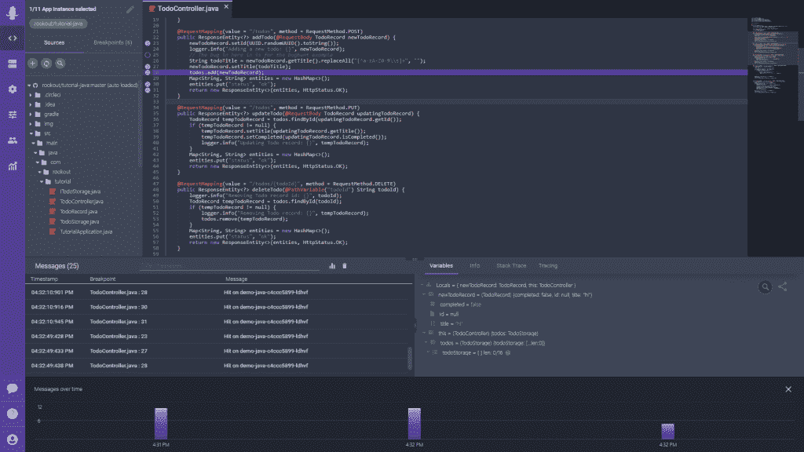

# Rookout 将调试引入第三方代码

> 原文：<https://thenewstack.io/rookout-brings-debugging-to-third-party-code/>

调试您自己的代码可能是一个重复且耗时的过程。然而，调试其他人的代码可能更加棘手，如果不是不可能的话，调试平台 [Rookout](https://www.rookout.com/) 本周发布了允许开发人员这样做的功能。Rookout 在第三方代码中提供了它所说的等同于“X 射线视觉”的功能，扩展了它的核心功能，使开发人员能够在运行生产代码时设置断点，以查看发生了什么，现在让他们能够在原本仍然是黑盒的地方设置断点。

Rookout 首席执行官[沙哈尔·福格尔](https://www.linkedin.com/in/shaharfogel/?originalSubdomain=il)在一次采访中解释说，该产品为开发者提供了一条捷径，否则这将是一个乏味的过程。

Fogel 说:“如果你想一想工程师通常解决问题或了解他们的应用程序中实际发生的事情的方法，那就是添加越来越多的日志行，希望它在正确的位置，将其推送到 CI/CD，等待部署周期，查看数据，然后开始分析它并理解它。”“通过 Rookout，您可以附加我们的 SDK，一旦它被部署到您的应用中，无论是 monolith 还是云原生应用，它都会分布在应用的所有实例中。一旦你决定要带什么，我们会在调用那一行代码时自动为你获取。”

Fogel 强调，Rookout 做所有这些都不会中断应用程序的正常性能，也不需要重新部署。相反，Rookout 使用代理在开发人员设置的“不间断断点”监听代码，并返回结果。Rookout SDK 目前支持 Java，。NET、Python、Node.js 和 Ruby，Fogel 说 Ruby 占据了后端市场的大部分，但也在努力在不久的将来增加对 C 和 C++的支持。

随着 Rookout 最新特性的增加，这种能力通过字节码操作扩展到了那些第三方黑盒中。

Fogel 说:“随着越来越多的开源、第三方库、SaaS 供应商、API、依赖项和服务网格，特别是在分布式环境中，你很难从整体上理解应用程序中发生了什么。”“我们使您能够调试堆栈，在这些代码的其他部分设置断点，而您没有这些代码的源代码。我们希望给工程师这种独立性，让他们可以做他们需要做的任何事情，并在没有外部依赖的情况下了解实际情况。”

当使用第三方代码时，开发人员可能无法访问源代码，因此他们会查看堆栈跟踪来确定在哪里设置断点。一旦设置了断点，在下一次执行该代码时，Rookout 收集并向开发人员公开局部变量、函数参数、跟踪数据和调用堆栈，以帮助他们调试应用程序。

[https://www.youtube.com/embed/wPwXgGKP1L8?feature=oembed](https://www.youtube.com/embed/wPwXgGKP1L8?feature=oembed)

视频

通过 Pixabay 的特征图像。

<svg xmlns:xlink="http://www.w3.org/1999/xlink" viewBox="0 0 68 31" version="1.1"><title>Group</title> <desc>Created with Sketch.</desc></svg>