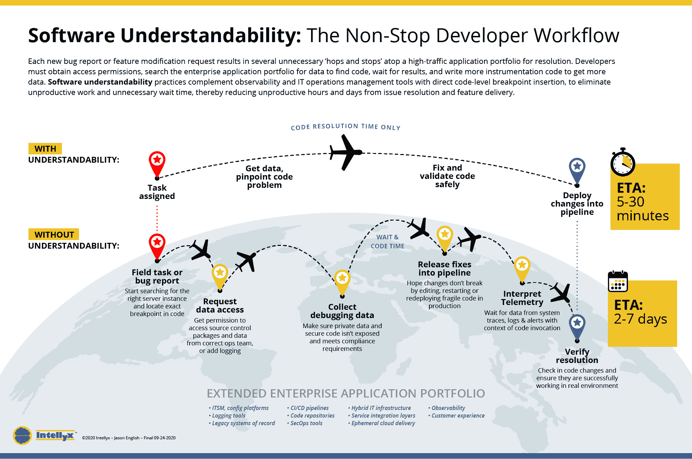
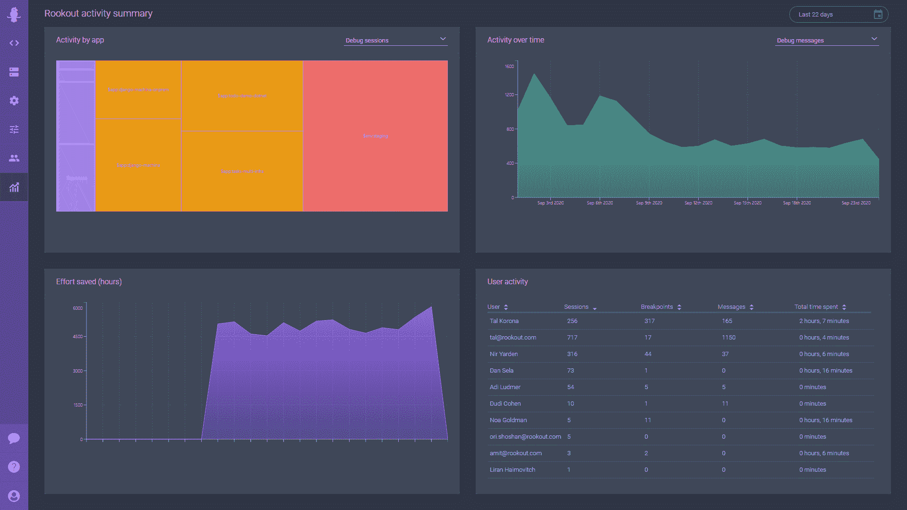

# Rookout 的实时调试热图承诺识别浪费时间的错误

> 原文：<https://thenewstack.io/rookouts-live-debugging-heatmap-promises-to-identify-time-wasting-bugs/>

 [沙哈尔·福格尔

沙哈尔·福格尔是 Rookout 的 CEO。在过去的二十年里，他一直领导着数据驱动的业务、产品和研发团队，从早期初创企业到政府机构。沙哈尔热衷于软件架构和可观察性；作为网络安全团队负责人、产品经理、风险投资人和剑桥大学 MBA 校友。](https://www.rookout.com/author/shahar-fogel) 

根据 OverOps 发布的《2020 年软件质量状态报告》,三分之二的软件开发人员估计他们每周至少花*一天来排除代码故障。这如何转化为金钱损失很难计算(当然因业务而异)，但分析公司 Digital Enterprise Journal 估计，由于应用程序发布的延迟，组织平均每月损失[2，129，000 美元](https://www.dej.cognanta.com/2019/07/19/the-roadmap-to-becoming-a-top-performing-organization-in-managing-it-operations/)。*

作为开发人员，我们大多认为调试代码是我们工作流程的一部分。我们编写无尽的日志行，编写新代码来获取新数据，有时没有上下文就向前推进，就是为了避免这个繁琐的过程。然而，如果我们退一步，我们会意识到花这么多时间去理解我们自己的软件是多么的疯狂！作为开发人员，我们为什么不能只需点击一个按钮，就能从生产系统中快速获得我们需要的数据呢？

## 传统调试的问题

当我们使用传统工具进行调试时，我们经常不得不停止应用程序并经历额外的发布周期，以便获得我们需要的数据。我们还必须编写额外的代码，只是为了更好地理解我们现有的代码，这增加了大量的开销成本和不必要的安全风险。随着分布式团队、系统和应用程序的兴起，这些问题被放大了。在当今世界，一个虚拟机可以有多个容器运行数百个应用程序！微服务意味着所有这些服务都是分散的，但仍然相互依赖，这使得任何一个人甚至团队都不可能了解整个系统。

当在应用程序中发现并报告 bug 时，开发人员通常会通过查找根本原因的线索来开始调试过程，或者进行日志文件分析，或者使用本地 IDE 中的调试器来单步调试代码。对代码的实际修改往往很简单。开发人员花费大部分时间只是试图获得必要的数据。

这就是为什么，到目前为止，我们在 Rookout 的主要重点是让点击一下按钮就能轻松地从实时系统中提取数据。通过允许开发人员在应用程序在其本机环境中运行时捕获数据快照，准确地捕获缺陷发生的位置，诊断问题的过程变得简单得多。与组织通常花费在重新创建环境上的时间相比，无论是在本地还是在共享测试环境中(这些环境从未完全反映生产环境)，采用现代调试解决方案的理由变得更加容易。

但是我们从高级开发经理那里得到的一个问题是，我们如何确切地知道在哪里调试浪费了最多的时间？这就是我们通过新的实时调试热图帮助公司回答的问题。

## 介绍实时调试热图

随着实时调试热图的普遍可用，开发人员和管理人员现在可以鸟瞰最有问题的应用程序所在的位置。

从与不同行业的开发团队的交流来看，实际情况是，一个孤立的团队可能会花费数小时来调试一个应用程序，而他们甚至不知道其他团队正在同一应用程序上浪费时间。

热图提供了一种快速、直观的方式，可以更全面地了解哪些地方浪费了最多的调试时间，开发人员敢在生产中调试哪些程序，以及使用 Rookout 与传统调试工具相比节省了多少时间。

Amdocs 的工程总监 Yan Davidovsky 写道，他们正在“利用 Rookout 的新热图，让跨团队人员了解开发人员浪费时间最多的地方。”他继续指出，他的团队“每周花很多时间调试代码”，并且“任何有助于准确定位时间花费在哪里，以及有助于衡量这些努力的 ROI 的东西都是无价的。”

通过监控热图，DevOps 团队还可以在审查其应用架构和技术堆栈时做出更明智的决策。也许你正在争论将一个整体转换为微服务，或者也许你怀疑有一个特定的平台正在引起不适当的技术债务——新的实时调试热图可以帮助你做出更明智的决定，接受或远离特定的技术。

<svg xmlns:xlink="http://www.w3.org/1999/xlink" viewBox="0 0 68 31" version="1.1"><title>Group</title> <desc>Created with Sketch.</desc></svg>