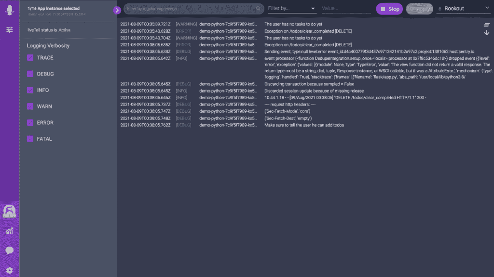

# Rookout 的 Live Logger 旨在消除开发人员的速度障碍

> 原文：<https://thenewstack.io/rookouts-live-logger-designed-to-remove-developer-speed-bumps/>

Rookout 表示，其 Live Logger 工具的发布有助于解决开发人员在寻求不干扰开发过程的精确日志数据时经常遇到的问题。

当访问数据时，一些日志记录产生了过多的“噪音”,带来了信息过载和相关成本。其他选项要求开发人员停止软件生产过程，以退出命令行并访问另一个界面，并搜索经常是多余的数据。这两种情况都会阻碍工作流程。

根据[数字企业杂志](https://www.dej.cognanta.com/)在其[的报告《实现高绩效工程团队》中的说法，](https://www.dej.cognanta.com/2021/04/13/enabling-top-performing-engineering-teams-study-key-findings/) 68%的受访者在“飞得慢还是盲目”的挑战中挣扎该报告描述了没有适当的日志记录数据的软件开发人员如何由于缺少过程中所需的信息而无法高效地创建代码和应用程序。其他人可能会不断地完全停止开发过程，直到他们解析了大量的日志数据，以找到为 Git 上的提交准备代码所需的内容，才重新开始开发过程。

Rookout 表示，它设计了[实时记录器](https://www.youtube.com/watch?v=Gl1JPri7C98)——补充了其[实时调试器](https://www.rookout.com/)工具——允许开发人员只需点击一下鼠标就可以直接访问他们需要的日志信息。Rookout 说，通过这种方式，该工具提高了“日志的详细程度”这是因为开发人员在有限的时间内激活“信息调试”或“跟踪日志”功能，而无需更改代码和重启应用程序，因此有助于最大限度地降低日志记录成本。该公司说，噪音也减少了，否则不必要的日志会产生。通过向开发人员提供必要的信息，调试过程可以在开发人员命令行界面中进行。

传统的开发人员工作流程包括试图“预先预测哪里需要日志以及日志的详细程度，”Rookout 首席执行官沙哈尔·福格尔告诉新堆栈。

“当生产中出现问题时，开发人员必须希望他们的选择是正确的，否则，他们必须编写新代码并重新部署应用程序。每次你需要重新部署应用程序时，这会浪费很多时间(更不用说它会增加安全风险)，”Fogel 告诉新堆栈。“现在，开发人员可以用手电筒照着问题区域，点击一下按钮就可以得到他们想要的数据。他们也不再需要为新的部署而困扰运营团队，他们获得了一项超级能力，可以在应用程序仍在运行的情况下动态更改日志的详细程度。”

Fogel 说，Live Logger 还有助于解决开发人员面临的问题，当调试团队可能会发现问题时，他们担心他们没有必要的日志。“这很快变得太昂贵和嘈杂，”福格尔说。“作为开发人员，我们发现不得不在高昂的 Splunk 费用和需要时没有必要的数据之间做出选择令人沮丧。”

一个典型的用例场景是开发人员必须如何管理一个问题，比如客户投诉。“现在，作为开发人员，我们必须排除故障，试图找到根本原因，并尽快解决问题，”福格尔说。“Live Logger 补充了我们现有的实时调试解决方案，通过允许您在生产过程中动态更改日志详细程度，实现了动态可观察性。这是通过字节码操作来实现的。”

<svg xmlns:xlink="http://www.w3.org/1999/xlink" viewBox="0 0 68 31" version="1.1"><title>Group</title> <desc>Created with Sketch.</desc></svg>