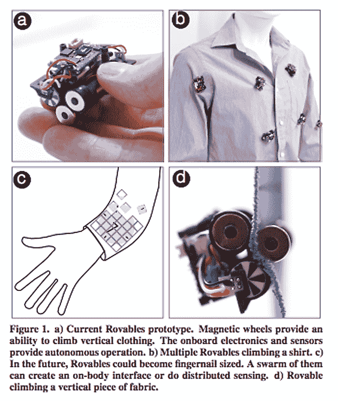
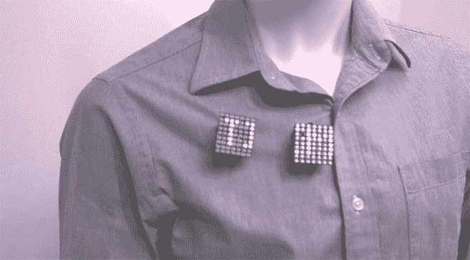
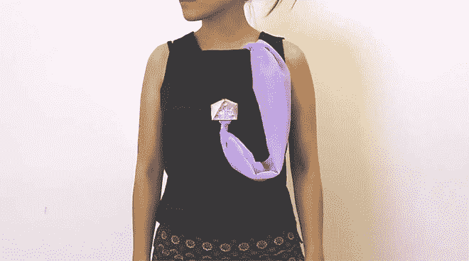

# 机器人是微小的多功能机器人，可以爬在你的衣服上

> 原文：<https://thenewstack.io/rovables-tiny-multipurpose-bots-crawl-clothes/>

对于我们大多数人来说，“可穿戴设备”这个词会让人联想到绑在身上的小玩意，这些小玩意可能会为我们翻译外语，监测我们的健康数据，或者帮助我们合法地获得快感，或者反过来，确保我们不会故态复萌。但是来自麻省理工学院和斯坦福大学的研究人员提出了一种不同的可穿戴设备——微型可穿戴机器人，准确地说，可以上下移动你的衣服——它可以自主运行并执行简单的任务。

这些被称为 Rovables 的微型互动移动机器人可以在身体上移动，这要归功于一个放置在衬衫面料两侧的磁轮系统，该系统可以抓住表面，给这些迷你机器人一些向前的牵引力。与其他设计不同，这些机器人可以穿着未经修改的衣服工作，这意味着你不需要一种特殊的衬衫来推动它们。这将使 Rovables 明显优于[智能可编程织物](https://thenewstack.io/googles-project-jacquard-conductive-threads-that-turn-fabrics-into-touch-screens/)和昂贵的、技术专用的、单一用途的服装，这些服装可以跟踪生物数据或进行非接触式支付。观看他们的行动:

[https://www.youtube.com/embed/IhIOLLE0ugg?feature=oembed](https://www.youtube.com/embed/IhIOLLE0ugg?feature=oembed)

视频

可移动机器人将采用传感器来收集由人工智能程序处理的信息。每个小型机器人都包括一个可以无线充电的 100 毫安时电池，一个微控制器，以及一个无线通信设备，允许它与计算机或智能设备以及其他机器人进行对话。

为了帮助导航，有一个低功率定位系统，带有一个[惯性测量单元](https://www.xsens.com/inertial-sensor-modules) (IMU)，集成了一个[加速度计](https://www.dimensionengineering.com/info/accelerometers)和[陀螺仪](http://science.howstuffworks.com/gyroscope.htm)。通过计算机器人车轮的转数，IMU 使迷你机器人能够跟踪自己的运动和相对于其他部署的机器人的位置。测试表明，这些机器人能够携带高达 152 克的重量，并且可以在一次充电后运行 45 分钟。

那么让微型机器人在你身上爬来爬去有什么意义呢？好吧，除了怕痒的因素，研究人员认为这是一种新型移动可穿戴设备的原型，它不仅超级便携，还可以对周围环境做出反应。在他们最近在东京举行的用户界面软件和技术研讨会上发表的论文中，研究人员写道，他们“设想未来的可穿戴技术将在人体周围移动，并将对其宿主和环境做出反应”。

特别是，他们认为这些移动设备可以提供一种新的身体感应，这对于医疗应用来说是一个潜在的福音。一群机器人可以从你的衣服口袋里出来，要么轻推你，要么组装起来创建模块化显示器，或许是为了提醒你一个重要的信息，或者为 GPS 系统创建一个屏幕来帮助你导航回家。

一堆触敏机器人可以为联网应用提供界面和触觉反馈。语音激活的可穿戴迷你机器人可以为那些可能无法完全使用四肢来控制设备的残疾用户提供更多的自主性和可访问性。正如该团队的视频所示，这些小机器甚至可以帮你穿衣服。Rovables 将是更大的[可穿戴机器人外骨骼](https://www.cnet.com/news/with-a-wearable-robot-the-paralyzed-are-walking/)的小型衣服操纵版本，这种外骨骼已经给截瘫患者提供了行走和运动的能力。

正如你在上面的视频中看到的，一些编程缝纫的机器人可以自动缝补衣服，让我们可以更长时间地保留和维护我们的衣柜。Rovables 还可以被编程为动态、互动、变形的珠宝:胸针可以兼作智能手机的显示器或麦克风。

目前，研究人员正致力于改进机器人的三维导航系统。他们的目标是构建一个足够强大的微控制器来处理这项任务所需的计算。

在未来，研究人员预见到指甲大小的多用途微型机器人的发展，这些机器人将动态组装形成一种“无处不在的计算”场景——不引人注目的小技术，可能会将智能手机用作服务器和充电站，但会在需要时出现。这是一个迷人的——尽管可能让人毛骨悚然——的概念。

图片:麻省理工学院和斯坦福大学

<svg xmlns:xlink="http://www.w3.org/1999/xlink" viewBox="0 0 68 31" version="1.1"><title>Group</title> <desc>Created with Sketch.</desc></svg>