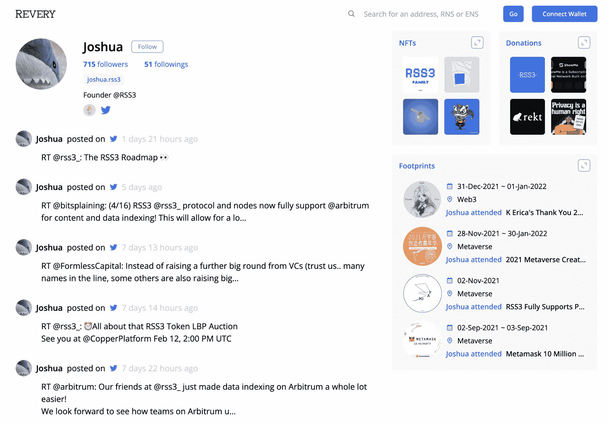

# RSS3 为 Web3 带来了联合供稿(和 FriendFeed)

> 原文：<https://thenewstack.io/rss3-syndication-feeds-web3/>

这个互联网时代被遗忘的技术之一是 RSS(真正简单的聚合)，这是一个帮助定义 Web 2.0 时代的开放聚合协议。从 21 世纪初开始，RSS 允许任何人通过博客在网上发表自己的想法，并使人们通过 RSS 阅读器订阅这些想法变得相对容易。RSS 提要使网络真正成为双向的(或者用我更喜欢的说法，读/写)。然而，当脸书和 Twitter 之类的公司在 2000 年代末开始通过它们自己的专有订阅源获得牵引力时，RSS 开始失去相关性。现在，唉，在我们的社交媒体饱和的文化中，它仅仅是一种小众技术。

接下来的问题是:RSS 或类似的协议在新兴的 Web3 中有一席之地吗？我们甚至需要由区块链和加密货币定义的网络平台上的联合供稿吗？为了找到答案，我采访了一个名为 [RSS3](https://rss3.io/) 的新协议的创始人，“这是一个旨在支持高效和分散信息分发的下一代 feed 标准。”RSS3 与以前的 RSS 版本没有关系，但它显然是受现有 RSS 规范的启发。

## 读/写网络的战争

 [理查德·麦克马努斯

Richard 是 New Stack 的高级编辑，每周撰写一篇关于 web 和应用程序开发趋势的专栏文章。此前，他在 2003 年创立了读写网，并将其发展成为世界上最有影响力的博客之一。在 Twitter @ricmac 上关注他。](https://twitter.com/ricmac) 

让我们先把 RSS3 放在上下文中，因为在过去的二十年里“feeds”发生了很多事情。脸书一直处于这一切的中心——巧合的是，它上周出现在新闻中，因为[从其订阅中删除了“新闻”一词。脸书的“新闻提要”一直是一个奇怪的绰号，但在当前错误信息泛滥的时代更是如此。无论如何，脸书是最应该为 RSS 在 2010 年被淘汰负责的公司。在 21 世纪初，写博客的梦想是每个人都可以通过博客服务在网上发表自己的想法。当然，这从未发生过，是社交网络——主要通过脸书——促使主流媒体在互联网上发布和订阅(后者改名为“follow”)。](https://www.techmeme.com/220215/p23#a220215p23)

因此，脸书——以及整个社交媒体——在读写网络上赢得了普通人的心。RSS 是那场战役的输家之一。但这并不意味着战争结束了。

Web3 目前成为一个大趋势的原因之一是为了对抗脸书、推特、抖音和其他人在在线社交话语中的主导地位。Web3 的支持者声称“去中心化和未经许可的创新”，用马克·安德森的话说[，可以从脸书这样的平台夺回用户控制权。(值得注意的是，安德森脚踏两只船，因为他的风险投资公司](https://twitter.com/pmarca/status/1493464162340532225) [a16z](https://a16z.com/) 是 Web3 初创公司的巨额投资者，但他也是 Meta 董事会的[。)](https://investor.fb.com/leadership-and-governance/default.aspx)

然而，在区块链世界中，内容的联合并不容易，主要是因为内容平台的金融化。简而言之，你必须付费才能玩——不仅是出版商，还有读者。评论或“喜欢”住在区块链上的博客文章需要增加区块链，这是要花钱的(以太坊里的“煤气费”)。

## RSS3 的幕后黑手是谁，它是如何工作的？

为了了解 RSS3 的功能，我联系了联合创始人约书亚·迈泰奥拉。他在 RSS3 中的合作伙伴是一个匿名的开发者，他的网名是 [@DIYgod](https://twitter.com/DIYgod) ，在 GitHub 上有将近 1 万名粉丝。DIYGod 过去的一个著名项目是 RSSHub，这是一个 RSS 抓取工具，口号是“一切都是可接收的”。

根据 Twitter 上的一个帖子，为了建造 RSS3，迈泰奥拉和@DIYGod 成立了一家名为自然选择实验室的公司。它从 CoinShares Ventures、比特币基地 Ventures、Dapper Labs、Arweave 和 Fabric Ventures 等公司获得了种子资金。

RSS3 正在积极开发中，目前的稳定版本是 v0.3.1。根据其 GitHub 页面，v4 目前“正在热烈讨论中”。

当我第一次开始研究 RSS3 时，我不清楚它的目的是什么。比如说，一个 Web3 博客的用户难道不能使用传统的 RSS 来整合他们的帖子吗？但是在与 Meteora 聊天后，我清楚地知道 RSS3 订阅源不会附加在博客上——而是一个加密钱包。

“让我们以 [Mirror.xyz](http://mirror.xyz) 为例，”迈泰奥拉说。“这基本上是一个博客平台，使用你的 ETH 钱包作为账户，并在 Arweave 上存储。在这种情况下，拥有 ETH 钱包的博客作者不需要注册 Mirror(从技术上来说),只需将 ETH 钱包带到 Mirror 并开始写博客。由于所有文章都存储在 Arweave[一个 p2p 存储网络]上，理论上没有人拥有它，也没有人可以审查它。此外，所有文章都是开放的，未经许可的。然而，在 RSS3 出现之前，任何应用程序都很难直接从 Arweave 获取 Mirror 的文章，而不依赖 Mirror 作为一个集中的参与方。基本上，它为任何地址创建了一个 feed，其中包含了许多有趣的东西——当然也包括镜像博客。如果没有 RSS3，访问 Mirror 的文章对 dApps 来说可能非常具有挑战性。”

所以要澄清的是，当 Meteora 说 RSS3 创建“任何地址的提要”时，他指的是任何钱包地址。以太坊 dApps 的工作方式是，它们使用特定的钱包地址作为用户的身份。一个用户可能有多个钱包(事实上这很常见)，所以 RSS3 为用户的每个身份提供一个提要。如果他们使用同一个钱包将他们的内容发布到网络上，无论他们使用哪个博客平台，都只有一个 feed 代表那个人的内容。

## revery:RSS 3 的一个 FriendFeed

Meteora 表示，已经有多种应用程序建立在 RSS3 的基础上，包括一个名为 [Revery](https://revery.so/) 的应用程序，允许用户连接他们想要的多个钱包——这意味着你可以将所有的 RSS3 订阅聚合到一个地方。

Revery 让我想起了一个叫做 [FriendFeed](https://en.wikipedia.org/wiki/FriendFeed) 的旧 Web 2.0 应用。FriendFeed 于 2007 年推出，是一种将你所有的社交网络和发布信息聚合到一个地方的方式，深受网络极客的喜爱。可悲的是，它在 2009 年被脸书收购，基本上再也没有消息了。

约书亚·迈泰奥拉的幻想

即使你不使用 Revery 或类似的 FriendFeed 应用程序，RSS3 也可以将你在网络上的所有内容聚合到一个供稿源中(前提是你使用同一个钱包)。

## RSS3 有前途吗？

对于 RSS3 项目来说，现在还为时尚早，因为(小的)社区仍在制定规范的细节。但是，理论上，基于钱包 ID 而不是博客为 Web3 创建联合供稿是有意义的。

RSS3 的一个关键挑战是，我们仍然不知道使用加密货币钱包作为一种在线身份的形式是否是一种可行的长期网络解决方案。这有很多危险，特别是对于非技术用户——也就是主流用户。例如，早在 2018 年，我测试了一个总部位于区块链的 Twitter 替代品，名为 Peepeth。但我在使用顶级加密钱包之一 MetaMask 时犯了一个用户错误，立即无法访问我的 Peepeth 帐户。我无法再次登录，因为我丢失了钱包的私人钥匙！去中心化的网络在理论上听起来很棒，直到你需要打电话给客户支持(这在 Web3 中是不存在的)。

尽管 RSS3 是一个有趣的项目，我会跟踪它的进展。给 Web3 添加联合供稿肯定有助于提高它的整体可用性——到目前为止，这一直是 crypto 和区块链的大问题之一。

<svg xmlns:xlink="http://www.w3.org/1999/xlink" viewBox="0 0 68 31" version="1.1"><title>Group</title> <desc>Created with Sketch.</desc></svg>