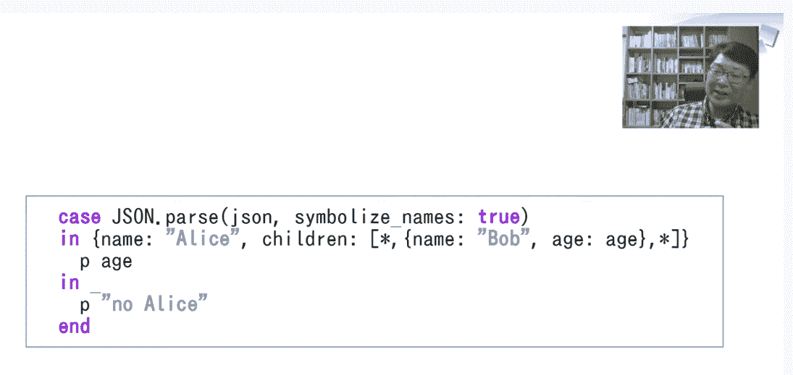
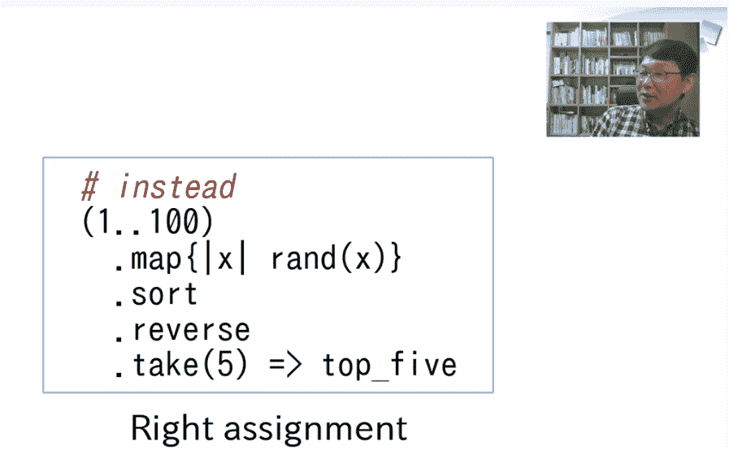
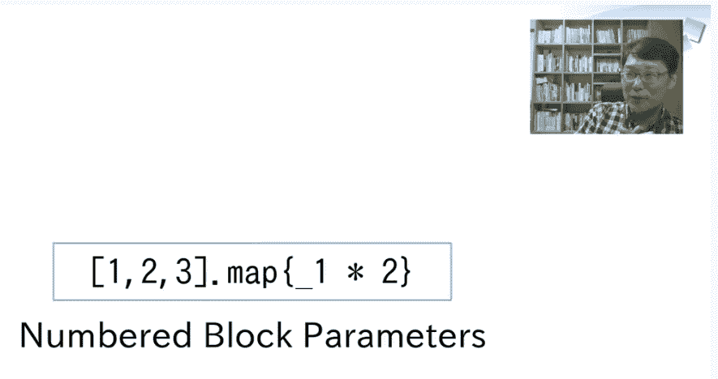

# Ruby 的创造者 Yukihiro Matsumoto 谈更新编程语言的挑战

> 原文：<https://thenewstack.io/ruby-creator-yukihiro-matsumoto-on-the-challenges-of-updating-a-programming-language/>

Ruby 编程语言的创造者和首席设计师、云平台即服务公司 [Heroku](https://www.heroku.com/) 的 Ruby 首席架构师松本幸弘(Yukihiro Matsumoto )最近做了一个演示，为松本领导他的 Ruby 社区的周到服务提供了一个清晰的例子。在[诺鲁科](https://noruko.org/)“纯虚拟 Ruby unconference”上进行的 30 分钟的演讲，也提供了一瞥这种语言即将出现的令人兴奋的新发展。

“在过去的四五年里，我一直在谈论 Ruby 3 的未来，”松本告诉他的观众，“很久很久了。也许你已经厌倦了从我这里听到 Ruby 3，”他谦逊地开玩笑说，列举了他在其他会议上讨论过同样的话题。“但今年——今年，这是真的，”他说，并确认 Ruby 3 最终将于今年圣诞节，即 12 月 25 日发布(作为在圣诞节发布 Ruby 语言升级的持续传统的一部分)。

“如果一切正常的话。除非发生非常非常糟糕的事情，否则我们会在今年 12 月发布 Ruby 3。”

## 设计师的困境

从印度到印度尼西亚，从巴西到柏林，来自世界各地的数百名观众正在观看松本“Ruby 3 and Beyond”的直播，在活动的聊天窗口留下了几十条热情的评论。他们聚在一起，看着这个花了 25 年时间领导 Ruby 开发的人从书架前走出来。“Matz”过去曾表示，Ruby 3 将在“东京奥运会前夕”上市，但由于奥运会被推迟到 2021 年，一些核心开发者想知道 Ruby 3 是否也应该推迟一年。

“但经过一些讨论后，我们决定今年发布 Ruby 3，因为作为一个开源社区，我们必须向前发展。我们必须继续前进。总的来说，开源社区不能停止发展。不然会死的……”

然后松本痛苦地描述了所有语言设计者面临的困境。“每个人都喜欢新事物——所以作为一名程序员，作为一名工程师，我喜欢新事物。我也是一个语言极客，所以我喜欢研究新的编程语言——比如 Elixir、Rust、Go 等等。它们非常令人兴奋。”但这似乎也产生了一种变革的压力。“红宝石有点老了，”松本继续说道。"它于 1995 年发行。"他后来补充说，“我们只是凡人。我们犯了错误。所以我们语言设计师想修正过去的错误。”

然而与此同时，“没有人想要痛苦。”由于所有的 web 应用程序都已经在使用现有版本的 Ruby，总是有迫使开发人员进行艰难升级的危险，而且“没有人希望痛苦”。从这个意义上说，Ruby 应该是稳定的。有点矛盾吧？”

“所以语言设计，语言计划——很难克服这种矛盾。那种矛盾是发自我们内心的。”

他提供了面临类似困境的其他编程语言的例子——包括 Python、PHP 和 ECMAScript——指出它们的社区花了多少年才接受这些变化。对于 Python 3，社区花了超过十年的时间来发展，而 PHP 6”甚至被取消了。他们只是放弃了在发布前做大的改变——所以他们从 PHP 5 开始了 PHP 7。EMCAScript 4 也被取消了。”

松本解释说，如果不做出改变，人们可能会离开这个社区。"他们停止使用 Ruby，只是因为他们厌倦了."但他也担心，如果升级到更高版本涉及太多痛苦，他们可能会离开社区，导致他们决定“也许我们的下一个项目将被写入，比如说，Rust，Go，或其他什么……”

“所以就像我说的，设计一种语言很难，但我们无论如何都需要前进，创造未来。”

## 让 Ruby 变得伟大

然后他概述了他保持兼容性的计划，同时“让 Ruby 更快，让 Ruby 程序员更有效率。”他确定了三个清晰而具体的目标来描述即将发布的 Ruby 3:快速、并发和正确。

为了让 Ruby 更快，开发团队将从改进其实时编译器(生成本机代码)开始。对于并发性，他们会避免使用其他语言的解决方案，而是尝试自己的解决方案。虽然 Node.js 增加了异步操作完成的承诺，ECSMAScript 7 增加了关键字`async`和`await`的控制机制，但 Ruby 3 将实现期待已久的异步 i/o“纤程”,作为控制异步线程的更好方式。"由于纤程之间的上下文切换很快，我们可以提高性能."

另一个他们期望它能提高性能的原因是:它是由 Ruby 的 falcon 应用服务器的开发者开发的(Matsumoto 将其描述为“非常快”。)但这并不是他们提高性能的唯一方式。他们还实现了“Ractors”(“Ruby Actors”)——类似于 JavaScript 提供后台“web worker”脚本的方式。“每个 ractor 都可以并行运行，”Matsumoto 解释道，他充分利用了现代多核系统中的并行处理能力。

更正确的 Ruby 的第三个目标将来自更早地检查错误，这要归功于将生成 Ruby 签名的类型分析器(Matsumoto 将其比作 TypeScript 中描述类型的 d.ts 文件)。Ruby 3 将为其核心库提供类型签名，既可用于类型检查，也可用于增强未来的 ide。

但它也有其局限性。“我们不追求类型系统的完整性或可靠性，因为，你知道，Ruby 就是 Ruby，”Matsumoto 解释道。“Ruby 基本上是动态类型的……这意味着即使我们有一些渐进类型，我们也不能做任何可靠的类型检查，所以我们只能放弃。…我们不会在语法中添加类型声明。”

## 三个新功能

但是 Ruby 3 中有一些语法变化。“我们正在让 Ruby 变得更好，”Matsumoto 说，并吹捧了三个新功能。第一个是复杂的模式匹配语法，“因此您不必解构数组和散列。除此之外，你还可以写模式……这非常方便。”

第二个新特性允许给等号右边的变量赋值。他称之为“不自然的”,因为我们的眼球——和我们的 IDEs——总是面对以变量名开头的表达式，即使它将被赋给更长代码块的结果值。“如果相反，我们可以用右手分配任务…这很自然…我们不建议在任何地方都这样做。你不必用右手边的赋值来替换每一个赋值，但是在某些情况下，这是非常方便的。”

Ruby 3 中的第三个新特性是编号块参数，“所以您不必担心命名临时本地块参数。”

但是松本的下一张幻灯片上写着，“除此之外……”

他一开始说“稳定性很重要”，所以他不预测 Ruby 3 之后会有什么大的语法变化。相反，他们将专注于改进 Ruby 现有的支持工具，如用于语言服务器协议的 Solargraph、用于静态类型检查的 Sorbet 和用于代码链接器的 Rubocop。“这些工具证明了更好的工具能够带来更好的用户体验。所以我们必须继续前进。我认为我们需要更多的工具，然后我们需要改进这些工具。”Matsumoto 还希望看到更好的类型检查器和格式化工具，或者更好的性能调整和调试工具。关于如何让 Ruby 更快，他还有一些其他想法——例如，位于虚拟机之上的第二个轻量级实时编译器——可能是 MIR 或 DynASM。

## 较小的红宝石

但是 Matsumoto 用他所谓的“另一个想法”结束了他关于 Ruby 3 之外的东西的讲话。这只是一个疯狂的想法。但我在考虑 Ruby 的一个更小的子集，它更简单，也更严格，希望能更快或更容易优化。”

它是向下兼容的——也就是说，Ruby 的一个子集可以在所有现有的、当前版本的 Ruby 上运行(尽管不是每个版本的 Ruby 都可以在更小的 Ruby 上运行)。在解释他的基本原理时，松本放了一张幻灯片，上面写着“更小的 Ruby 可以运行得更快(希望如此)。”他笑着大声读出来，然后补充道“这只是一个想法。我还不知道。我们必须保持兼容性…但如果我们停留在 Ruby 的这种子集…这有点不灵活，但更容易优化…”

为了强调这一点，他放了一张幻灯片，上面写着“这只是一个想法。”

“但我有许多疯狂的想法，我们一个接一个地尝试这些东西，让 Ruby 变得更棒。”

* * *

## WebReduce

<svg xmlns:xlink="http://www.w3.org/1999/xlink" viewBox="0 0 68 31" version="1.1"><title>Group</title> <desc>Created with Sketch.</desc></svg>