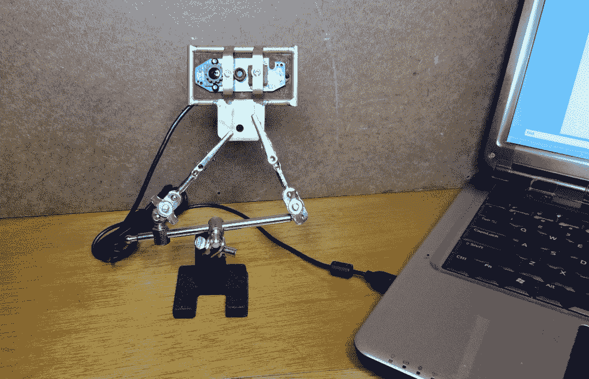

# 在 Linux 笔记本上运行 JeVois 智能机器视觉算法

> 原文：<https://thenewstack.io/run-jevois-smart-machine-vision-algorithms-linux-notebook/>

JeVois 智能机器视觉算法在 [$50 JeVois 智能相机封装](http://jevois.org/)中的小型四核 ARM 处理器上运行良好。再加上配备最新 Raspbian“Sketch”发行版的 Raspberry Pi 3，这种组合为您提供了一个很好的系统来探索机器视觉概念，并将它们用于像[赫德利、机器人头骨](https://thenewstack.io/off-shelf-hacker-hedley-formerly-old-one-eye/)这样的项目。

该软件也可以在普通的 64 位英特尔笔记本电脑上运行，比如我的老款华硕双核 Xubuntu 电脑。虽然你可以简单地将 JeVois 相机插入笔记本电脑的 USB 端口，启动 [guvcview](http://guvcview.sourceforge.net/) 并开始，但你也可以让 JeVois 固定在头骨上，并用一个日常廉价的网络摄像头获得相同的结果。我用的是我被黑的罗技 C310 型号。



被黑的罗技 C310 网络摄像头

为什么要把相机算法放在笔记本上？

首先，因为我们可以。这是另一个很好的例子，说明了为什么 Linux 是严肃的物理计算工作的首选操作系统，而不需要过多考虑硬件。无论是笔记本还是微型 ARM nano-Linux 盒子(就像 JeVois 相机)，一切都是标准的，只是工作正常。

在 64 位英特尔处理器上运行算法也非常快。也许你想在桌面上进行物体识别。当我离开去重新装满咖啡杯的时候，我可以使用这个设置(带有内置摄像头或网络摄像头)作为智能防盗传感器来保护我的笔记本电脑吗？这可能是一个即将到来的故事的想法。

让我们来看一下 JeVois 软件的安装，这样您就可以开始寻找自己的桌面智能视觉应用程序了。

## 在 Xubuntu 笔记本上安装

我的华硕笔记本电脑已经有将近十年的历史了，阿朵核心的英特尔芯片主频约为 2.3 GHz，内存为 4 GB。还有一个 750 GB 的磁盘，1g 的视频内存，5 个 USB 2.0 端口，WiFi 和 1280×800 的显示分辨率。以今天的标准来看，这是一款老派的热棒，当然仍然可以完成我交给它的所有日常写作和物理计算任务。

在 GitHub 上找到[的完整说明。](https://github.com/jevois/jevois/blob/master/INSTALL)

在笔记本上安装基本的运行程序，与网络摄像头一起使用，只需要几个步骤，需要大约 15 GB 的空间。GitHub 页面也推荐使用 Ubuntu 版本。我使用 Xubuntu 17.04 没有问题。

在连接到互联网的情况下，打开一个终端并键入以下命令。

```
sudo apt-key adv  --keyserver keyserver.ubuntu.com  --recv-keys DD24C027
sudo add-apt-repository  "deb http://jevois.usc.edu/apt zesty main"
sudo apt update
sudo apt upgrade
sudo apt install jevois-host jevoisbase-host

```

第一行和第二行建立了到 JeVois 存储库所在服务器的安全连接。然后，我们确保笔记本的存储库列表是最新的。接下来是将所有的 Linux 包升级到最新的版本，考虑所有的依赖关系。最后，我们在笔记本电脑上安装 JeVois 智能视觉摄像头基座系统。

安装大概需要 10 分钟左右。这很简单。请记住，你应该运行的是全新安装的 [Ubuntu](http://releases.ubuntu.com/17.04/) 或 [Xubuntu 17.04](https://xubuntu.org/news/xubuntu-17-04-release/) 。

## 智能视觉桌面平台

软件安装到笔记本电脑上后，将网络摄像头插入 USB 端口。

然后，从命令行，在终端中启动 jevois 守护进程:

```
jevois-daemon  --cameradev=/dev/video1

```

请注意，cameradev 选项指向“/dev/video1”，这是外部 USB 连接的网络摄像头。默认摄像头是内置设备，通常位于显示屏的顶部。也许我可以使用内置摄像头来执行面部激活命令或眼球追踪项目。内置摄像头如果要用的话最有可能叫“/dev/video0”。

一旦你点击 return，就会弹出一个 640×300 的两部分视频显示，在左边显示相机视图和增强符号，在右边显示显著图。

JeVois 相机算法大约有 24 种[不同的视频映射](http://jevois.org/doc/UserDemos.html)。每个映射对应于智能神经网络引擎的特定类型的行为。

默认映射覆盖了来自相机的帧中的“显著性”结果。把显著性想象成吸引注意力的事物。就像婴儿注意到运动、明亮的颜色或人脸。

在摄像机前移动，观察显著性映射窗格。移动和各种感兴趣的点会导致亮点出现(在右窗格中)，而绿色的注意力圆圈会移动到视野中的这些位置(在左窗格中)。粉色方块是瞬时兴趣点，当被计算到显著性时，会卷起显示绿色圆圈。

您可以选择其他模型，如使用 Darknet 框架来识别对象，阅读各种 ArUco 符号，阅读骰子，进行道路导航或观察惊喜对象。

当程序运行时，点击进入终端执行一些命令:“退出”停止程序并返回命令行；“listmappings”向终端打印出所有视频模式的完整列表，以及它们的功能。由于屏幕滚动，可能有点难以阅读，因为算法结果数据出现在终端窗口上。

启动程序时，使用“视频映射”选项选择不同的映射。

```
jevois-daemon  --videomapping=20  --cameradev=/dev/video1

```

请注意，我们不必像使用插入 USB 端口的独立 JeVois smart vision 摄像机那样启动 guvcview 来查看增强的分析结果。在笔记本上运行 JeVois 算法，它有自己的内置视频浏览器。

不要忘记进入终端，输入“quit”关闭相机并返回命令行。

## 接下来:玩数据

有许多其他命令行选项可供探索，让您调整算法的行为和正在生成的数据。当然，数据是我们所追求的，所以我们可以将它输入 Python 程序，或者通过管道传输给其他应用程序。我们将在下一篇文章中讨论这个问题。

这里有一个提示:使用文件重定向或 Linux 管道进行数据输出。

```
jevois-daemon  --videomapping=19  --cameradev=/dev/video1  --serout=All  &gt;  jevois-data.txt

```

在笔记本电脑上运行 JeVois 程序还可以让您编译新的视觉模块，为独立的 JeVois 摄像机进行交叉编译，或者在订购独立摄像机之前简单地看一下程序。

<svg xmlns:xlink="http://www.w3.org/1999/xlink" viewBox="0 0 68 31" version="1.1"><title>Group</title> <desc>Created with Sketch.</desc></svg>