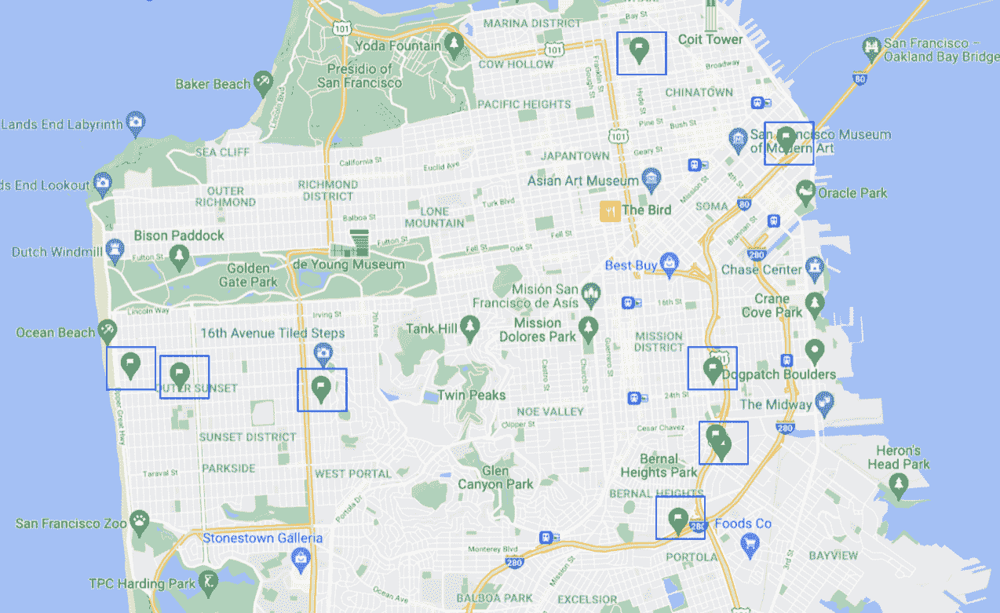
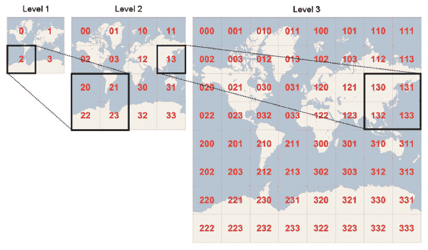
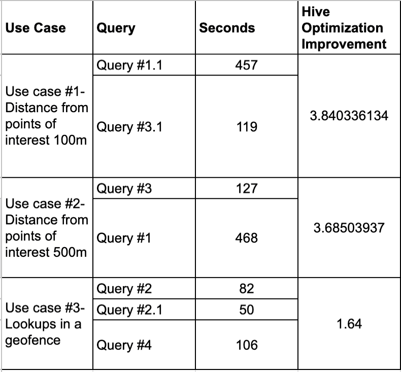

# 使用 Trino 运行优化的地理空间查询

> 原文：<https://thenewstack.io/run-optimized-geospatial-queries-with-trino/>

[Guy Mast](https://www.linkedin.com/in/guy-mast-852139a6/?originalSubdomain=il)

[Guy Mast 是 Varada 的产品经理，这是一个自主数据湖加速平台，他致力于将 Varada 的索引技术与 Trino OSS 项目相结合。](https://www.linkedin.com/in/guy-mast-852139a6/?originalSubdomain=il)

众所周知， [Trino 开源分布式查询引擎](https://trino.io/)是运行即席分析的一个选择，在这种情况下，不需要对数据进行建模，并且可以很容易地对数据进行分割。因此，Trino 也可以用于在不同数据源上运行地理空间工作负载。

在运行地理空间查询时，Trino 符合 OpenGIS，并支持大量使用 WKT/WKB 矢量数据格式的地理空间特定功能。它的各种功能使您能够统一和连接来自多个来源的地理空间数据。例如，您可以使用 Trino 的 Postgres 连接器将兴趣点与使用 Hive 连接器存储在 S3 上的事件表连接起来。

在本文中，我们将向您介绍使用 Trino 的 Hive connector 在数据湖上运行地理空间查询的两种方法，探索一些优化来帮助您加速和改进地理空间查询的交互性。

## **深入探究:使用 Trino 的地理空间分析方法**

利用 Trino 的原生地理空间支持和 Bing tiles 系统是运行常见用例的交互式地理空间查询的两种方法。在本节中，我们将通过使用 Trino 的 Hive 连接器从公共拼车数据集查询 *trips_data* 表(44 亿行)和 *places* 表(10 行)来演示这两种方法。

*位置表位置:*

以下是我们遇到的一些常见地理空间分析用例:

1.  通过使用 Trino 的 *great_circle_distance* 功能  ，获取兴趣点附近事件的详细信息，例如，乘车共享应用程序中的行程经过广告牌或商店的不同距离
2.  使用 Trino 的 *ST_Contains* 函数  将事件(如出租车行程)与定义明确的多边形(如邻域)相交
3.  通过使用 Trino 的 *ST_Contains* 函数，找出多边形是否包含特定的  点，例如，一次旅行是否在城市的特定区域开始或结束

## **方法 1——利用 Trino 的地理空间支持**

Trino 提供了大量开箱即用的 [地理空间功能](https://trino.io/docs/current/functions/geospatial.html) 。

第一个用例可能需要运行查询，以获取离兴趣点(餐馆、广告牌等)有一定距离的所有乘客。).

下面您会发现这样一个查询，它连接了 *trips_data* 表和 *places* 表，并计算了从 *places* 表中存储的兴趣点出发的 5 亿次旅行中的乘客人数。

### **寻找相邻的地理数据点**

*查询#1*

### **在确定的地理位置寻找数据点**

在 Trino 中使用地理空间功能的另一个例子是运行与用例 2 相关的查询，在用例 2 中，我们查找在一个明确定义的区域中发生的事件。下面您会发现这样一个查询，它计算在特定区域驾驶的司机数量:

*查询#2*

在上面的查询中，谓词中使用的地理空间函数没有下推到 Hive 连接器，导致大量数据读取。为了减轻这种情况，可以通过使用查询 2.1 中建议的 *lon* 和 *lat* 列来构建额外的边界框，或者使用查询 4 中建议的 Bing tiles 系统。

### 构建附加边界框

查询#2.1

这里，我们使用包含感兴趣的多边形的 *lat，lon* 列构建了一个边界框。这些列上的过滤器被下推到 Hive 连接器，这导致与查询#2 相比，从 S3 读取的数据更少。

尽管通过在 Hive 和 Varada 连接器上添加边界框谓词，我们看到了性能的提高，但是需要注意的是，动态构建边界框并不总是简单明了的。

## **方法 2–使用 Bing 图块**

[必应图块](https://docs.microsoft.com/en-us/bingmaps/articles/bing-maps-tile-system?redirectedfrom=MSDN) 是一种以不同分辨率定义地图区域的方式:

它们被存储为“四键”:

*   Quadkey = "03 "定义缩放级别为 2 的单幅图块，单幅图块边长约为 7，000 千米
*   Quadkey = "03023323 "是缩放级别 8，在赤道  边长约 60 公里
*   我们用的是 19 级，边长约 75 米

注意，图块四键的前缀总是较大的图块，其包括较低分辨率的图块。

### **使用崔诺的 CTAS 命令建造宾瓦**

为了利用 Bing tile 分段，我们可以在查询运行时创建 Bing tile(就像我们在查询#4 中所做的那样),或者通过使用 ETL/ELT 过程向 *trips_data* 和 *places* 表添加一个新的四键列。在本文中，我们使用 Trino 的 [CTAS](https://trino.io/docs/current/sql/create-table-as.html) 命令来完成这里描述的 ELT 过程。

一旦 quadkey 列就位，我们现在可以通过 quakey 列连接 *places* 表和 trips_data 表。

创建 trips_data_bing 表的 CTAS

创建 *trips_data 和 places 表的说明可以在* [*这里*](https://docs.varada.io/docs/creating-the-ride-sharing-tables) *找到。*

### **使用 Bing 图块查找相邻地理数据点**

在下面的查询#3 中，我们实现了与查询#1 相同的逻辑，并利用 Bing tiles 来连接 places 和 trips 表。

*查询#3*

该查询通过*四键*列连接表，由于 [动态过滤](https://trino.io/blog/2019/06/30/dynamic-filtering.html) 优化，显著减少了读取的行数并提高了查询性能。

### **使用 Bing 图块在定义的地理位置查找数据点**

也可以利用 Bing 磁贴，如下面的查询#4 所示，它实现了我们在查询#2 中看到的相同登录:

查询#4

当在查询执行期间创建 Bing 磁贴时，与等价的查询#2 相比，该查询的执行时间较慢，这可能表明对于这种类型的查询，在查询执行期间创建 Bing 磁贴可能并不总是有益的。也就是说，当我们使用 Varada Trino 连接器进行相同的实验时，我们确实看到了显著的改进。

## **结果**

运行上述查询后，我们可以将数据编译成一个小型基准测试，详细说明查询的运行时间，并显示实现建议的优化后的改进因素。下面是一个迷你基准测试数据的结果，使用的是亚马逊网络服务上的 4Xi3.4xlarage 机器。

优化将性能提高了四倍。

## 结论

运行这些查询强调了一个事实，即由于 Trino 对地理空间函数的现成支持，您可以使用 Trino 在您的数据湖上运行地理空间查询。

然而，通过简单地应用上面建议的方法，您可以将地理空间查询的性能提高 4 倍。

现在，通过应用本文中描述的任何方法和优化，您可以利用您在 Trino 上的投资在 Hive connector 上运行地理空间分析。查看这篇 [帖子](https://varada.io/blog/varada/large-scale-geospatial-queries-with-varada-trino-connector/) ，了解在 Varada 的 Trino connector 社区版上运行相同查询的结果。

<svg xmlns:xlink="http://www.w3.org/1999/xlink" viewBox="0 0 68 31" version="1.1"><title>Group</title> <desc>Created with Sketch.</desc></svg>