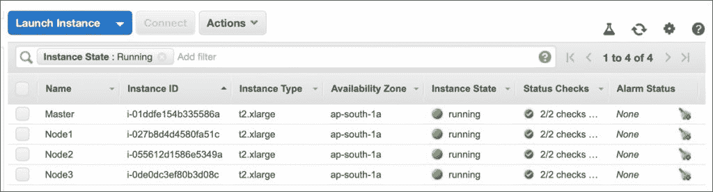
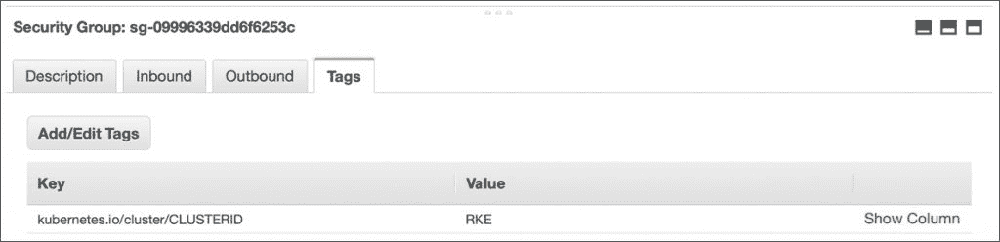
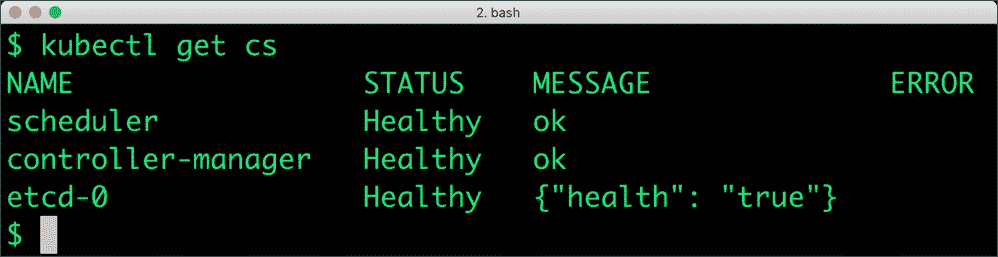
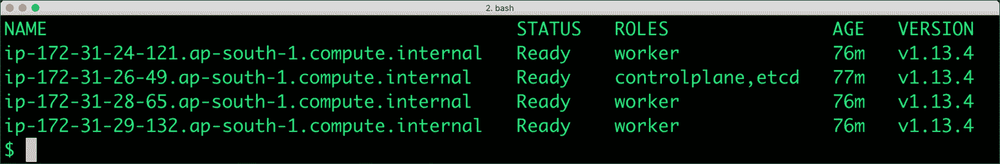
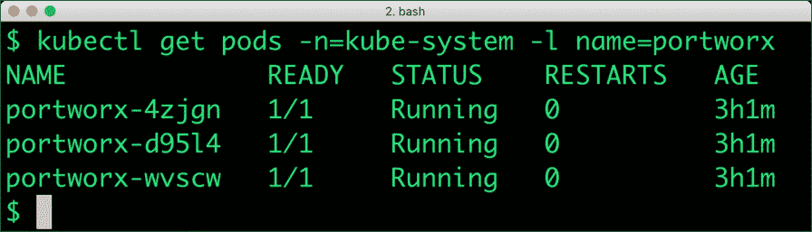

# 使用 Rancher Kubernetes 引擎和 Portworx 运行有状态的容器化工作负载

> 原文：<https://thenewstack.io/run-stateful-containerized-workloads-with-rancher-kubernetes-engine-and-portworx/>

Rancher 已经构建了一个安装程序，名为[Rancher Kubernetes Engine](https://github.com/rancher/rke)(RKE)，它简化了在任何环境中安装 Kubernetes 集群。根据我使用各种工具和托管服务的个人经验，我发现 RKE 是配置 Kubernetes 集群的轻量级、快速且健壮的工具。无论是具有几个节点的开发环境，还是具有高度可用的控制平面和多个节点的安全生产环境，RKE 都非常方便。

[Portworx](https://portworx.com/) 是一个容器原生存储平台，用于[在生产 Kubernetes 集群中运行有状态工作负载](https://thenewstack.io/how-portworx-solves-the-problem-of-running-stateful-workloads-in-containers/)。它用健壮、可靠和高度可用的存储引擎增强了 Kubernetes 原语，如持久卷和状态集。

在本教程中，我们将探索如何通过 RKE 在 Amazon Web Services (AWS)上安装一个运行 Portworx 存储引擎的 3 节点 Kubernetes 集群。这个集群基础设施可以用来运行关系数据库、NoSQL 数据库、键/值存储和其他有状态的应用程序。

安装有三个步骤:

1.  为 Kubernetes 准备您的 AWS 帐户
2.  用 RKE 安装 Kubernetes
3.  在 Kubernetes 安装 Portworx

让我们从准备和配置 AWS 帐户的第一步开始

### 步骤 1:为 Rancher Kubernetes 引擎配置 AWS

我们需要配置一个 IAM 策略，该策略有适当的权限级别来处理 Amazon EC2、EBS 和 ELB。此策略将附加到主节点和工作节点将承担的实例角色。Portworx 还需要创建、描述、附加和分离 EBS 卷的权限。我们可以安全地将这两种权限合并到一个角色中。

在创建 IAM 角色之前，让我们创建一个信任策略，将该策略附加到资源时需要用到该策略。

创建下面的文件，并将其命名为 rke-px-trust-policy.json:

```
{
  "Version":  "2012-10-17",
  "Statement":  {
    "Effect":  "Allow",
    "Principal":  {"Service":  "ec2.amazonaws.com"},
    "Action":  "sts:AssumeRole"
  }
}

```

现在，创建另一个名为 **rke-px-policy.json** 的 JSON 文件，内容如下所示。

```
{
    "Version":  "2012-10-17",
    "Statement":  [
        {
            "Sid":  "VisualEditor0",
            "Effect":  "Allow",
            "Action":  [
                "ec2:*",
                "elasticloadbalancing:*"
            ],
            "Resource":  "*"
        }
    ]
}

```

为了简单起见，我们正在创建一个策略，允许所有与 EC2 和 ELB 相关的权限。在生产环境中，您希望调整这一点以实现细粒度的访问。

假设您已经安装并配置了 AWS CLI，运行命令来创建策略和实例概要文件。

```
aws iam create-role  --role-name rke-px-role  --assume-role-policy-document file://rke-px-trust-policy.json
aws iam put-role-policy  --role-name rke-px-role  --policy-name rke-px-access-policy  --policy-document file://rke-px-policy.json
aws iam create-instance-profile  --instance-profile-name rke-px-ec2
aws iam add-role-to-instance-profile  --instance-profile-name rke-px-ec2  --role-name rke-px-role

```

最后一个命令以创建 EC2 实例可以承担的角色结束。

下一步是启动 EC2 实例，作为 Kubernetes 的主节点和工作节点。对于本演练，我们使用 t2.xlarge 系列和 Ubuntu 16.04 LTS AMI。因为我们需要足够的空间来安装 Portworx，所以将根 EBS 卷大小配置为 20GB。配置允许流量通过所有端口的安全组。同样，在生产中，您需要在方法上更加严格。



确保您拥有登录实例的 SSH 密钥。这是 RKE 的一项关键要求。将您的密钥重命名为 id_rsa 并将其移动到~/.ssh 是一个好主意。这是 RKE 寻找私钥的位置。

在继续之前，用值、***Key = kubernetes.io/cluster/CLUSTERID Value = RKE***标记所有 EC2 实例、安全组和 VPC。这个标签告诉 RKE 集群中涉及的所有资源。



有了核心基础设施，我们将只需要在所有实例中安装一个软件包——Docker。您可能希望使用 Ansible 行动手册来自动化这一过程。但是要确保 Docker 引擎在所有机器上都在运行。

下面的命令安装最新版本的 Docker CE。

```
sudo apt-get  remove docker docker-engine docker.io containerd runc
sudo apt-get  update
sudo apt-get  install  -y  \
    apt-transport-https  \
    ca-certificates  \
    curl  \
    gnupg-agent  \
    software-properties-common
curl  -fsSL https://download.docker.com/linux/ubuntu/gpg  |  sudo apt-key add  -
sudo apt-key fingerprint  0EBFCD88
sudo add-apt-repository  \
 "deb  [arch=amd64]  https://download.docker.com/linux/ubuntu  \
 $(lsb_release  -cs)  \
 stable"
sudo apt-get  update
sudo apt-get  install  -y  docker-ce docker-ce-cli containerd.io 
sudo usermod  -a  -G  docker ubuntu
docker version

```

我们现在已经准备好和 RKE 一起发布 Kubernetes 集群。

### 步骤 2:用 RKE 安装 Kubernetes

RKE 是一个运行在本地机器上的漂亮的 CLI 工具。从 Github 发布页面下载最新版本。

重命名二进制文件，并将其添加到$PATH 中包含的目录中。

```
wget https://github.com/rancher/rke/releases/download/v0.1.17/rke_darwin-amd64 
mv  rke_darwin-amd64 rke 
chmod  +x  ./rke
mv  ./rke  /usr/local/bin

```

接下来，我们需要创建一个 YAML 文件，看起来像一个可回复的库存文件。它包含实例及其角色的列表。在创建这个文件之前，请准备好 EC2 实例的名称。

创建一个 cluster.yml 文件，并用 EC2 实例公共 DNS 名称填充它。

```
---
cloud_provider:
  name: aws

nodes:
  -  address: ec2-13-232-134-242.ap-south-1.compute.amazonaws.com
    user: ubuntu
    role:
    -  controlplane
    -  etcd
  -  address: ec2-13-233-94-39.ap-south-1.compute.amazonaws.com
    user: ubuntu
    role:
    -  worker
  -  address: ec2-13-126-184-8.ap-south-1.compute.amazonaws.com
    user: ubuntu
    role:
    -  worker
  -  address: ec2-13-126-161-198.ap-south-1.compute.amazonaws.com
    user: ubuntu
    role:
    -  worker

```

名为**ec2-13-232-134-242.ap-south-1.compute.amazonaws.com**的第一个节点被指定为主节点。它运行控制面板和 etcd 数据库。其余节点充当工作节点。

如果您想试验配置，请随意运行**rke config–name cluster . yml**获得该工具的交互式版本，它提供了修改许多参数的机会。

有了 cluster.yml 文件，我们现在就可以开始集群安装了。

这是您需要运行的唯一命令。坐下来看安装进度。几分钟后，集群就准备好了。RKE 在当前目录下创建了一个 **kube_config_cluster.yml** 文件，这个文件可以和 kubectl 一起使用。

使用下面的命令将 kubectl 指向集群:

```
export KUBECONFIG=$PWD/kube_config_cluster.yml

```

我们都准备好探索星团了。





## 步骤 3:安装和配置 Portworx

在最后一步，我们将安装 Portworx 作为容器本地存储层。

关于在 Kubernetes 中安装 Portworx 的详细指南，请参考我以前的[教程](https://thenewstack.io/deploy-a-mean-web-app-with-google-kubernetes-engine-portworx/)。

使用 Portworx 规范生成器，我们可以创建 YAML 工件来创建 Kubernetes 资源。简单地复制规范，并提交给 RKE 集群。

```
kubectl apply  -f  'https://install.portworx.com/?mc=false&kbver=1.13.4&b=true&s=%22type%3Dgp2%2Csize%3D20%22&md=type%3Dgp2%2Csize%3D150&c=px-cluster-64e89cf9-22ab-48e9-9ba0-c47b11c182df&stork=true&lh=true&st=k8s'  

```

几分钟后，Portworx 应该在我们的集群中启动并运行。验证 *kube-system* 名称空间中的 DaemonSet。



现在，您可以在全新的集群中安装和运行微服务了。关于部署 MEAN web 应用程序的简单演练，请参考本[教程](https://thenewstack.io/deploy-a-mean-web-app-with-google-kubernetes-engine-portworx/)。

*贾纳基拉姆·MSV 的网络研讨会系列“[机器智能和现代基础设施(MI2)](https://mi2.janakiram.com/) ”提供了涵盖前沿技术的信息丰富、见解深刻的会议。[注册](https://mi2.janakiram.com/)参加即将举行的 MI2 网络研讨会，深入了解如何使用 Istio 执行蓝/绿色部署。*

Portworx 是新堆栈的赞助商。

通过 Pixabay 的特征图像。

<svg xmlns:xlink="http://www.w3.org/1999/xlink" viewBox="0 0 68 31" version="1.1"><title>Group</title> <desc>Created with Sketch.</desc></svg>